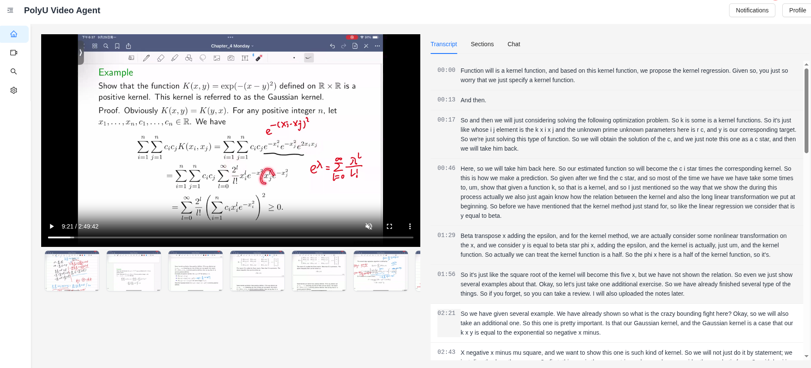

# PolyU Video Agent

## Project Background
The **PolyU Video Agent** is an advanced AI system designed to process video inputs and generate context-aware responses based on content analysis. This project addresses the growing need for intelligent video understanding in diverse scenarios, such as security monitoring and educational content management. By automatically identifying video types (e.g., surveillance footage, lecture recordings), the system enables users to:
- Query specific events in videos (e.g., "When did Person X appear in the surveillance footage?")
- Segment educational videos into thematic units and summarize key concepts
- Locate precise video segments corresponding to user-specified knowledge points

The system leverages multimodal AI techniques to handle video, audio, and text data, transforming raw video inputs into structured, searchable knowledge.



---

## Algorithm Overview
The core functionality is powered by a **Video-RAG (Retrieval-Augmented Generation)** pipeline that processes videos through hierarchical granularities. Below is the technical implementation:

### Framework & Modalities
- **Framework**: LangGraph (for agent orchestration)
- **Supported Modalities**: Video, Audio, Text
- **Processing Workflow**:  
  `Video Splitting → Coarse-Grained Analysis → Fine-Grained Analysis`

### Key Algorithm Steps
1. **Video Chunking**  
   Input videos are split into temporal segments using adaptive cutting strategies.
2. **Audio-to-Text Conversion**  
   Audio tracks are transcribed into text for linguistic analysis.
3. **Coarse-Grained Vector Store**  
   High-level embeddings of video segments are generated for initial content retrieval.
4. **Fine-Grained Vector Store**  
   Detailed embeddings capture nuanced visual/auditory features for precise query matching.
5. **Agent Scheduling**  
   LangGraph orchestrates task execution, ensuring context-aware responses through dynamic reasoning.

### Workflow Diagram
```
[Video Input] → [Adaptive Cutting Strategies] → [Coarse-Grained Analysis]  
                      ↓  
               [Fine-Grained Analysis] → [Agent Scheduling] → [User Response]
```
This pipeline ensures **temporal alignment** between visual, auditory, and textual data, enabling accurate timestamp-based queries and semantic content retrieval.

---

## Technical Stack
- **Frontend**: React + TypeScript + Tailwind CSS (for responsive UI)
- **Backend**: Python Django (API server and task orchestration)
- **AI Pipeline**: LangGraph, multimodal embeddings, and vector databases

---

## Example Use Cases
| Scenario                | Capability                                                                 |
|-------------------------|----------------------------------------------------------------------------|
| **Surveillance**        | Identify timestamps of specific individuals or events in security footage. |
| **Education**           | Segment lectures, summarize concepts, and locate knowledge-point segments. |
| **Content Moderation**  | Detect inappropriate content via multimodal analysis.                      |

---

## Getting Started (Preview)
```bash
# Frontend setup
npm install
npm run dev

# Backend setup
pip install -r requirements.txt
python manage.py runserver
```
