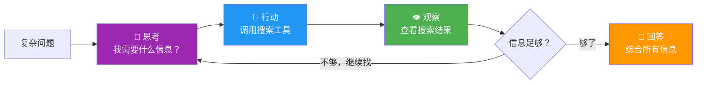
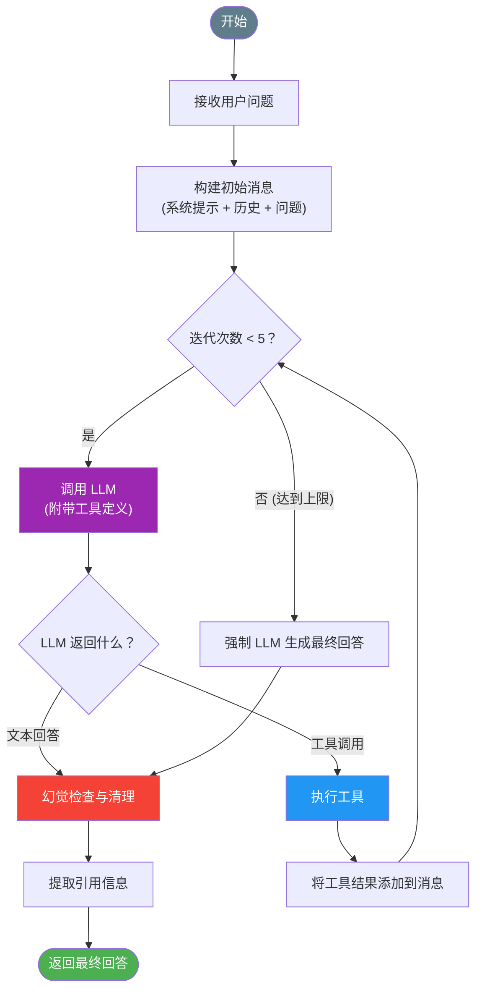
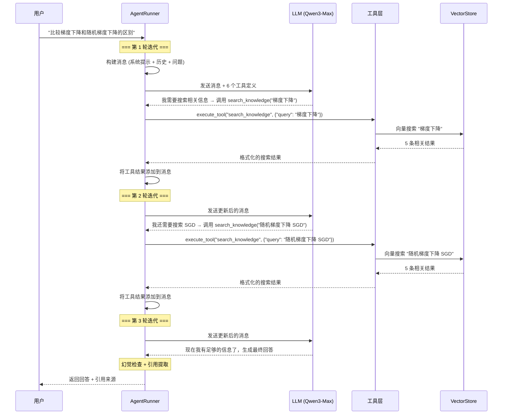
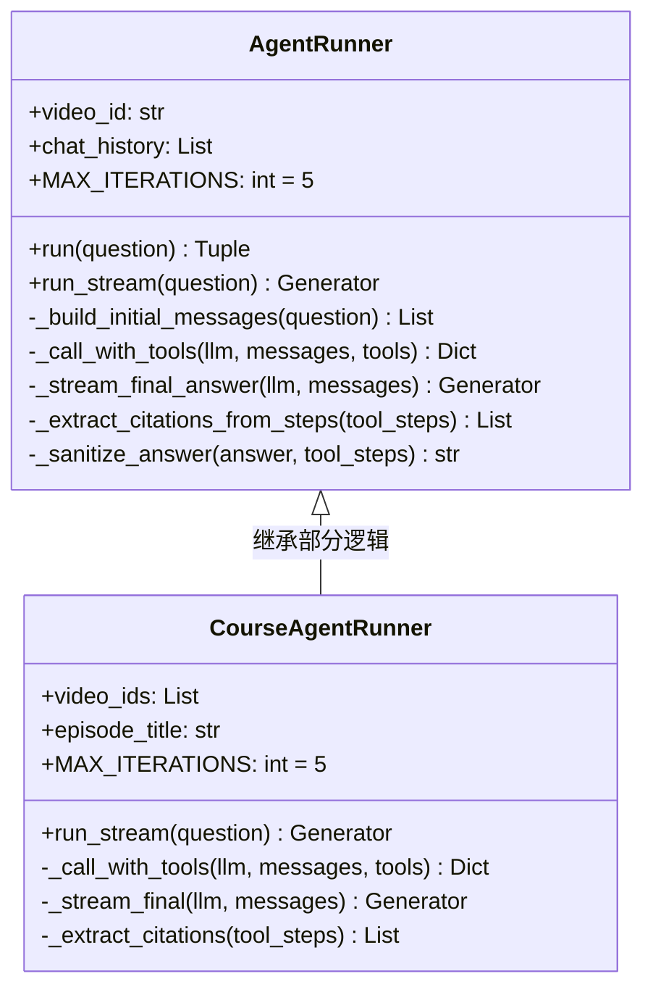
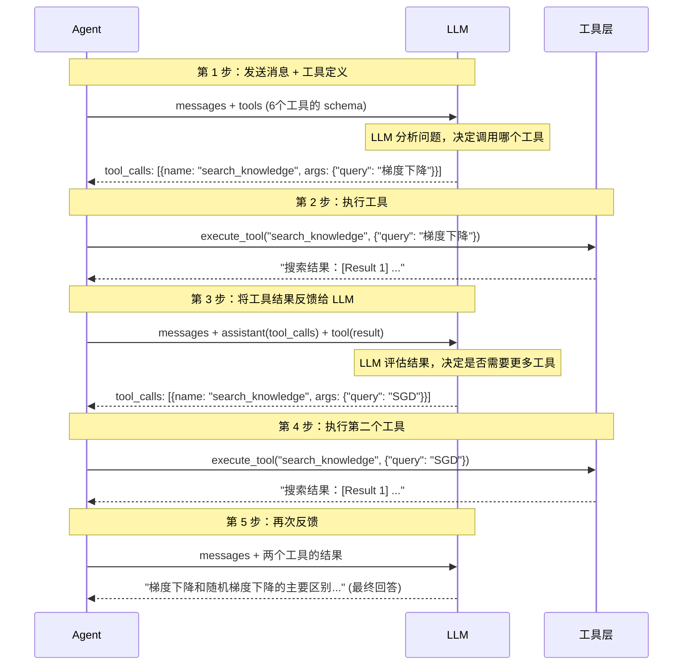
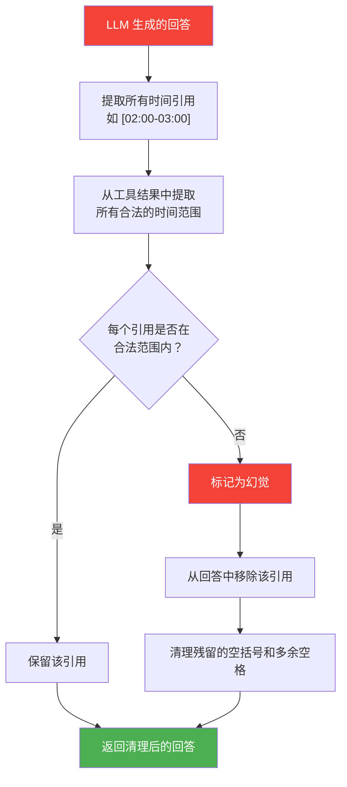
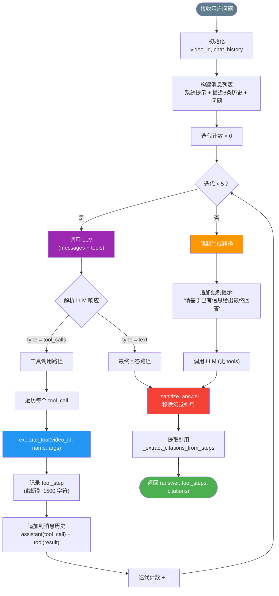
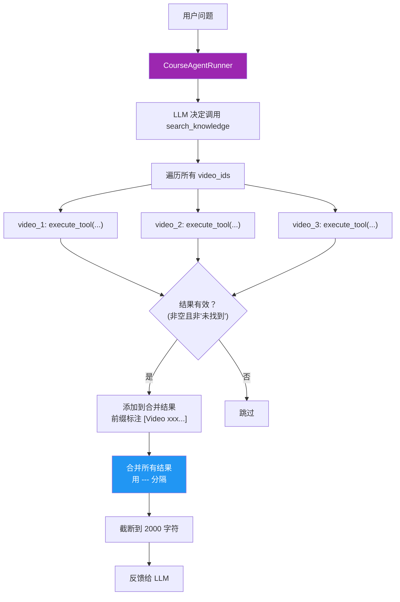

# Agent 系统 (核心)

Agent 系统是 LectureMind 中最强大、最复杂的 AI 组件。与简单的 RAG 问答不同，Agent 能够**自主推理、选择工具、多步执行**，处理需要交叉引用多个信息源的复杂问题。

:::info 本章是最详细的章节
本章将深入剖析 Agent 系统的每一个设计细节，包括 ReAct 循环、工具调用流程、幻觉防护、引用提取等。建议先阅读 [RAG 引擎](./rag-engine.md) 了解基础知识。
:::

---

## 什么是 AI Agent？

### 给初学者的解释

传统的 AI 像一个"只能回答问题的学生"——你问什么，它凭记忆回答什么。

AI Agent 像一个"会做研究的助手"——面对复杂问题，它会：

1. **思考** — 分析问题，决定需要什么信息
2. **行动** — 主动去查找资料（调用工具）
3. **观察** — 查看找到的资料
4. **再思考** — 判断信息是否足够，是否需要继续查找
5. **回答** — 综合所有信息，给出完整回答



### Agent vs 传统 RAG

| 对比 | 传统 RAG | Agent |
|------|---------|-------|
| 工作方式 | 一次检索 + 生成 | 多轮推理 + 工具调用 |
| 工具使用 | 无 | 6 种专用工具 |
| 推理能力 | 无 | 多步推理、自我纠正 |
| 信息来源 | 单次向量搜索 | 多种工具、多次调用 |
| 适用场景 | 简单概念查询 | 复杂分析、对比、综合 |

---

## ReAct 模式详解

LectureMind 的 Agent 使用 **ReAct (Reasoning + Acting)** 模式，这是当前最流行的 AI Agent 架构之一。

### ReAct 循环



### 一次典型的 Agent 交互

让我们追踪一个完整的例子：**"比较梯度下降和随机梯度下降的区别"**



---

## AgentRunner 类深度解析

### 类结构



### 构造与初始化

```python
class AgentRunner:
    MAX_ITERATIONS = 5  # 最大迭代次数，防止无限循环

    def __init__(self, video_id: str, chat_history=None):
        self.video_id = video_id        # 限定在哪个视频内搜索
        self.chat_history = chat_history or []
```

**MAX_ITERATIONS = 5 的含义：**
- Agent 最多进行 5 轮"思考 → 工具调用"的循环
- 超过 5 轮后，强制 LLM 基于已有信息生成最终回答
- 这是为了防止 Agent 陷入无限循环，同时控制 API 调用成本

### 消息构建

```python
def _build_initial_messages(self, question: str):
    messages = [
        {"role": "system", "content": AGENT_SYSTEM_PROMPT}  # 系统提示
    ]
    # 添加最近 6 条对话历史
    for msg in self.chat_history[-6:]:
        messages.append({"role": msg["role"], "content": msg["content"]})
    # 添加当前问题
    messages.append({"role": "user", "content": question})
    return messages
```

消息结构如下：

```
┌─ system ──────────────────────────────────────────────┐
│  Agent 系统提示词（详见下方解读）                        │
├─ history (最近 6 条) ─────────────────────────────────┤
│  user: "什么是梯度下降？"                               │
│  assistant: "梯度下降是一种优化算法..."                   │
├─ user ────────────────────────────────────────────────┤
│  "比较梯度下降和随机梯度下降的区别"                       │
└───────────────────────────────────────────────────────┘
```

---

## LLM 工具调用机制

### _call_with_tools 方法

这是 Agent 与 LLM 交互的核心方法。它使用 OpenAI 的 **Function Calling** 协议让 LLM 能够"选择使用工具"。

```python
def _call_with_tools(self, llm, messages, tools):
    kwargs = {
        "model": llm.model,
        "messages": messages,
        "temperature": 0.3,       # 低温度 = 更确定性的输出
        "max_tokens": 2048,
    }
    if tools:
        kwargs["tools"] = tools           # 传入工具定义
        kwargs["tool_choice"] = "auto"    # 让 LLM 自主决定是否使用工具

    response = llm._client.chat.completions.create(**kwargs)
    choice = response.choices[0]

    if choice.message.tool_calls:
        # LLM 决定调用工具
        return {"type": "tool_calls", "tool_calls": [...]}
    else:
        # LLM 直接返回文本回答
        return {"type": "text", "content": choice.message.content}
```

### Function Calling 协议



### 消息历史的累积

随着迭代进行，消息历史不断增长：

```
轮次 1:
  [system] Agent 系统提示
  [user]   比较梯度下降和SGD的区别

轮次 2:
  [system] Agent 系统提示
  [user]   比较梯度下降和SGD的区别
  [assistant] tool_calls: search_knowledge("梯度下降")
  [tool]   搜索结果: [Result 1] (knowledge_point) "梯度下降" ...

轮次 3:
  [system] Agent 系统提示
  [user]   比较梯度下降和SGD的区别
  [assistant] tool_calls: search_knowledge("梯度下降")
  [tool]   搜索结果: ...
  [assistant] tool_calls: search_knowledge("SGD")
  [tool]   搜索结果: ...
```

:::warning 结果截断
每次工具调用的结果会被截断到 1500 个字符（`result[:1500]`），以防止消息历史过长导致超出 LLM 的上下文窗口。
:::

---

## Agent 系统提示词解读

Agent 的系统提示词是其行为的核心指令。让我们逐段解读：

```
You are an expert teaching assistant for a video lecture.
You help students understand lecture content by using
available tools to find relevant information before answering.
```

**角色定义：** 将 LLM 定位为课程助教，明确其职责是"先查资料再回答"。

---

```
## Your Process:
1. **Analyze** the student's question to understand what information you need
2. **Select the right tool** based on question type
3. **Search** the lecture content using the appropriate tool
4. **Synthesize** the retrieved information into a clear, educational answer
```

**工作流程：** 明确了四步工作法 — 分析、选工具、搜索、综合。

---

```
## Tool Selection Guidelines:

**Use `search_slides` for:**
- Course logistics: tutors, teaching assistants, office hours
- Contact information: emails, phone numbers, office locations
...

**Use `search_knowledge` for:**
- Conceptual questions: definitions, explanations, theories
- Technical topics: algorithms, methods, frameworks
...
```

**工具选择指南：** 教 LLM 在什么情况下使用什么工具。这是 Agent 行为质量的关键。

---

```
## Rules:
- ALWAYS use at least one tool before answering
- NEVER fabricate section names, timestamps, or specific examples
- If retrieved content doesn't contain specific timestamps, do not invent them
```

**行为约束：**
- **强制使用工具** — 防止 LLM 直接凭记忆回答（可能产生幻觉）
- **禁止编造** — 防止 LLM 编造不存在的时间戳、章节名等

---

```
## Citation Guidelines:
- Only cite specific timestamps [MM:SS] if they appear in the tool results
- If no specific timestamps are available, provide a general answer without fabricated citations
```

**引用规范：** 只引用工具结果中实际存在的时间戳，没有就不引用。

---

## 幻觉防护机制 (_sanitize_answer)

即使有系统提示词约束，LLM 仍然可能"编造"不存在的引用。`_sanitize_answer` 方法是最后一道防线：



**工作原理：**

1. 用正则表达式从 LLM 回答中提取所有时间引用（如 `at 02:00-03:00`、`[02:00-03:00]`）
2. 从工具调用结果中提取所有合法的时间范围
3. 检查每个引用是否在合法范围内
4. 移除不合法的引用，并清理残留的格式符号

```python
# 示例：LLM 编造了一个不存在的时间引用
answer = "梯度下降在 [05:30-06:00] 被详细讲解，SGD 在 [10:00-11:00] 讨论。"

# 工具结果中实际只有 02:00-03:00 和 08:00-09:00
valid_ranges = {"02:00-03:00", "08:00-09:00"}

# 清理后：
# "梯度下降在 被详细讲解，SGD 在 讨论。" → 清理空格 → "梯度下降被详细讲解，SGD讨论。"
```

---

## 引用提取机制

Agent 从工具调用结果中自动提取引用信息，支持三种工具的引用格式：

### search_knowledge 引用

从格式化的搜索结果中提取：

```
[Result 1] (knowledge_point) "梯度下降算法" [02:00 - 03:00] (relevance: 0.85)
```

正则匹配模式：`\[Result \d+\]\s*\((\w+)\)\s*"([^"]+)"\s*\[(\d+:\d+)\s*-\s*(\d+:\d+)\]`

### search_slides 引用

从幻灯片搜索结果中提取：

```
[Slide 1] [02:30] (relevance: 0.90)
```

正则匹配模式：`\[Slide(?:\s+\d+)?\s*@?\s*(\d+:\d+)\]`

### get_section_details 引用

从章节详情中提取：

```
## Section 2: 梯度下降算法
Time: 02:00 - 05:30
```

正则匹配模式：`Time:\s*(\d+:\d+)\s*-\s*(\d+:\d+)`

---

## 流式事件 (Streaming Events)

Agent 的流式模式会产出多种事件类型，前端可以据此展示丰富的交互效果：

```python
# 流式调用示例
for event in run_agent_stream(video_id, question, chat_history):
    print(event)
```

### 事件类型详解

| 事件类型 | 触发时机 | 数据格式 | 前端展示 |
|---------|---------|---------|---------|
| `thinking` | 每轮迭代开始 | `{"thought": "分析问题 (步骤 1)..."}` | 显示"思考中"动画 |
| `tool_call` | LLM 决定调用工具 | `{"tool": "search_knowledge", "args": {"query": "..."}}` | 显示正在搜索... |
| `tool_result` | 工具执行完成 | `{"tool": "search_knowledge", "result": "截断的结果..."}` | 显示搜索结果摘要 |
| `token` | 最终回答生成中 | `{"token": "梯度"}` | 逐字显示回答 |
| `citations` | 回答生成完成 | `{"citations": [...]}` | 显示引用来源面板 |
| `done` | 整个流程结束 | `{"tool_steps": [...]}` | 移除加载状态 |

### 事件流示例

```json
{"event": "thinking", "data": {"thought": "分析问题 (步骤 1)..."}}
{"event": "tool_call", "data": {"tool": "search_knowledge", "args": {"query": "梯度下降"}}}
{"event": "tool_result", "data": {"tool": "search_knowledge", "result": "[Result 1] (knowledge_point)..."}}
{"event": "thinking", "data": {"thought": "分析问题 (步骤 2)..."}}
{"event": "tool_call", "data": {"tool": "search_knowledge", "args": {"query": "随机梯度下降 SGD"}}}
{"event": "tool_result", "data": {"tool": "search_knowledge", "result": "[Result 1] (knowledge_point)..."}}
{"event": "thinking", "data": {"thought": "撰写回答..."}}
{"event": "token", "data": {"token": "梯"}}
{"event": "token", "data": {"token": "度"}}
{"event": "token", "data": {"token": "下降"}}
...
{"event": "citations", "data": {"citations": [{"source_num": 1, "title": "梯度下降", ...}]}}
{"event": "done", "data": {"tool_steps": [{"tool": "search_knowledge", "args": {...}, "result": "..."}]}}
```

---

## 达到最大迭代次数时的处理

如果 5 轮迭代后 LLM 仍在调用工具（没有生成最终回答），Agent 会强制要求 LLM 生成最终回答：

```python
# 添加一条强制提示
messages.append({
    "role": "user",
    "content": "Please provide your final answer based on all the information gathered so far."
})

# 不传入 tools，强制 LLM 生成文本而非调用工具
response = self._call_with_tools(llm, messages, tools=[])
```

这是一个关键的安全机制：
- 防止 Agent 陷入无限循环
- 确保用户始终能得到一个回答
- 5 次迭代已经收集了足够的信息

---

## 完整决策树

下图展示了 Agent 从接收问题到返回回答的完整决策流程：



---

## AgentRunner vs 课程 Agent (CourseAgentRunner)

除了针对单个视频的 `AgentRunner`，LectureMind 还提供了 `CourseAgentRunner` 用于跨视频搜索。

### CourseAgentRunner 特点

| 特性 | AgentRunner | CourseAgentRunner |
|------|------------|-------------------|
| 搜索范围 | 单个视频 | 课程内所有视频 |
| 构造参数 | `video_id` | `video_ids`, `episode_title` |
| 工具执行 | 搜索一个视频 | 遍历所有视频，合并结果 |
| 系统提示 | 标准教学助手 | 强调跨视频对比分析 |
| 使用场景 | "第3讲中什么是梯度下降？" | "比较第3讲和第5讲中的优化算法" |

### 跨视频搜索机制



**代码逻辑：**

```python
# CourseAgentRunner 的工具执行逻辑
combined_results = []
for vid in self.video_ids:
    result = execute_tool(vid, tool_name, args)
    # 过滤无效结果
    if result and "not found" not in result.lower() \
       and "no relevant" not in result.lower():
        combined_results.append(f"[Video {vid[:8]}...] {result[:500]}")

# 合并结果
merged = "\n\n---\n\n".join(combined_results)
```

---

## 代码走读：Agent 主循环

让我们逐行走读 `AgentRunner.run()` 方法的核心逻辑：

```python
def run(self, question):
    # 1. 初始化
    llm = get_llm_client(model="qwen3-max")      # 使用高质量模型
    tools = make_tools(self.video_id)              # 构建 6 个工具定义
    messages = self._build_initial_messages(question)  # 构建初始消息
    tool_steps = []                                # 记录工具调用历史
    citations = []                                 # 最终引用列表

    # 2. ReAct 循环
    for iteration in range(self.MAX_ITERATIONS):   # 最多 5 轮
        response = self._call_with_tools(llm, messages, tools)

        if response["type"] == "text":
            # LLM 生成了最终回答
            raw_answer = response["content"]
            # 幻觉检查：移除不存在的引用
            sanitized_answer = self._sanitize_answer(raw_answer, tool_steps)
            # 从工具结果中提取引用
            citations = self._extract_citations_from_steps(tool_steps)
            return sanitized_answer, tool_steps, citations

        elif response["type"] == "tool_calls":
            # LLM 决定调用工具
            for tc in response["tool_calls"]:
                tool_name = tc["function"]["name"]
                args = json.loads(tc["function"]["arguments"])

                # 执行工具
                result = execute_tool(self.video_id, tool_name, args)

                # 记录工具调用步骤（截断结果）
                tool_steps.append({
                    "tool": tool_name,
                    "args": args,
                    "result": result[:1500],
                })

                # 将工具调用和结果添加到消息历史
                messages.append({
                    "role": "assistant",
                    "content": None,
                    "tool_calls": [tc],           # LLM 的工具调用请求
                })
                messages.append({
                    "role": "tool",
                    "tool_call_id": tc["id"],     # 关联到对应的调用
                    "content": result[:1500],      # 工具执行结果
                })

    # 3. 达到最大迭代次数
    messages.append({
        "role": "user",
        "content": "Please provide your final answer..."
    })
    # 不传 tools，强制生成文本
    response = self._call_with_tools(llm, messages, [])
    raw_answer = response.get("content", "I was unable to find a complete answer.")
    sanitized_answer = self._sanitize_answer(raw_answer, tool_steps)
    citations = self._extract_citations_from_steps(tool_steps)
    return sanitized_answer, tool_steps, citations
```

---

## 便捷函数

LectureMind 提供了两个便捷函数来简化 Agent 的使用：

### run_agent — 非流式调用

```python
from api.agent_graph import run_agent

answer, tool_steps, citations = run_agent(
    video_id="abc-123",
    question="比较梯度下降和SGD的区别",
    chat_history=[
        {"role": "user", "content": "什么是梯度下降？"},
        {"role": "assistant", "content": "梯度下降是..."},
    ],
)

print("回答:", answer)
print("工具调用步骤:", len(tool_steps))
print("引用来源:", len(citations))
```

### run_agent_stream — 流式调用

```python
from api.agent_graph import run_agent_stream

for event in run_agent_stream(
    video_id="abc-123",
    question="比较梯度下降和SGD的区别",
):
    event_type = event["event"]
    data = event["data"]

    if event_type == "thinking":
        print(f"[思考] {data['thought']}")
    elif event_type == "tool_call":
        print(f"[工具调用] {data['tool']}({data['args']})")
    elif event_type == "tool_result":
        print(f"[工具结果] {data['result'][:100]}...")
    elif event_type == "token":
        print(data["token"], end="", flush=True)
    elif event_type == "citations":
        print(f"\n[引用] {len(data['citations'])} 条来源")
    elif event_type == "done":
        print(f"\n[完成] 共 {len(data['tool_steps'])} 次工具调用")
```

### run_course_agent_stream — 跨视频流式调用

```python
from api.agent_graph import run_course_agent_stream

for event in run_course_agent_stream(
    video_ids=["video-1", "video-2", "video-3"],
    episode_title="机器学习导论",
    question="这门课中不同章节对优化算法的讲解有什么不同？",
):
    # 处理事件同上
    ...
```

---

## RAG vs Agent 完整对比

| 维度 | RAG 模式 | Agent 模式 | 课程 Agent |
|------|---------|-----------|-----------|
| **检索方式** | 单次向量搜索 | 多轮工具调用 | 跨视频多轮调用 |
| **工具数量** | 0 | 6 种 | 6 种（跨视频） |
| **最大迭代** | 1 | 5 | 5 |
| **LLM 调用次数** | 1 | 1-6 | 1-6 |
| **响应速度** | 快 (2-5s) | 中等 (5-15s) | 较慢 (10-20s) |
| **幻觉防护** | 依赖提示词 | 提示词 + _sanitize_answer | 提示词 |
| **引用来源** | 向量搜索结果 | 工具调用结果 | 跨视频工具结果 |
| **适用问题** | 简单概念查询 | 复杂分析性问题 | 跨课程对比 |
| **资源消耗** | 低 | 中 | 高 |
| **代码位置** | `rag_engine.py` | `agent_graph.py` | `agent_graph.py` |

:::tip 选择建议
- 大多数日常问题用 **RAG 模式** 就够了，速度快且准确
- 需要查找课件信息、比较多个概念、深入分析时用 **Agent 模式**
- 需要跨视频对比时用 **课程 Agent**
:::
