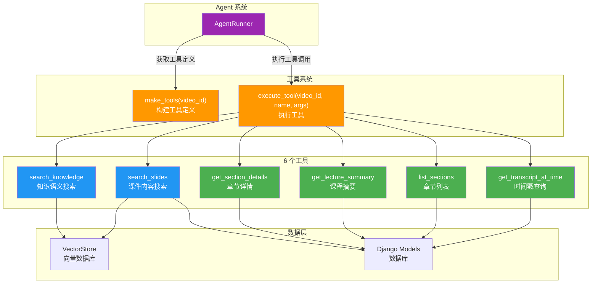
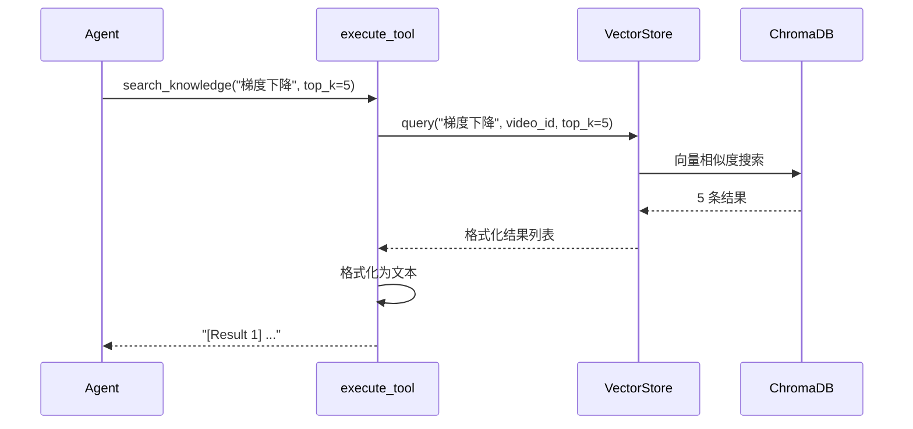
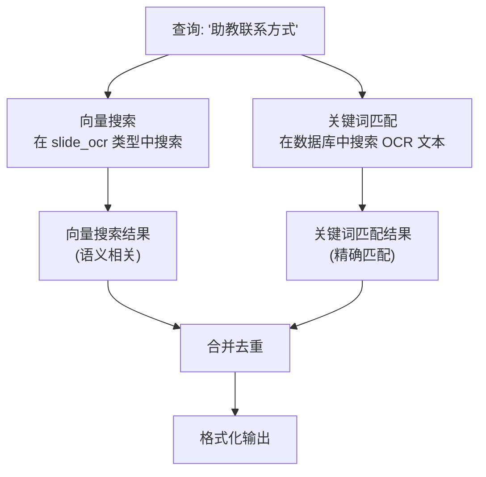
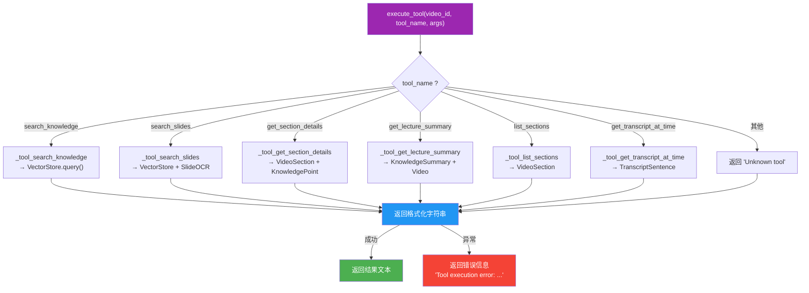

# Agent 工具详解

Agent 工具是 Agent 系统的"手和脚"——它们让 LLM 从"只能说"变成"能做"。每个工具封装了一种特定的查询能力，Agent 根据问题类型自主选择合适的工具。

---

## 工具系统架构



### 工具定义与执行分离

LectureMind 的工具系统采用**定义与执行分离**的设计：

- **`make_tools(video_id)`** — 生成 OpenAI Function Calling 格式的工具定义（JSON Schema），供 LLM 理解每个工具的用途和参数
- **`execute_tool(video_id, tool_name, args)`** — 根据工具名称执行实际的数据库/向量库查询，返回格式化的字符串结果

```python
# 1. 构建工具定义（传给 LLM）
tools = make_tools("video-abc-123")

# 2. 执行工具（Agent 循环中调用）
result = execute_tool("video-abc-123", "search_knowledge", {"query": "梯度下降"})
```

### 视频作用域

所有工具都通过 `video_id` 参数限定在特定视频范围内。这意味着：
- 搜索只返回该视频的内容
- 章节列表只显示该视频的章节
- 时间戳查询只在该视频的时间轴上定位

---

## 工具 Schema 格式

所有工具遵循 **OpenAI Function Calling** 标准格式：

```json
{
    "type": "function",
    "function": {
        "name": "search_knowledge",
        "description": "Semantic search over the lecture's knowledge points...",
        "parameters": {
            "type": "object",
            "properties": {
                "query": {
                    "type": "string",
                    "description": "The search query..."
                },
                "top_k": {
                    "type": "integer",
                    "description": "Number of results to return",
                    "default": 5
                }
            },
            "required": ["query"]
        }
    }
}
```

这个格式让 LLM 能够理解：
- 工具的名称和用途（`name`, `description`）
- 需要传入哪些参数（`parameters.properties`）
- 哪些参数是必须的（`required`）

---

## 工具总览

| 工具名称 | 用途 | 必需参数 | 可选参数 | 数据来源 |
|---------|------|---------|---------|---------|
| `search_knowledge` | 语义搜索知识点和文字稿 | `query` | `top_k` | VectorStore |
| `search_slides` | 搜索课件 OCR 内容 | `query` | `top_k` | VectorStore + DB |
| `get_section_details` | 获取章节完整详情 | `section_order` | - | DB |
| `get_lecture_summary` | 获取课程整体摘要 | - | - | DB |
| `list_sections` | 列出所有章节 | - | - | DB |
| `get_transcript_at_time` | 查询特定时间点的文字稿 | `time_seconds` | `window_seconds` | DB |

---

## 工具详解

### 1. search_knowledge — 知识语义搜索

**用途：** 对知识点和文字稿进行语义搜索。这是最常用的工具，适合回答概念性、学术性问题。

**适用场景：**
- "什么是梯度下降？"
- "反向传播是如何工作的？"
- "讲义中如何解释学习率？"

**参数：**

| 参数 | 类型 | 必需 | 默认值 | 说明 |
|------|------|------|-------|------|
| `query` | string | 是 | - | 搜索查询，可以是概念、术语或问题 |
| `top_k` | integer | 否 | 5 | 返回结果数量 |

**返回格式：**

```
[Result 1] (knowledge_point) "梯度下降算法" [02:00 - 03:00] (relevance: 0.85)
梯度下降是一种迭代优化算法，通过沿损失函数梯度的反方向更新参数来逐步
逼近最优解。学习率 α 控制每步更新的幅度...

[Result 2] (transcript) "Section 2: 优化基础" [03:15 - 04:00] (relevance: 0.78)
接下来我们讨论梯度下降的具体实现。首先我们定义损失函数...
```

**内部流程：**



**代码实现：**

```python
def _tool_search_knowledge(video_id, query, top_k=5):
    store = get_vector_store()
    results = store.query(query_text=query, video_id=video_id, top_k=top_k)

    if not results:
        return "No relevant results found for this query."

    lines = []
    for i, r in enumerate(results):
        meta = r.get("metadata", {})
        title = meta.get("title", "Unknown")
        begin = float(meta.get("begin_time", 0))
        end = float(meta.get("end_time", 0))
        ctype = meta.get("type", "unknown")
        relevance = r.get("relevance", 0)
        text = r.get("text", "")[:400]

        lines.append(
            f"[Result {i+1}] ({ctype}) \"{title}\" "
            f"[{format_time(begin)} - {format_time(end)}] "
            f"(relevance: {relevance:.2f})\n{text}"
        )
    return "\n\n".join(lines)
```

---

### 2. search_slides — 课件内容搜索

**用途：** 搜索从幻灯片截图中 OCR 提取的文字内容。采用**向量搜索 + 关键词匹配**的混合策略。

**适用场景：**
- "这门课的助教是谁？"（通常在第一张幻灯片上）
- "作业截止日期是什么时候？"
- "课件上展示的那个表格内容是什么？"

**参数：**

| 参数 | 类型 | 必需 | 默认值 | 说明 |
|------|------|------|-------|------|
| `query` | string | 是 | - | 搜索关键词 |
| `top_k` | integer | 否 | 5 | 返回结果数量 |

**返回格式：**

```
# Slide Search Results

## Semantic Search Results:
[Slide 1] [00:30] (relevance: 0.92)
CS229 Machine Learning
Instructor: Andrew Yang
Email: ayang@university.edu
Office Hours: Tue/Thu 2:00-3:30 PM

[Slide 2] [01:15] (relevance: 0.85)
Course Schedule: Week 1-3 Linear Regression...

## Keyword Matching Results:
[Slide @ 00:30]
CS229 Machine Learning
Instructor: Andrew Yang
Email: ayang@university.edu
Office: Room 302, Building B
```

**混合搜索策略：**



**为什么需要混合搜索？**

| 搜索方式 | 优势 | 劣势 |
|---------|------|------|
| 向量搜索 | 理解语义（"联系方式" 能匹配 "email"） | 可能漏掉精确匹配 |
| 关键词匹配 | 精确匹配（"ayang@university.edu"） | 不理解语义 |
| 混合搜索 | 兼顾语义和精确 | 结果可能有重叠 |

---

### 3. get_section_details — 章节详情

**用途：** 获取某个章节的完整信息，包括时间范围、完整文字稿、以及该章节的所有知识点。

**适用场景：**
- "第二章详细讲了什么？"
- "请给我第三章的完整内容"
- "某个章节有哪些知识点？"

**参数：**

| 参数 | 类型 | 必需 | 说明 |
|------|------|------|------|
| `section_order` | integer | 是 | 章节序号（从 0 开始） |

**返回格式：**

```
## Section 2: 梯度下降算法
Time: 02:00 - 05:30

### Transcript:
接下来我们讨论梯度下降算法。梯度下降是一种迭代优化方法...
（完整文字稿，最多 2000 字符）

### Knowledge Points:
- **梯度下降** (importance: 0.9)
  梯度下降通过沿梯度反方向更新参数来最小化损失函数
  Key terms: 梯度, 学习率, 损失函数, 迭代优化

- **学习率选择** (importance: 0.7)
  学习率过大会导致震荡，过小会导致收敛缓慢
  Key terms: 学习率, 收敛, 震荡
```

---

### 4. get_lecture_summary — 课程摘要

**用途：** 获取视频的整体摘要信息，包括概述、关键主题、学习目标、先修要求和难度级别。

**适用场景：**
- "这节课讲了什么？"
- "这门课的难度如何？"
- "学习这节课需要什么基础？"

**参数：** 无

**返回格式：**

```
# Lecture Summary: 机器学习导论 - 第3讲

**Overview:** 本节课介绍了机器学习中的优化算法，包括梯度下降及其变体，
讲解了学习率的选择策略和收敛性分析。

**Key Topics:** 梯度下降, 随机梯度下降, 学习率, 收敛性

**Learning Objectives:**
- 理解梯度下降算法的数学原理
- 掌握学习率的选择方法
- 了解 SGD 与批量梯度下降的区别

**Prerequisites:** 线性代数基础, 微积分（偏导数）

**Difficulty Level:** 中等
```

---

### 5. list_sections — 章节列表

**用途：** 列出视频的所有章节及其时间范围和知识点数量。用于了解视频的整体结构。

**适用场景：**
- "这节课有哪些章节？"
- "关于 XX 的内容在哪个章节？"
- "帮我了解一下这节课的结构"

**参数：** 无

**返回格式：**

```
# Lecture Sections

- **Section 0:** 课程介绍 [00:00 - 02:00] (2 knowledge points)
- **Section 1:** 线性回归回顾 [02:00 - 08:30] (5 knowledge points)
- **Section 2:** 梯度下降算法 [08:30 - 15:00] (4 knowledge points)
- **Section 3:** 随机梯度下降 [15:00 - 22:00] (3 knowledge points)
- **Section 4:** 学习率与收敛性 [22:00 - 30:00] (4 knowledge points)
- **Section 5:** 课程总结 [30:00 - 32:00] (1 knowledge point)
```

---

### 6. get_transcript_at_time — 时间戳查询

**用途：** 获取视频特定时间点前后的一段文字稿。用于精确定位某个时刻的讲话内容。

**适用场景：**
- "15分30秒左右说了什么？"
- "视频开头讲了什么？"
- "最后几分钟的总结是什么？"

**参数：**

| 参数 | 类型 | 必需 | 默认值 | 说明 |
|------|------|------|-------|------|
| `time_seconds` | number | 是 | - | 目标时间点（秒） |
| `window_seconds` | number | 否 | 30 | 上下文窗口（秒） |

**返回格式：**

```
# Transcript around 15:30 (window: 30s)

[15:15] 随机梯度下降和批量梯度下降的核心区别在于...
[15:22] 批量梯度下降每次使用全部训练数据计算梯度...
[15:30] 而随机梯度下降每次只使用一个样本...
[15:38] 这样做的好处是计算速度快，但梯度估计会有噪声...
[15:45] 在实践中，我们通常使用小批量梯度下降作为折中方案...
```

**时间窗口示意：**

```
        ← 15秒 → [目标时间] ← 15秒 →
    |-----------|-----15:30-----|-----------|
    15:15       15:30           15:45

    返回这个范围内的所有文字稿句子
```

---

## 工具执行流程

当 Agent 调用工具时，`execute_tool` 函数负责路由和执行：



**错误处理：** 每个工具调用都被 `try-except` 包裹。如果工具执行失败，不会导致 Agent 崩溃，而是返回错误信息字符串，LLM 可以据此调整策略。

---

## 工具选择指南

Agent 的系统提示词中包含了详细的工具选择指南。下表总结了 LLM 如何选择工具：

| 问题类型 | 推荐工具 | 示例问题 |
|---------|---------|---------|
| 概念解释 | `search_knowledge` | "什么是梯度下降？" |
| 技术方法 | `search_knowledge` | "反向传播是怎么实现的？" |
| 课程后勤信息 | `search_slides` | "助教的邮箱是什么？" |
| 作业/考试安排 | `search_slides` | "期中考试是什么时候？" |
| 图表/表格内容 | `search_slides` | "课件上的 ROC 曲线是什么样的？" |
| 课程概览 | `get_lecture_summary` | "这节课主要讲了什么？" |
| 课程结构 | `list_sections` | "这节课有哪些章节？" |
| 某章节详情 | `get_section_details` | "第三章的完整内容是什么？" |
| 特定时间内容 | `get_transcript_at_time` | "10分20秒说了什么？" |

:::tip 工具组合使用
复杂问题往往需要多个工具配合。例如"比较梯度下降和 SGD"：
1. 先用 `search_knowledge("梯度下降")` 搜索梯度下降的内容
2. 再用 `search_knowledge("随机梯度下降 SGD")` 搜索 SGD 的内容
3. 综合两次搜索结果生成对比回答
:::
