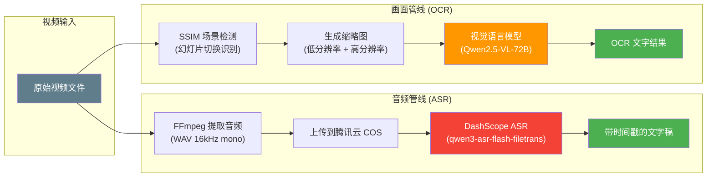
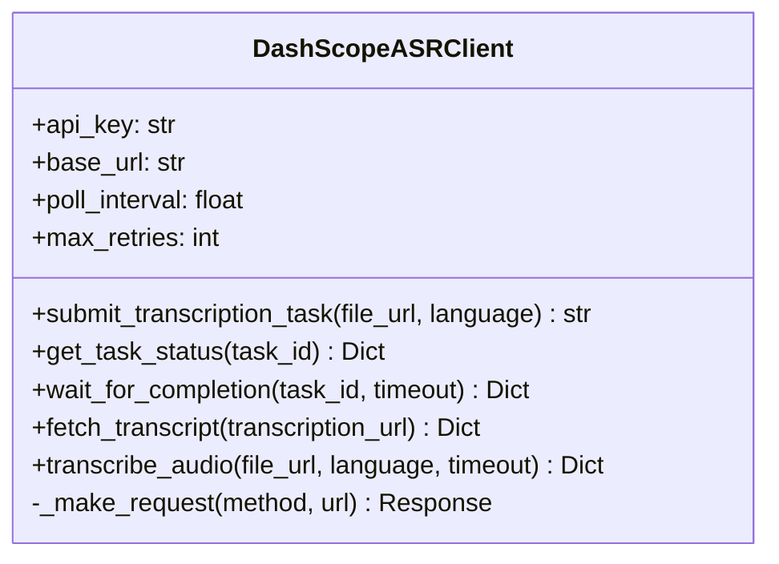
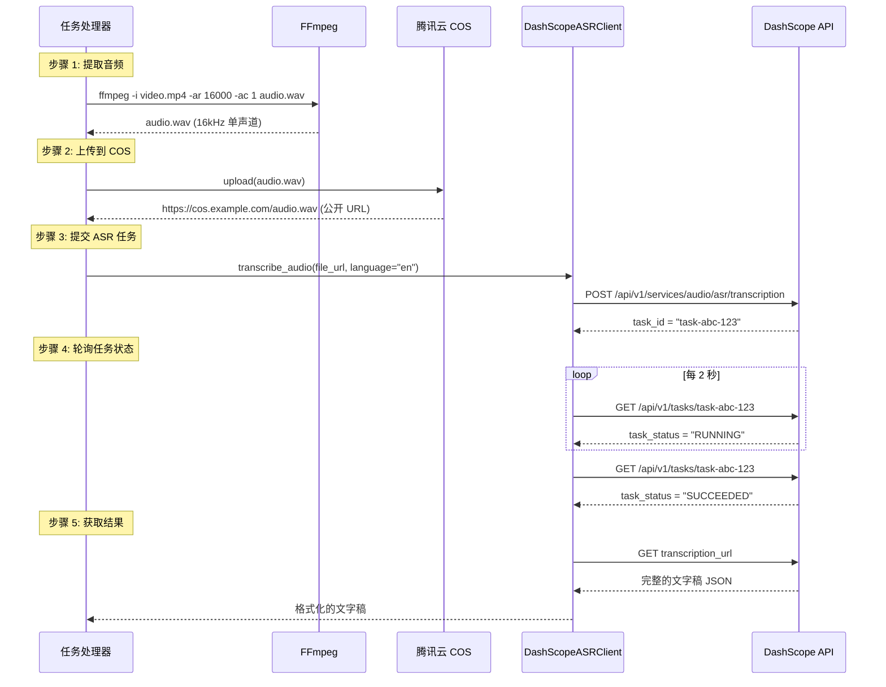
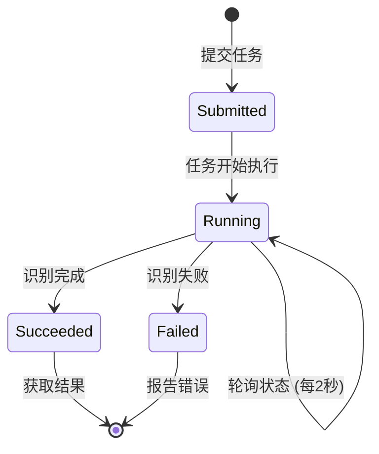
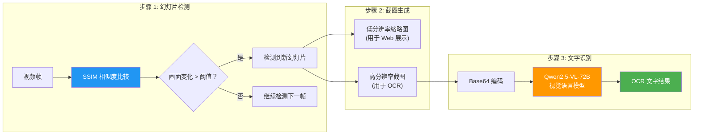
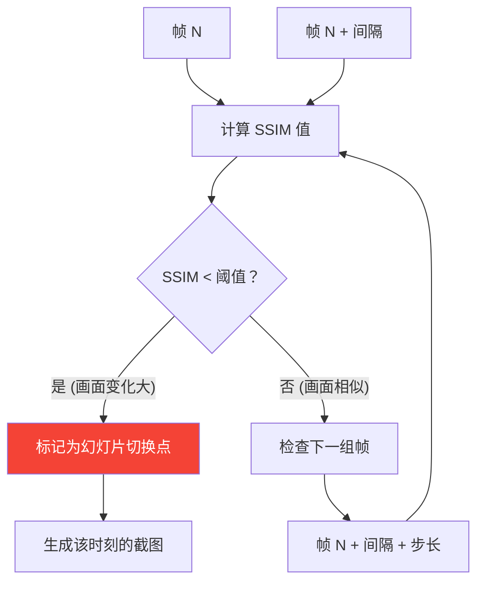
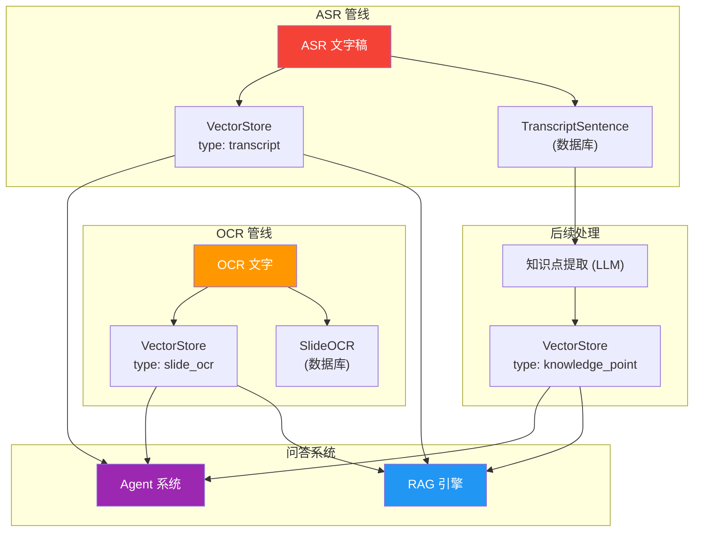

# ASR 与 OCR

ASR（自动语音识别）和 OCR（光学字符识别）是 LectureMind 数据处理管线中的关键 AI 能力。它们将视频中的音频和画面转化为可搜索、可引用的文本数据。

---

## 整体流程概览



---

## ASR：自动语音识别

### 什么是 ASR？

ASR (Automatic Speech Recognition) 是将语音转换为文字的技术。LectureMind 使用它来生成视频的完整文字稿（transcript），这是后续知识提取、章节分割、向量搜索的基础。

### 技术方案

| 组件 | 技术 | 说明 |
|------|------|------|
| 音频提取 | FFmpeg | 从视频中提取音频 |
| 音频格式 | WAV 16kHz mono | DashScope ASR 要求的标准格式 |
| 文件存储 | 腾讯云 COS | 对象存储，提供公开 URL |
| ASR 模型 | `qwen3-asr-flash-filetrans` | 阿里云 DashScope 的 ASR 模型 |
| API 类型 | 异步任务 | 提交 → 轮询 → 获取结果 |

### DashScopeASRClient 架构



### ASR 完整流程



### ASR 输出格式

DashScope ASR 返回的文字稿包含句子级别的时间戳信息：

```json
{
    "transcription": {
        "sentences": [
            {
                "text": "Welcome to today's lecture on machine learning.",
                "begin_time": 1200,
                "end_time": 4800
            },
            {
                "text": "We'll start by reviewing linear regression.",
                "begin_time": 5100,
                "end_time": 8200
            }
        ]
    }
}
```

:::info 时间单位
DashScope ASR 返回的时间戳单位是**毫秒 (ms)**。在存储到数据库时会进行转换。
:::

### 异步任务机制

ASR 使用异步任务模式，因为语音识别可能需要较长时间（几分钟到几十分钟）：



**超时处理：** `wait_for_completion` 支持设置超时时间。如果在指定时间内任务未完成，抛出 `TimeoutError`。

**重试机制：** HTTP 请求支持最多 3 次重试（`max_retries=3`），用于处理网络抖动等瞬时故障。

### 代码示例

```python
from api.dashscope_asr import DashScopeASRClient

# 初始化客户端
client = DashScopeASRClient(
    api_key="your-dashscope-key",
    region="beijing",         # 或 "singapore"
    poll_interval=2.0,        # 每 2 秒轮询一次
    max_retries=3,            # HTTP 请求最多重试 3 次
)

# 方式 1: 一站式调用
transcript = client.transcribe_audio(
    file_url="https://cos.example.com/lecture.wav",
    language="en",
    timeout=600.0,  # 最多等待 10 分钟
)

# 方式 2: 分步调用
task_id = client.submit_transcription_task(
    file_url="https://cos.example.com/lecture.wav",
    language="en",
)
result = client.wait_for_completion(task_id, timeout=600.0)
transcription_url = result["output"]["result"]["transcription_url"]
transcript = client.fetch_transcript(transcription_url)
```

### 配置参数

| 参数 | 说明 | 默认值 |
|------|------|-------|
| `api_key` | DashScope API 密钥（或从环境变量 `DASHSCOPE_API_KEY` 读取） | 必需 |
| `region` | API 区域，`"beijing"` 或 `"singapore"` | `"beijing"` |
| `poll_interval` | 轮询间隔（秒） | `2.0` |
| `max_retries` | HTTP 请求最大重试次数 | `3` |

| ASR 参数 | 说明 | 默认值 |
|---------|------|-------|
| `language` | 语言代码 (`"en"`, `"zh"` 等) | `"en"` |
| `channel_id` | 音频通道 | `[0]` (单声道) |
| `enable_itn` | 逆文本标准化（数字 → 文字） | `False` |
| `timeout` | 最大等待时间（秒） | `None` (无限等待) |

---

## OCR：光学字符识别

### 什么是 OCR？

在 LectureMind 中，OCR 指的是从视频画面中识别课件幻灯片上的文字。这些文字可能包含课程后勤信息（助教联系方式、作业截止日期）、图表标签、公式等，是 ASR 无法覆盖的信息来源。

### 技术方案

LectureMind 的幻灯片 OCR 采用三步方案：



### 步骤 1: SSIM 幻灯片检测

**SSIM (Structural Similarity Index)** 是一种衡量两幅图像结构相似度的指标。LectureMind 用它来检测视频中幻灯片的切换时刻。

**工作原理：**



**SSIM 值含义：**
- SSIM = 1.0 — 两幅图像完全相同
- SSIM = 0.0 — 两幅图像完全不同
- 阈值通常设为 0.8-0.9 — 低于此值认为发生了幻灯片切换

### 步骤 2: 双分辨率截图

检测到幻灯片切换后，会生成两种分辨率的截图：

| 类型 | 分辨率 | 用途 | 存储位置 |
|------|--------|------|---------|
| 低分辨率缩略图 | 较小 | 前端幻灯片浏览器展示 | 媒体文件目录 |
| 高分辨率截图 | 原始分辨率 | OCR 文字识别 | 媒体文件目录 |

为什么需要两种分辨率？
- Web 展示需要快速加载，低分辨率就够了
- OCR 需要高清晰度才能准确识别文字

### 步骤 3: 视觉语言模型 OCR

LectureMind 使用 **Qwen2.5-VL-72B-Instruct** 视觉语言模型进行 OCR，而不是传统的 OCR 引擎（如 Tesseract）。

**为什么用 VL 模型做 OCR？**

| 对比 | 传统 OCR (Tesseract) | VL 模型 (Qwen2.5-VL) |
|------|---------------------|----------------------|
| 纯文字识别 | 好 | 好 |
| 表格理解 | 差 | 好 |
| 图表描述 | 不支持 | 支持 |
| 公式识别 | 有限 | 较好 |
| 布局理解 | 有限 | 好 |
| 速度 | 快 | 较慢 |
| 成本 | 免费 | 按 token 计费 |

**OCR 流程：**

```mermaid
sequenceDiagram
    participant P as 任务处理器
    participant ENC as Base64 编码器
    participant LLM as LLMClient
    participant VL as Qwen2.5-VL-72B

    P->>P: 加载高分辨率截图
    P->>ENC: 将图片编码为 Base64
    ENC-->>P: "data:image/png;base64,iVBOR..."
    P->>LLM: chat_vl(prompt, image_urls)
    LLM->>VL: 发送多模态消息 (文本 + 图片)
    VL-->>LLM: OCR 文字结果
    LLM-->>P: "CS229 Machine Learning\nInstructor: Andrew Yang..."
    P->>P: 存储到 SlideOCR 模型
```

**VL 模型的提示词：**

```python
prompt = "请提取这张幻灯片中的所有文字内容，包括标题、正文、" \
         "图表标签、页脚信息等。保持原始布局结构。"
```

**调用示例：**

```python
from api.llm_client import get_llm_client

llm = get_llm_client()
ocr_text = llm.chat_vl(
    prompt="请提取这张幻灯片中的所有文字内容。",
    image_urls=["data:image/png;base64,iVBOR..."],
    model="qwen2.5-vl-72b-instruct",
    temperature=0.3,   # 低温度 = 更稳定的输出
    max_tokens=2048,
)
```

### OCR 输出示例

**输入：** 一张课件幻灯片截图

**输出：**

```
CS229: Machine Learning
Autumn 2024

Instructor: Prof. Andrew Yang
Email: ayang@cs.university.edu
Office: Gates 238

Teaching Assistants:
- Sarah Chen (schen@cs.university.edu)
- David Kim (dkim@cs.university.edu)

Office Hours:
- Prof. Yang: Tue/Thu 2:00-3:30 PM
- Sarah: Mon/Wed 10:00-11:30 AM
- David: Fri 1:00-2:30 PM

Grading: Homework 40%, Midterm 25%, Final 35%
```

---

## ASR 与 OCR 的协同

ASR 和 OCR 产出的文本数据会被存入向量数据库，供 RAG 和 Agent 系统使用：



**信息互补：**

| 信息来源 | ASR 文字稿 | OCR 课件文字 |
|---------|-----------|-------------|
| 老师讲的话 | 包含 | 不包含 |
| 课件上的文字 | 不包含 | 包含 |
| 图表内容 | 可能口头描述 | 直接识别 |
| 联系方式 | 可能口头提及 | 通常在课件上 |
| 作业截止日期 | 可能口头提及 | 通常在课件上 |

两者结合，确保了知识库的完整性。

---

## 常见问题

### ASR 识别不准怎么办？

- 检查音频质量 — 确保原视频音质清晰
- 确认语言设置 — `language` 参数要匹配视频语言
- 检查 DashScope 配额 — 识别失败可能是 API 限制

### OCR 遗漏了课件上的文字？

- 确保使用高分辨率截图 — 低分辨率会影响识别准确率
- 检查 VL 模型配置 — 确认 `qwen2.5-vl-72b-instruct` 模型可用
- 查看幻灯片检测 — 可能该幻灯片未被 SSIM 检测到

### 处理时间太长？

- ASR 耗时主要取决于视频时长，通常 1 分钟视频需要 1-3 分钟处理
- OCR 耗时主要取决于幻灯片数量，每张约 3-10 秒
- 可以通过配置并发数来加速处理
