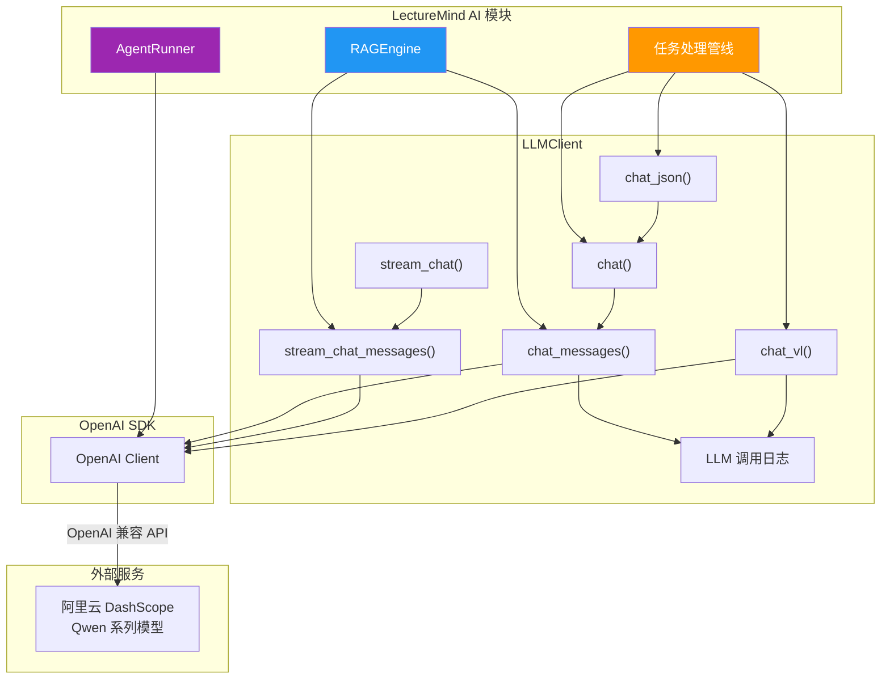
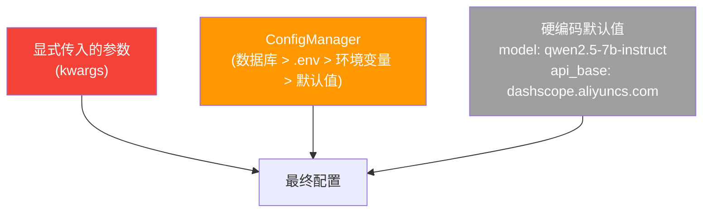

# LLM 客户端 (LLMClient)

LLMClient 是 LectureMind AI 模块的通信基础。它封装了 OpenAI Python SDK，连接阿里云 DashScope 的 Qwen 系列模型，为 RAG 引擎和 Agent 系统提供统一的 LLM 调用接口。

---

## 架构设计



---

## 初始化与配置

### 构造函数

```python
class LLMClient:
    def __init__(
        self,
        model: Optional[str] = None,        # 模型名称
        api_key: Optional[str] = None,       # API 密钥
        api_base: Optional[str] = None,      # API 地址
        temperature: float = 0.7,            # 温度参数
        max_tokens: int = 4096,              # 最大输出 token 数
    ):
```

### 配置优先级



配置优先级从高到低：

1. **显式传入参数** — 直接传给构造函数或 `get_llm_client()` 的参数
2. **ConfigManager** — 从数据库、`.env` 文件、环境变量中读取
3. **默认值** — 代码中硬编码的默认配置

### 环境变量

| 环境变量 | 说明 | 默认值 |
|---------|------|--------|
| `DASHSCOPE_API_KEY` | DashScope API 密钥 | (空) |
| `LLM_MODEL` | 默认 LLM 模型 | `qwen2.5-7b-instruct` |
| `LLM_API_BASE` | API 基础地址 | `https://dashscope.aliyuncs.com/compatible-mode/v1` |

---

## 单例模式

`get_llm_client()` 函数实现了单例模式：

```python
from api.llm_client import get_llm_client

# 无参数调用：返回全局共享的默认客户端
client = get_llm_client()

# 带参数调用：创建新客户端（不缓存）
client = get_llm_client(model="qwen3-max")

# 内部逻辑：
# 1. 如果有 kwargs → 创建新实例
# 2. 如果无 kwargs 且已有单例 → 返回现有实例
# 3. 如果无 kwargs 且无单例 → 创建并缓存
```

:::info 为什么需要单例？
- OpenAI 客户端的初始化涉及网络连接建立
- 全局共享一个客户端避免重复初始化
- 不同模型（如 chat 模型 vs VL 模型）需要不同的客户端实例
:::

---

## 方法详解

### chat — 简单聊天

最简单的接口，发送一条消息，返回完整响应。

```python
client = get_llm_client(model="qwen3-max")

response = client.chat(
    prompt="什么是梯度下降？",
    system_prompt="你是一位耐心的教学助手。",
    temperature=0.5,
    max_tokens=1024,
)
print(response)
```

**参数说明：**

| 参数 | 类型 | 说明 |
|------|------|------|
| `prompt` | str | 用户消息文本 |
| `system_prompt` | str, 可选 | 系统提示词 |
| `temperature` | float, 可选 | 温度参数，覆盖默认值 |
| `max_tokens` | int, 可选 | 最大输出 token 数 |
| `response_format` | str, 可选 | 如果为 `"json"`，请求 JSON 格式输出 |

### chat_messages — 完整消息列表聊天

支持传入完整的消息列表，用于多轮对话或 Agent 场景。

```python
messages = [
    {"role": "system", "content": "你是一位教学助手。"},
    {"role": "user", "content": "什么是梯度下降？"},
    {"role": "assistant", "content": "梯度下降是一种优化算法..."},
    {"role": "user", "content": "它和随机梯度下降有什么区别？"},
]

response = client.chat_messages(
    messages=messages,
    temperature=0.5,
    max_tokens=2048,
)
```

### stream_chat — 流式聊天（简单版）

逐 token 返回响应，适合前端实时显示。

```python
for token in client.stream_chat(
    prompt="详细解释反向传播算法",
    system_prompt="你是一位教学助手。",
    temperature=0.5,
):
    print(token, end="", flush=True)
```

### stream_chat_messages — 流式聊天（完整版）

```python
messages = [
    {"role": "system", "content": "你是一位教学助手。"},
    {"role": "user", "content": "解释反向传播"},
]

for token in client.stream_chat_messages(messages, temperature=0.5):
    print(token, end="", flush=True)
```

### chat_vl — 视觉语言模型

发送图片 + 文本，使用视觉语言模型（如 Qwen2.5-VL-72B-Instruct）进行多模态理解。主要用于课件幻灯片的 OCR 文字识别。

```python
response = client.chat_vl(
    prompt="请提取这张幻灯片中的所有文字内容。",
    image_urls=[
        "data:image/png;base64,iVBORw0KGgo...",  # Base64 编码图片
        "https://example.com/slide2.jpg",           # 或 HTTP URL
    ],
    system_prompt="你是一个 OCR 助手。",
    model="qwen2.5-vl-72b-instruct",
    temperature=0.3,
    max_tokens=2048,
)
print(response)
```

**消息格式：** chat_vl 会自动构建 OpenAI 兼容的多模态消息格式：

```json
{
    "role": "user",
    "content": [
        {"type": "image_url", "image_url": {"url": "data:image/png;base64,..."}},
        {"type": "image_url", "image_url": {"url": "https://example.com/slide2.jpg"}},
        {"type": "text", "text": "请提取这张幻灯片中的所有文字内容。"}
    ]
}
```

### chat_json — JSON 结构化输出

请求 LLM 返回 JSON 格式响应，并自动解析。

```python
result = client.chat_json(
    prompt='请以 JSON 格式返回：{"name": "课程名", "topics": ["主题1", "主题2"]}',
    system_prompt="你是一个数据提取助手。请始终返回合法的 JSON。",
)
# result 已经是 dict 类型
print(result["name"])
print(result["topics"])
```

:::tip 内部处理
`chat_json` 会自动：
1. 设置 `response_format = {"type": "json_object"}` 请求 JSON 输出
2. 使用较低的 `temperature=0.3` 以获得更稳定的结构化输出
3. 如果直接解析失败，尝试从响应中提取 JSON 块
:::

---

## LLM 调用日志

每次 LLM 调用都会被记录到专用日志文件中，用于调试和性能分析。

### 日志配置

| 配置项 | 值 |
|-------|-----|
| 日志目录 | `server/app/logs/llm_calls/` |
| 日志文件 | `llm_calls.log` |
| 最大文件大小 | 50 MB |
| 备份数量 | 5 个 |
| 格式 | 每行一条 JSON |

### 日志内容

每次调用记录以下信息：

```json
{
    "timestamp": "2024-01-15T10:30:00.123456",
    "method": "chat_messages",
    "model": "qwen3-max",
    "temperature": 0.5,
    "max_tokens": 2048,
    "messages": [{"role": "user", "content": "什么是梯度下降？"}],
    "response": "梯度下降是一种迭代优化算法...",
    "usage": {
        "prompt_tokens": 150,
        "completion_tokens": 200,
        "total_tokens": 350
    },
    "error": null,
    "duration_ms": 1234.5
}
```

---

## 模型选择指南

LectureMind 在不同场景下使用不同的模型：

| 场景 | 推荐模型 | 原因 |
|------|---------|------|
| 任务管线（知识提取、章节分割等） | `qwen2.5-7b-instruct` | 轻量快速，适合批量处理 |
| RAG 问答 | `qwen3-max` | 高质量，需要准确理解和生成 |
| Agent 问答 | `qwen3-max` | 需要推理和工具调用能力 |
| 视觉 OCR | `qwen2.5-vl-72b-instruct` | 视觉语言理解能力 |
| JSON 结构化输出 | `qwen2.5-7b-instruct` | 稳定的 JSON 输出 |

:::warning 模型配置
默认使用 `qwen2.5-7b-instruct` 作为通用模型。RAG 和 Agent 模式在代码中显式指定使用 `qwen3-max` 以确保回答质量。可以通过 ConfigManager 动态切换这些模型，无需修改代码。
:::

---

## 使用场景汇总

| 方法 | 使用场景 | 调用者 |
|------|---------|-------|
| `chat()` | 简单的单轮对话 | 任务管线中的 LLM 步骤 |
| `chat_messages()` | 多轮对话、Agent 非流式调用 | RAGEngine.ask() |
| `stream_chat()` | 简单的流式对话 | 前端实时显示 |
| `stream_chat_messages()` | 多轮流式对话 | RAGEngine.ask_stream() |
| `chat_vl()` | 图片 + 文本的多模态理解 | 幻灯片 OCR |
| `chat_json()` | 需要结构化 JSON 输出 | 知识提取、思维导图生成 |
