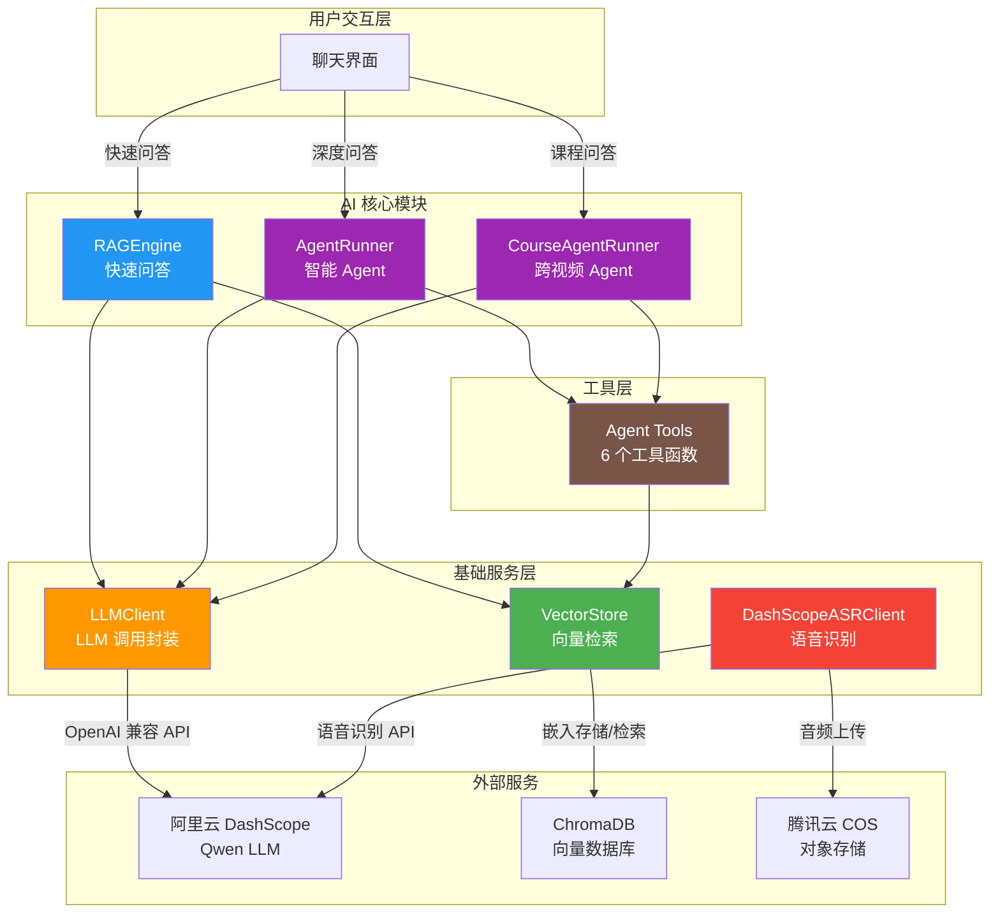
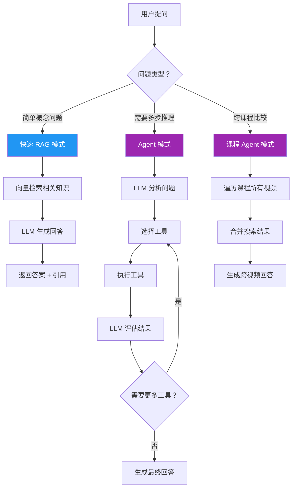
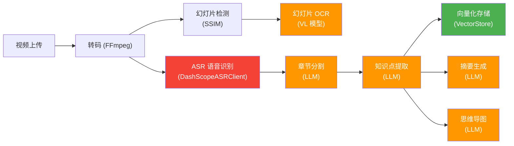

# AI 模块概览

LectureMind 的 AI 核心模块是整个系统的"大脑"。它负责将原始的视频、音频和课件转化为可检索的结构化知识，并通过智能问答系统帮助学生理解和回顾课程内容。

---

## AI 提供了哪些能力？

LectureMind 的 AI 模块提供以下核心能力：

| 能力 | 说明 | 所属组件 |
|------|------|---------|
| **语音识别 (ASR)** | 将视频音频转为带时间戳的文字稿 | `DashScopeASRClient` |
| **幻灯片 OCR** | 识别课件截图中的文字内容 | VL 模型 (Qwen2.5-VL) |
| **知识提取** | 从文字稿中提取知识点和摘要 | LLM (Qwen) |
| **向量语义搜索** | 将文本编码为向量，支持语义检索 | `VectorStore` (ChromaDB) |
| **RAG 问答** | 基于检索结果生成有据可查的回答 | `RAGEngine` |
| **Agent 智能问答** | 多步推理 + 工具调用的深度问答 | `AgentRunner` |
| **跨视频搜索** | 在整个课程的所有视频中搜索 | `CourseAgentRunner` |

---

## AI 模块架构总览

下图展示了 AI 模块中各组件的交互关系：

---

## 核心组件一览

### LLMClient — LLM 调用客户端

封装了 OpenAI 兼容 API，连接阿里云 DashScope 的 Qwen 系列模型。提供同步/流式聊天、视觉理解、JSON 结构化输出等能力。

**详细文档:** [LLM 客户端](./llm-client.md)

### VectorStore — 向量存储

基于 ChromaDB 和 sentence-transformers 的向量数据库。将知识点、文字稿、课件 OCR 文本编码为向量，支持语义相似度检索。

**详细文档:** [向量存储](./vector-store.md)

### RAGEngine — RAG 问答引擎

"检索增强生成"引擎。接收用户问题后，先从向量库中检索相关知识，再将检索结果作为上下文交给 LLM 生成回答。速度快、引用准确。

**详细文档:** [RAG 引擎](./rag-engine.md)

### AgentRunner — 智能 Agent

基于 ReAct 模式的 AI Agent。LLM 可以自主决定使用哪个工具（搜索知识点、查看课件、获取摘要等），经过多轮推理后给出深度回答。适合复杂问题。

**详细文档:** [Agent 系统](./agent-system.md)

### Agent Tools — Agent 工具集

为 Agent 提供的 6 个专用工具函数，包括语义搜索、课件搜索、章节详情、课程摘要、章节列表、时间戳查询。

**详细文档:** [Agent 工具](./agent-tools.md)

### DashScopeASRClient — 语音识别客户端

调用阿里云 DashScope 的 Qwen3-ASR 模型进行异步语音识别。支持提交任务、轮询状态、获取带时间戳的文字稿。

**详细文档:** [ASR 与 OCR](./asr-ocr.md)

---

## 两种聊天模式对比

LectureMind 提供两种聊天模式，适用于不同场景：

### 快速 RAG 模式 (Fast RAG)

- **工作原理：** 单次向量检索 + LLM 生成
- **响应速度：** 快（约 2-5 秒）
- **适用场景：** "什么是梯度下降？"、"这节课讲了什么？"
- **优点：** 速度快，引用准确
- **限制：** 无法多步推理，无法交叉引用多个信息源

### Agent 模式 (Agentic RAG)

- **工作原理：** 多轮 ReAct 循环（推理 -> 工具调用 -> 观察 -> 再推理）
- **响应速度：** 较慢（约 5-15 秒，取决于工具调用次数）
- **适用场景：** "比较第三章和第五章中关于优化算法的异同"、"查找所有提到神经网络的幻灯片"
- **优点：** 可以多步推理、使用多种工具、交叉验证信息
- **限制：** 更慢，消耗更多 token

### 选择指南

| 场景 | 推荐模式 | 原因 |
|------|---------|------|
| 查询某个概念的定义 | 快速 RAG | 单次检索即可 |
| 了解课程整体内容 | 快速 RAG | 摘要已包含概览 |
| 比较多个知识点 | Agent | 需要多次检索 |
| 查找课件上的联系信息 | Agent | 需要 `search_slides` 工具 |
| 查看特定时间点说了什么 | Agent | 需要 `get_transcript_at_time` 工具 |
| 跨视频对比 | 课程 Agent | 需要搜索多个视频 |

---

## 数据处理管线中的 AI

在 LectureMind 的任务处理管线中，AI 模块承担了多个关键步骤：

AI 在数据处理管线中的参与点：

1. **ASR 语音识别** — 将音频转为文字稿
2. **幻灯片 OCR** — 使用视觉语言模型识别课件文字
3. **章节分割** — LLM 将长文字稿智能分割为有逻辑的章节
4. **知识点提取** — LLM 从每个章节中提取知识点、关键术语、重要度评分
5. **摘要生成** — LLM 生成视频级别的摘要和学习目标
6. **思维导图** — LLM 构建概念间的层次关系
7. **向量化存储** — 将所有文本内容编码为向量，存入 ChromaDB

---

## 模型选择

LectureMind 使用了多种模型来完成不同任务：

| 任务 | 模型 | 说明 |
|------|------|------|
| 任务管线处理 | `qwen2.5-7b-instruct` | 轻量模型，用于知识提取等批量任务 |
| RAG 问答 | `qwen3-max` | 高质量模型，用于生成回答 |
| Agent 问答 | `qwen3-max` | 高质量模型，需要推理和工具调用 |
| 视觉 OCR | `qwen2.5-vl-72b-instruct` | 视觉语言模型，用于课件 OCR |
| 语音识别 | `qwen3-asr-flash-filetrans` | ASR 专用模型 |
| 文本嵌入 | `all-MiniLM-L6-v2` | 句子嵌入模型，用于向量化 |

:::tip 模型可配置
所有模型均可通过环境变量或配置管理器动态切换，无需修改代码。详见 [配置详解](../configuration.md)。
:::

---

## 下一步

按推荐顺序阅读 AI 模块文档：

1. **[LLM 客户端](./llm-client.md)** — 了解 AI 模块的基础通信层
2. **[向量存储](./vector-store.md)** — 理解语义检索的工作原理
3. **[RAG 引擎](./rag-engine.md)** — 掌握快速问答的完整流程
4. **[Agent 系统](./agent-system.md)** — 深入理解智能 Agent 的核心机制（最详细的章节）
5. **[Agent 工具](./agent-tools.md)** — 了解 Agent 可以使用的每个工具
6. **[ASR 与 OCR](./asr-ocr.md)** — 了解数据处理管线中的 AI 能力
