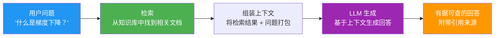
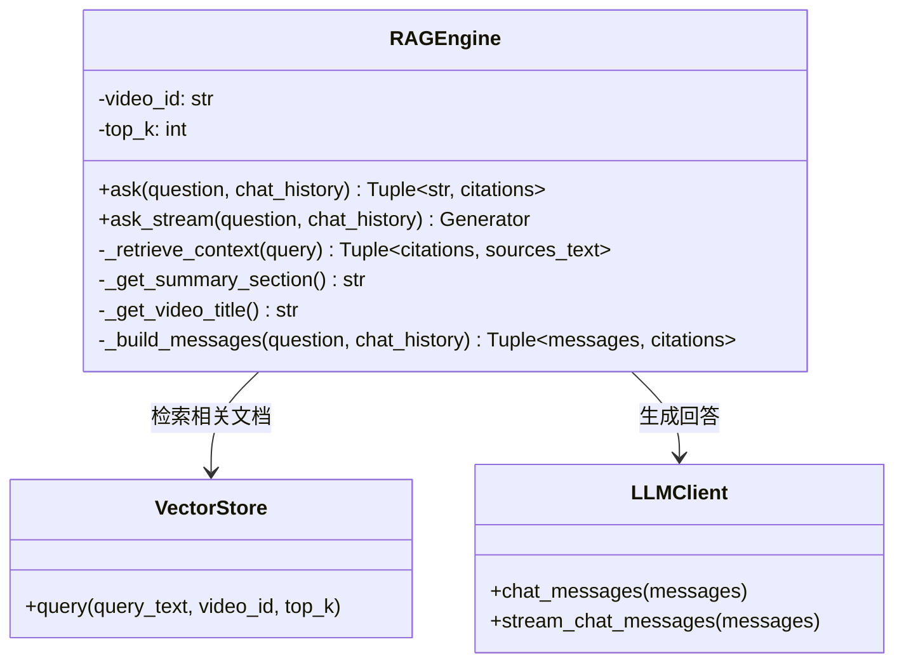
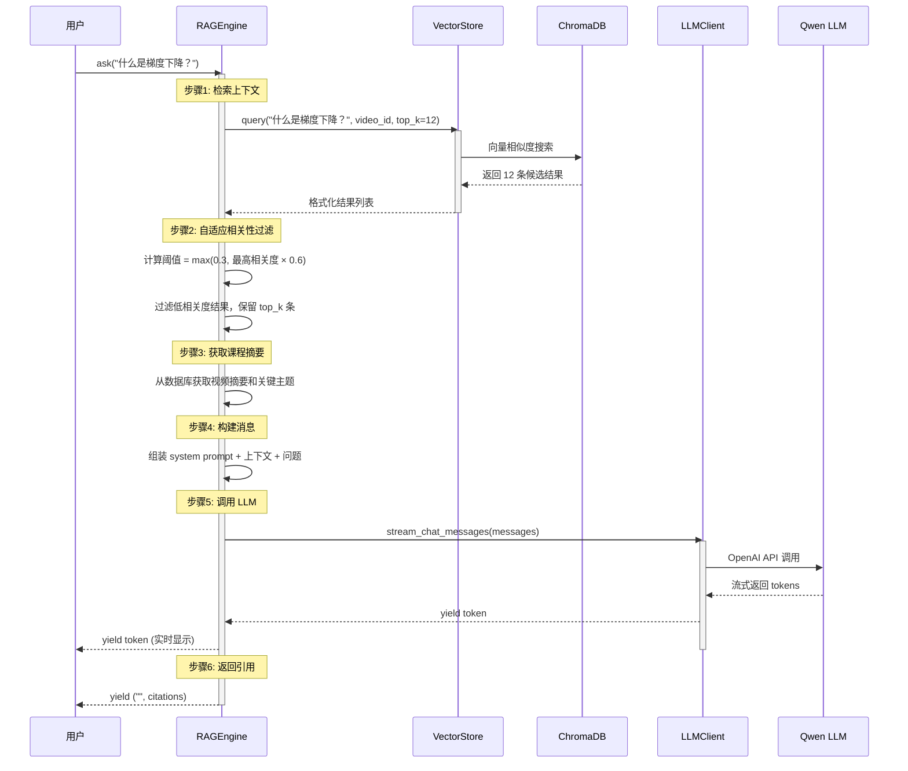
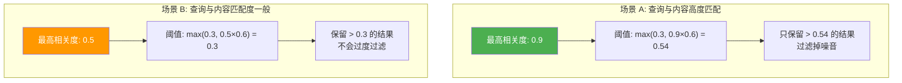

# RAG 引擎 (RAGEngine)

RAG（Retrieval-Augmented Generation，检索增强生成）是 LectureMind 最基础的问答模式。它将"从知识库中检索相关内容"与"LLM 生成回答"结合在一起，让 AI 的回答有据可查、准确可靠。

---

## 什么是 RAG？

### 给初学者的解释

想象你参加一场开卷考试：

- **没有 RAG 的 LLM** — 像闭卷考试，只能凭记忆回答，可能会"编造"不存在的内容（幻觉）
- **有 RAG 的 LLM** — 像开卷考试，先翻书找到相关章节，再根据书上的内容回答问题



### RAG 的优势

| 对比 | 纯 LLM | RAG |
|------|--------|-----|
| 知识来源 | 训练数据（可能过时） | 实时检索知识库 |
| 准确性 | 可能产生幻觉 | 基于检索结果，更可靠 |
| 可追溯性 | 无法引用来源 | 可以标注引用来源 |
| 领域知识 | 通用知识 | 特定课程的精准知识 |
| 更新成本 | 需要重新训练 | 更新知识库即可 |

---

## RAGEngine 架构



---

## 完整查询流程

一次完整的 RAG 查询经历以下步骤：



---

## 核心机制详解

### 1. 自适应相关性过滤

这是 RAGEngine 最巧妙的设计之一。检索结果不是越多越好，需要过滤掉不够相关的结果。

```python
# 检索 2 倍于 top_k 的候选结果
results = store.query(query_text=query, video_id=self.video_id, top_k=self.top_k * 2)

# 自适应阈值：取最高相关度的 60%，但不低于 0.3
max_relevance = max([r["relevance"] for r in results])
relevance_threshold = max(0.3, max_relevance * 0.6)

# 只保留相关度高于阈值的结果
filtered = [r for r in results if r["relevance"] >= relevance_threshold]
```

**为什么要自适应？**



- **高匹配场景：** 阈值自动抬高，只保留最相关的结果，避免引入噪音
- **低匹配场景：** 阈值保持在 0.3 的下限，避免过滤掉所有结果导致没有上下文

### 2. 消息构建

RAGEngine 将检索到的内容组装成结构化的消息：

```python
RAG_SYSTEM_PROMPT = """You are a knowledgeable teaching assistant...
- Answer ONLY based on the provided context
- Cite the source using [Source N] notation
- DO NOT make up information..."""

RAG_CONTEXT_TEMPLATE = """## Lecture Context

### Video: {video_title}

{summary_section}

### Retrieved Sources:
{sources_section}

---
Student Question: {question}"""
```

最终发送给 LLM 的消息结构：

```
┌─ system ─────────────────────────────────────────────┐
│  系统提示词：定义 AI 的角色和回答规则                   │
├─ user (上下文) ──────────────────────────────────────┤
│  ## Lecture Context                                  │
│  ### Video: 机器学习导论 - 第3讲                      │
│  ### Lecture Overview                                │
│  本节课介绍优化算法...                                 │
│  ### Retrieved Sources:                              │
│  [Source 1] (knowledge_point) "梯度下降" [02:00-03:00]│
│  梯度下降是一种迭代优化算法...                          │
│  [Source 2] (transcript) "Section 2" [03:00-04:00]   │
│  ...                                                │
│  ---                                                │
│  Student Question: 什么是梯度下降？                    │
└──────────────────────────────────────────────────────┘
```

### 3. 流式响应

`ask_stream()` 方法逐 token 返回响应，前端可以实时显示：

```python
for chunk_type, data in engine.ask_stream("什么是梯度下降？"):
    if chunk_type:  # 文本 token
        print(data, end="")
    else:  # 最后一次 yield 包含 citations
        citations = data
        for c in citations:
            print(f"\n[引用] {c['title']} [{c['begin_time']}-{c['end_time']}]")
```

**返回格式：**

| yield 次数 | 第一个值 | 第二个值 | 说明 |
|-----------|---------|---------|------|
| 1 ~ N-1 | `"token"` 或 `""` | `None` | 文本 token |
| N (最后一次) | `""` | `citations_list` | 引用信息 |

---

## 引用追踪

RAGEngine 在检索时记录每个结果的来源信息，并在最终返回时一并提供：

```python
citations = [
    {
        "source_num": 1,
        "title": "梯度下降算法",
        "begin_time": 120.0,     # 开始时间（秒）
        "end_time": 180.0,       # 结束时间（秒）
        "type": "knowledge_point",  # 内容类型
        "relevance": 0.85,       # 相关度评分
    },
    # ...
]
```

前端可以利用这些引用信息：
- 显示"答案来源"面板
- 点击引用跳转到视频对应时间点
- 高亮显示相关知识点

---

## RAG 系统提示词解读

RAGEngine 使用的系统提示词经过精心设计：

| 指令 | 目的 |
|------|------|
| "Answer ONLY based on the provided context" | 防止幻觉，确保回答有据可查 |
| "cite the source using [Source N] notation" | 要求标注引用来源 |
| "DO NOT make up information, examples, or timestamps" | 禁止编造内容 |
| "If context doesn't contain enough information, clearly state..." | 当信息不足时诚实告知 |
| "Maintain an educational, helpful tone" | 保持教育性的语调 |

---

## 代码示例

### 基本使用（非流式）

```python
from api.rag_engine import RAGEngine

engine = RAGEngine(video_id="abc-123-def", top_k=6)

# 非流式问答
answer, citations = engine.ask("什么是梯度下降？")

print("回答：", answer)
print("引用来源：")
for c in citations:
    print(f"  [{c['source_num']}] {c['title']} ({c['type']}) "
          f"[{c['begin_time']:.0f}s - {c['end_time']:.0f}s] "
          f"相关度: {c['relevance']:.2f}")
```

### 流式使用

```python
from api.rag_engine import RAGEngine

engine = RAGEngine(video_id="abc-123-def")

# 流式问答
citations = None
for chunk_type, data in engine.ask_stream("反向传播是如何工作的？"):
    if chunk_type:  # 文本 token
        print(data, end="", flush=True)
    else:  # citations
        citations = data

print("\n\n--- 引用来源 ---")
if citations:
    for c in citations:
        print(f"  [{c['source_num']}] {c['title']}")
```

### 带多轮对话历史

```python
chat_history = [
    {"role": "user", "content": "什么是梯度下降？"},
    {"role": "assistant", "content": "梯度下降是一种迭代优化算法..."},
]

answer, citations = engine.ask(
    "它和随机梯度下降有什么区别？",
    chat_history=chat_history,
)
```

:::info 对话历史限制
RAGEngine 会保留最近 6 条对话历史（3 轮对话），以保持多轮对话的上下文连贯性，同时避免超出 LLM 的上下文窗口限制。
:::

---

## RAG vs Agent 模式对比

| 特性 | RAG 模式 | Agent 模式 |
|------|---------|-----------|
| **检索方式** | 单次向量搜索 | 多轮工具调用 |
| **响应速度** | 快（2-5 秒） | 较慢（5-15 秒） |
| **推理能力** | 无（直接生成） | 多步推理 |
| **工具使用** | 无 | 6 种工具可选 |
| **适用问题** | 简单概念查询 | 复杂分析性问题 |
| **准确性** | 高（上下文集中） | 更高（多源验证） |
| **资源消耗** | 较少 | 较多（多次 LLM 调用） |

:::tip 选择建议
- 查询某个概念的定义或解释 → 用 **RAG 模式**
- 需要比较、分析、综合多个信息源 → 用 **Agent 模式**
- 不确定用哪个？先试 RAG，如果回答不够深入再用 Agent
:::
