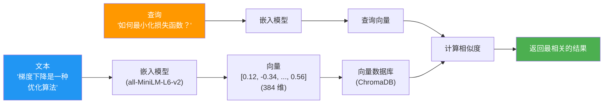
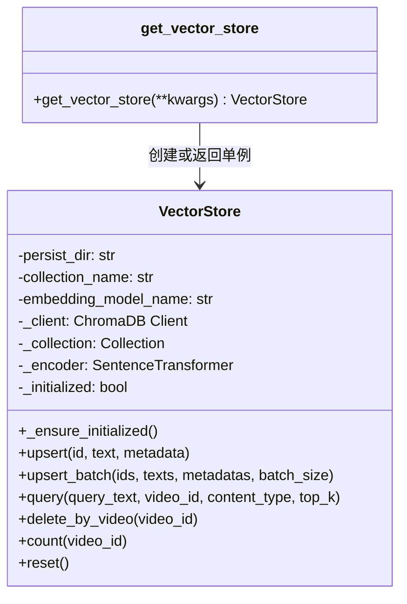
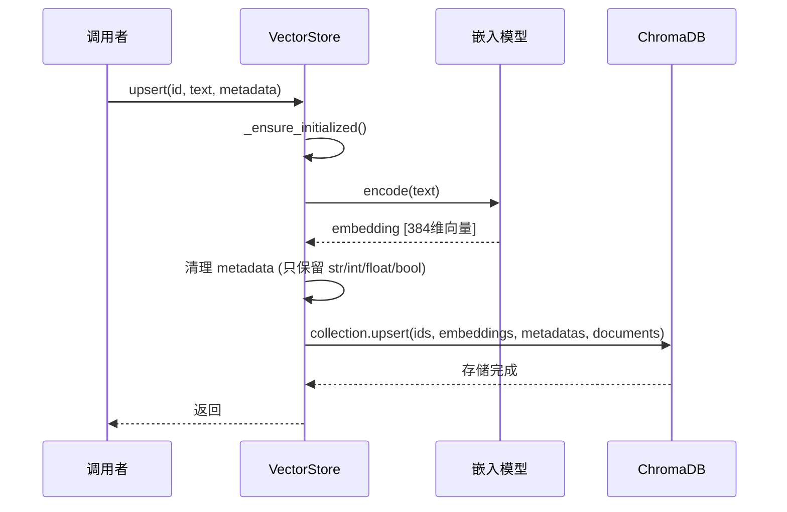
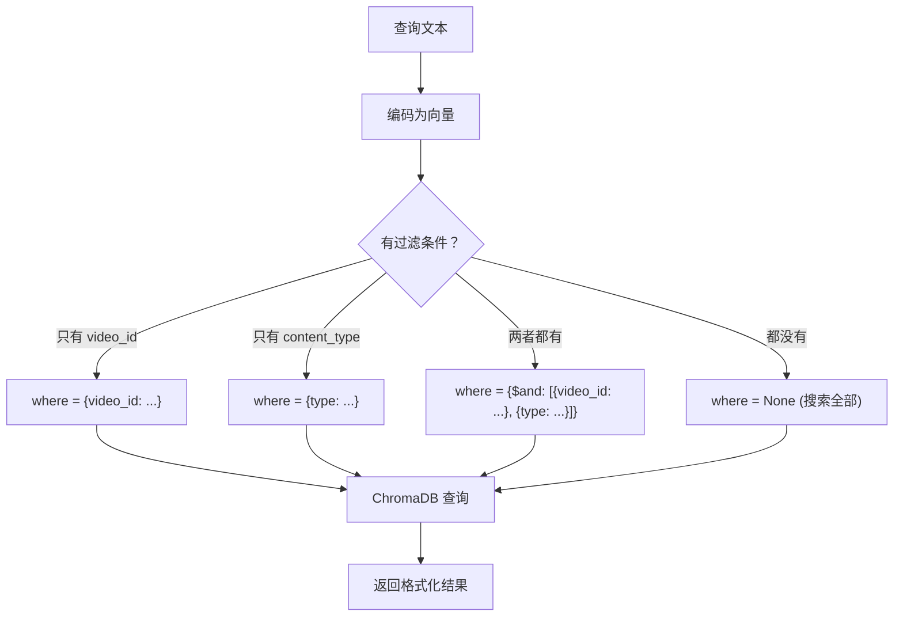
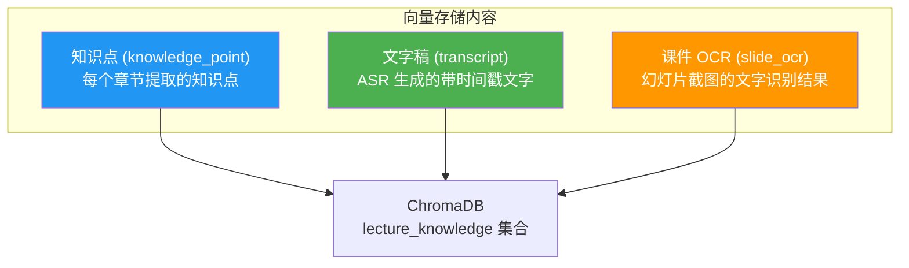

# 向量存储 (VectorStore)

向量存储是 LectureMind 语义检索的基础设施。它将课程内容（知识点、文字稿、课件文字）编码为高维向量，使得 AI 能够理解"语义相似"而不仅仅是"关键词匹配"。

---

## 什么是向量存储？

### 给初学者的解释

想象你有一个图书馆，传统的检索方式是按书名或作者名查找（关键词匹配）。但如果你想找"关于机器学习入门的书"，即使书名里没有"入门"两个字，只要内容确实是入门级别的，你也希望能找到它。

**向量存储**就是这样的"智能图书馆"：



### 核心概念

| 概念 | 说明 |
|------|------|
| **嵌入 (Embedding)** | 将文本转换为数值向量的过程。语义相似的文本会被转换为相近的向量 |
| **向量 (Vector)** | 一组数字（如 384 个浮点数），表示文本的"语义坐标" |
| **余弦相似度 (Cosine Similarity)** | 衡量两个向量方向的相似程度，值越接近 1 越相似 |
| **语义搜索 (Semantic Search)** | 基于语义相似度而非关键词匹配的搜索方式 |

### 为什么不用关键词搜索？

| 对比 | 关键词搜索 | 语义搜索 |
|------|----------|---------|
| 查询: "如何最小化损失" | 只找包含"最小化"和"损失"的文本 | 能找到"梯度下降"、"优化算法"等相关内容 |
| 查询: "过拟合怎么办" | 只找包含"过拟合"的文本 | 能找到"正则化"、"Dropout"、"数据增强"等相关内容 |
| 理解能力 | 精确匹配 | 理解语义和上下文 |

---

## 技术栈

LectureMind 的向量存储使用以下技术：

| 组件 | 技术 | 说明 |
|------|------|------|
| 向量数据库 | **ChromaDB** | 轻量级嵌入式向量数据库，支持持久化存储 |
| 嵌入模型 | **all-MiniLM-L6-v2** | sentence-transformers 提供的轻量嵌入模型，384 维 |
| 相似度度量 | **余弦相似度** | ChromaDB 使用 `hnsw:space = cosine` 配置 |

:::info 为什么选择这些技术？
- **ChromaDB** — 零配置、嵌入式运行、支持持久化，非常适合 LectureMind 这种单机部署场景
- **all-MiniLM-L6-v2** — 轻量且高效（约 80MB），CPU 上即可运行，384 维向量平衡了精度和存储
- 无需外部向量数据库服务，降低了部署复杂度
:::

---

## VectorStore 类架构



---

## API 详解

### 懒初始化模式

VectorStore 采用**懒初始化 (Lazy Initialization)** 策略。构造函数不会立即连接数据库或加载模型，只有在第一次实际使用时才进行初始化：

```python
store = VectorStore()  # 此时不加载任何东西
store.query("test")    # 此时才初始化 ChromaDB 和嵌入模型
```

这样做的好处是：避免在模块导入时就触发重量级的依赖加载，加快应用启动速度。

### upsert — 插入或更新文档

```python
store.upsert(
    id="kp-001",
    text="梯度下降是一种迭代优化算法，通过沿梯度的反方向更新参数来最小化损失函数。",
    metadata={
        "video_id": "abc-123",
        "type": "knowledge_point",
        "title": "梯度下降",
        "begin_time": 120.0,
        "end_time": 180.0,
    }
)
```

内部流程：



**metadata 清理规则：**
- `str`, `int`, `float`, `bool` 类型 — 直接保留
- `None` — 转为空字符串 `""`
- 其他类型 — 转为字符串 `str(v)`

### upsert_batch — 批量插入

```python
count = store.upsert_batch(
    ids=["kp-001", "kp-002", "kp-003"],
    texts=["梯度下降...", "反向传播...", "学习率..."],
    metadatas=[
        {"video_id": "abc", "type": "knowledge_point", ...},
        {"video_id": "abc", "type": "knowledge_point", ...},
        {"video_id": "abc", "type": "knowledge_point", ...},
    ],
    batch_size=100,  # 每批处理 100 条
)
print(f"共插入 {count} 条文档")
```

批量操作会自动分批处理，避免一次性编码过多文本导致内存溢出。

### query — 语义搜索

```python
results = store.query(
    query_text="什么是梯度下降？",
    video_id="abc-123",           # 可选：限定某个视频
    content_type="knowledge_point",  # 可选：限定内容类型
    top_k=5,                      # 返回最多 5 条结果
)

for r in results:
    print(f"相似度: {r['relevance']:.2f}")
    print(f"内容: {r['text'][:100]}")
    print(f"元数据: {r['metadata']}")
```

**返回格式：**

```python
[
    {
        "id": "kp-001",
        "text": "梯度下降是一种迭代优化算法...",
        "metadata": {
            "video_id": "abc-123",
            "type": "knowledge_point",
            "title": "梯度下降",
            "begin_time": 120.0,
            "end_time": 180.0,
        },
        "distance": 0.25,      # 余弦距离 (越小越相似)
        "relevance": 0.75,     # 余弦相似度 = 1 - distance (越大越相似)
    },
    ...
]
```

**过滤逻辑：**



### delete_by_video — 删除视频数据

```python
store.delete_by_video("abc-123")
# 删除该视频的所有向量化文档
```

用于视频被删除或需要重新处理时清理旧数据。

### count — 统计文档数量

```python
total = store.count()              # 全部文档数
video_count = store.count("abc-123")  # 某个视频的文档数
```

### reset — 重置集合

```python
store.reset()
# 删除集合中的所有文档，重新创建空集合
```

:::warning 谨慎使用
`reset()` 会删除所有已存储的向量数据。在生产环境中请谨慎调用。
:::

---

## 存储了哪些内容？

LectureMind 将三类内容存入向量数据库：



### 元数据 Schema

每种内容类型都有对应的元数据字段：

| 字段 | 类型 | 说明 | 示例 |
|------|------|------|------|
| `video_id` | string | 所属视频 ID | `"abc-123-def"` |
| `type` | string | 内容类型 | `"knowledge_point"`, `"transcript"`, `"slide_ocr"` |
| `title` | string | 内容标题 | `"梯度下降算法"` |
| `begin_time` | float | 开始时间（秒） | `120.0` |
| `end_time` | float | 结束时间（秒） | `180.0` |

这些元数据使得查询结果可以精确地关联到视频的特定时间点，实现"点击引用跳转到视频对应位置"的功能。

---

## 余弦相似度与相关性评分

ChromaDB 使用余弦距离（cosine distance）来衡量向量之间的差异：

```
余弦距离 = 1 - 余弦相似度
余弦相似度 = cos(θ) = (A · B) / (|A| × |B|)
```

- **余弦相似度 = 1** — 两个向量完全相同方向（语义完全一致）
- **余弦相似度 = 0** — 两个向量正交（语义无关）
- **余弦相似度 = -1** — 两个向量完全相反（语义对立）

VectorStore 在返回结果时将距离转换为相似度：

```python
relevance = 1.0 - distance
```

这样 `relevance` 值越大表示越相关，更符合直觉。

---

## 单例模式

`get_vector_store()` 函数实现了单例模式，确保整个应用共享同一个 VectorStore 实例：

```python
from api.vector_store import get_vector_store

# 首次调用：创建实例
store1 = get_vector_store()

# 后续调用：返回同一个实例
store2 = get_vector_store()
assert store1 is store2  # True

# 自定义参数：创建新实例（不缓存）
custom_store = get_vector_store(persist_dir="/tmp/custom_chromadb")
```

:::info 为什么用单例？
- ChromaDB 的嵌入式模式只允许一个进程访问持久化目录
- 嵌入模型（all-MiniLM-L6-v2）加载需要时间和内存
- 单例避免了重复初始化的开销
:::

---

## 代码示例

### 基本使用

```python
from api.vector_store import get_vector_store

store = get_vector_store()

# 存储一条知识点
store.upsert(
    id="kp-001",
    text="反向传播算法利用链式法则计算损失函数对每个参数的梯度。",
    metadata={
        "video_id": "lecture-001",
        "type": "knowledge_point",
        "title": "反向传播",
        "begin_time": 300.0,
        "end_time": 420.0,
    }
)

# 搜索相关知识
results = store.query(
    query_text="如何计算神经网络的梯度？",
    video_id="lecture-001",
    top_k=3,
)

for r in results:
    print(f"[{r['relevance']:.2f}] {r['text'][:80]}...")
```

### 批量存储文字稿

```python
# 假设我们有一组 ASR 识别的文字稿句子
sentences = [
    {"id": "ts-001", "text": "今天我们来学习梯度下降算法", "time": 10.0},
    {"id": "ts-002", "text": "梯度下降的目标是最小化损失函数", "time": 15.0},
    # ... 更多句子
]

ids = [s["id"] for s in sentences]
texts = [s["text"] for s in sentences]
metadatas = [
    {
        "video_id": "lecture-001",
        "type": "transcript",
        "title": "Section 1: 梯度下降",
        "begin_time": s["time"],
        "end_time": s["time"] + 5.0,
    }
    for s in sentences
]

count = store.upsert_batch(ids, texts, metadatas)
print(f"成功存储 {count} 条文字稿")
```

---

## 总结

| 特性 | 说明 |
|------|------|
| **数据库** | ChromaDB（嵌入式、持久化） |
| **嵌入模型** | all-MiniLM-L6-v2（384 维、CPU 运行） |
| **相似度** | 余弦相似度 |
| **初始化** | 懒加载模式 |
| **实例管理** | 单例模式 |
| **内容类型** | 知识点、文字稿、课件 OCR |
| **过滤支持** | 按 video_id 和 content_type 过滤 |
