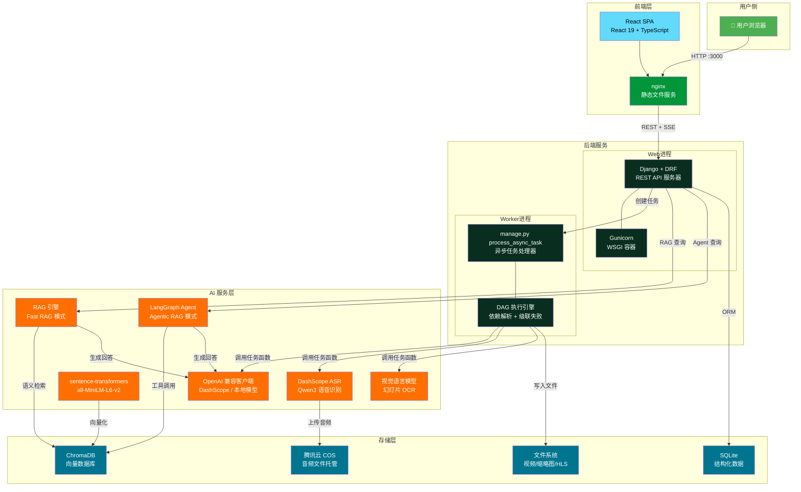
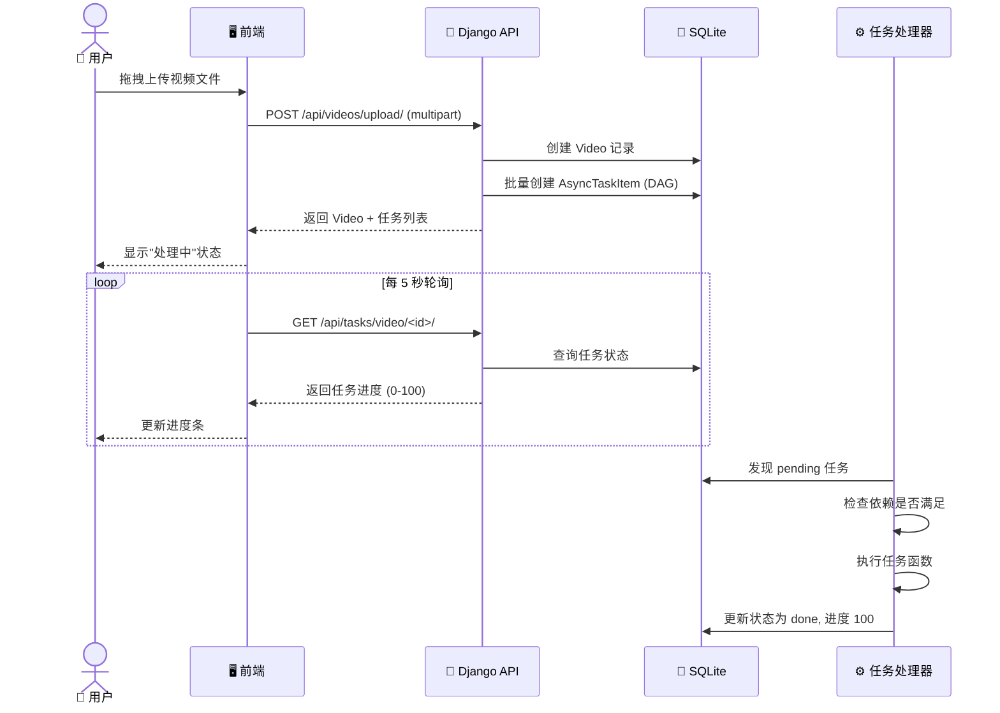
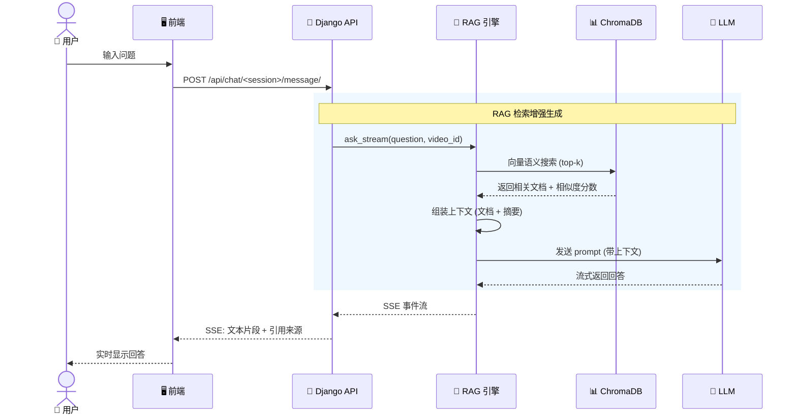
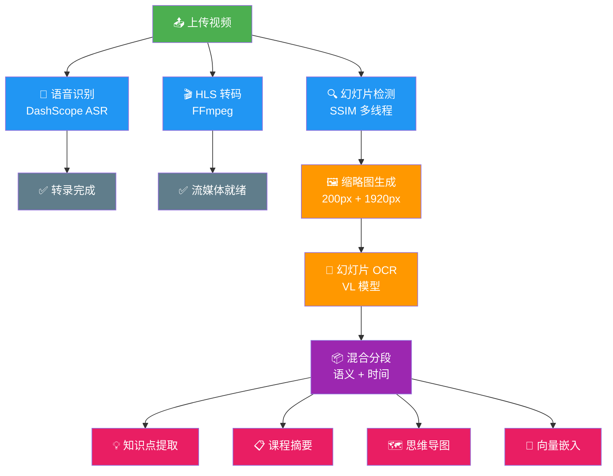

# 架构概览

本章从全局视角介绍 LectureMind 的系统架构。我们会先看整体组件关系，再逐层拆解每个部分的职责，最后解释几个关键的技术决策。

---

## 系统全景图

下图展示了 LectureMind 所有主要组件及其交互关系。数据从左到右流动：用户通过浏览器访问前端，前端通过 REST API 与后端通信，后端调用 AI 服务处理视频，所有持久化数据存储在右侧的存储层中。

---

## 组件架构详解

LectureMind 采用经典的分层架构，从上到下分为四层。每一层只与相邻层通信，层内组件职责单一。

```mermaid
graph LR
    subgraph Frontend["🖥️ 前端层"]
        direction TB
        P1["视频分析页面"]
        P2["知识探索面板"]
        P3["聊天对话面板"]
        P4["思维导图查看器"]
    end

    subgraph API["📡 REST API 层"]
        direction TB
        A1["Video API"]
        A2["Chat API"]
        A3["Config API"]
        A4["Task API"]
    end

    subgraph AI["🤖 AI 服务层"]
        direction TB
        AI1["RAG 引擎"]
        AI2["Agent 图"]
        AI3["向量存储"]
        AI4["ASR / OCR"]
    end

    subgraph Storage["💾 存储层"]
        direction TB
        S1["SQLite"]
        S2["ChromaDB"]
        S3["文件系统"]
    end

    Frontend -->|"REST + SSE"| API
    API --> AI
    AI --> Storage
```

### 前端层 (Frontend)

前端是一个单页应用 (SPA)，负责所有用户交互。

| 组件 | 技术 | 职责 |
|------|------|------|
| **React SPA** | React 19 + TypeScript | 应用主体，路由管理 |
| **视频分析页面** | @mux/mux-video-react | HLS 自适应视频播放 |
| **知识探索面板** | Ant Design | 展示知识点、摘要、章节 |
| **聊天对话面板** | SSE + React Markdown | 与 AI 实时对话 |
| **思维导图查看器** | @xyflow/react (ReactFlow) | 可视化概念关系图 |
| **nginx** | nginx | 提供静态文件服务，SPA 路由 |

**关键设计**：前端通过 `window.__ENV__.API_PREFIX` 在运行时注入后端地址，无需重新构建即可切换后端。

### REST API 层

基于 Django REST Framework 构建，提供所有业务接口。

| API 模块 | 端点示例 | 职责 |
|----------|---------|------|
| **Video API** | `POST /api/videos/upload/` | 视频上传、列表、详情 |
| **Task API** | `GET /api/tasks/video/<uuid>/` | 查询异步任务状态和进度 |
| **Chat API** | `POST /api/chat/<session_id>/message/` | 创建会话、发送消息 (SSE) |
| **Config API** | `GET /api/config/` | 系统配置读写 |
| **Health API** | `GET /api/health/` | 健康检查 |

### AI 服务层

封装所有与 AI/ML 相关的逻辑，与 Django 解耦。

| 组件 | 职责 |
|------|------|
| **LLM 客户端** | 通过 OpenAI 兼容协议调用大语言模型 |
| **Embedding 模型** | 本地运行 sentence-transformers 生成向量 |
| **ASR 客户端** | 调用 DashScope 进行语音识别 |
| **VL 模型** | 视觉语言模型，用于幻灯片 OCR |
| **RAG 引擎** | Fast RAG 模式——单次向量检索 + LLM 生成 |
| **Agent 图** | Agentic RAG 模式——LangGraph 状态机 + 工具调用 |

### 存储层

| 存储 | 技术 | 存储内容 |
|------|------|---------|
| **关系数据库** | SQLite | 视频元数据、任务状态、聊天记录、知识点 |
| **向量数据库** | ChromaDB | 知识点、章节、转录文本的向量嵌入 |
| **文件系统** | 本地磁盘 | 视频文件、缩略图、HLS 流、日志 |
| **云存储** | 腾讯云 COS | ASR 音频文件临时托管 |

---

## 组件间通信方式

### 用户上传视频的完整流程

### 用户发起 RAG 聊天的流程

---

## 异步任务管线 (DAG)

LectureMind 的核心特色之一是基于 DAG (有向无环图) 的异步任务管线。视频处理涉及多个步骤，有些可以并行执行，有些存在依赖关系。

**关键机制**：
- **依赖链**：每个 `AsyncTaskItem` 通过 `previous` 字段指向前置任务
- **并发执行**：没有依赖关系的任务（如 ASR、HLS、SSIM）自动并行
- **级联失败**：前置任务失败时，所有后续任务自动标记为失败
- **进度追踪**：每个任务维护 0-100 的进度值，前端可实时轮询

---

## 架构决策记录 (ADR)

在开发 LectureMind 的过程中，我们做出了一系列技术选型。以下是每个决策背后的思考。

### 为什么选择 Django 而不是 FastAPI？

| 考量 | Django | FastAPI |
|------|--------|---------|
| ORM | 内置成熟 ORM，自动迁移 | 需要额外集成 SQLAlchemy |
| 后台管理 | 自带 Admin 界面，调试方便 | 无内置方案 |
| 认证系统 | 内置用户认证和权限框架 | 需要自己实现 |
| 生态成熟度 | 20 年历史，文档完善 | 较新，社区相对小 |
| 异步支持 | Django 5.x 已支持 async | 原生 async |

**结论**：LectureMind 需要快速搭建 CRUD API、后台管理和任务处理。Django 的"自带电池"哲学完美匹配。FastAPI 的异步性能优势在本项目中不是瓶颈（主要耗时在 AI 调用而非 Web 框架）。

### 为什么选择 SQLite 而不是 PostgreSQL？

| 考量 | SQLite | PostgreSQL |
|------|--------|-----------|
| 部署复杂度 | 零配置，单文件 | 需要独立服务 |
| Docker 友好 | 共享卷即可 | 需要额外容器 |
| 性能 | 单节点完全够用 | 高并发更强 |
| 迁移成本 | Django ORM 抽象了差异 | 一行配置切换 |

**结论**：LectureMind 是单服务器部署的教育工具。SQLite 的简单性大幅降低了运维成本。如果未来需要水平扩展，只需修改 `DATABASES` 配置即可切换到 PostgreSQL——Django ORM 让这变得透明。

### 为什么选择自定义任务处理器而不是 Celery？

| 考量 | 自定义 DAG 处理器 | Celery |
|------|-------------------|--------|
| 依赖 | 无额外依赖 | 需要 Redis/RabbitMQ |
| 任务依赖 | 原生支持 DAG 链 | 需要额外的 celery-chord/chain |
| 进度追踪 | 内置 0-100 进度 | 需要自定义实现 |
| 级联失败 | 自动级联 | 需要手动处理 |
| 复杂度 | 约 280 行代码 | 学习曲线陡峭 |

**结论**：LectureMind 的任务管线是固定 DAG 结构（上传→ASR→OCR→分段→提取），不需要 Celery 的通用任务队列能力。自定义实现更轻量、更可控，且不引入额外的基础设施依赖。

### 为什么选择 ChromaDB 而不是 Pinecone？

| 考量 | ChromaDB | Pinecone |
|------|----------|----------|
| 部署 | 嵌入式运行，无需外部服务 | 云服务，需要 API Key |
| 数据主权 | 数据完全在本地 | 数据存储在第三方 |
| 开发体验 | 零配置即可开始 | 需要注册和配置 |
| 成本 | 免费开源 | 按量计费 |
| 迁移 | `VectorStore` 已完全抽象 | 同样可抽象 |

**结论**：ChromaDB 是嵌入式向量数据库，与 SQLite 的"零配置"哲学一致。数据完全留在本地，无需外部服务。`VectorStore` 类已经做了完整抽象，未来切换到 Qdrant 或 pgvector 只需重写一个类。

### 为什么选择 OpenAI 兼容 API 而不是 LangChain？

| 考量 | OpenAI 兼容 API | LangChain |
|------|-----------------|-----------|
| 依赖 | 单个 `openai` 包 | 庞大的依赖树 |
| 灵活性 | 直接控制每个调用 | 抽象层可能隐藏细节 |
| 厂商锁定 | 任意兼容端点 | 深度绑定 LangChain 生态 |
| 调试 | 直接查看请求/响应 | 中间层增加调试难度 |
| 流式输出 | 原生支持 | 封装后的流式接口 |

**结论**：所有 LLM 调用都通过 OpenAI SDK 指向 `LLM_API_BASE`。DashScope、vLLM、OpenAI 等任何兼容端点都可以无缝切换，只需修改配置。LangChain 的 Agent 功能通过 LangGraph 单独引入，而非全盘采用。

### 为什么使用双分辨率缩略图？

| 分辨率 | 用途 | 原因 |
|--------|------|------|
| 200px | 网页展示 | 加载快，列表中显示清晰 |
| 1920px | OCR 输入 | 高分辨率确保文字识别准确率 |

**背景**：最初只生成 200px 缩略图，但 OCR 质量很差。解决方案是在一次 FFmpeg 提取中同时生成两种分辨率，`image_high_res` 字段为可空，确保向后兼容。

---

## 小结

LectureMind 的架构可以用一句话概括：**Django REST 后端 + 自定义 DAG 任务管线 + 多模式 RAG 问答 + Docker 单机部署**。

核心设计原则：
1. **简单优先** — SQLite、ChromaDB、自定义任务处理器，避免引入不必要的基础设施
2. **完全抽象** — 向量存储、LLM 客户端都做了抽象层，便于未来替换
3. **渐进增强** — 三种 RAG 模式（LLM Direct → Fast RAG → Agentic RAG）逐级增强能力
4. **运行时可配置** — 所有关键参数通过环境变量和 SystemConfig 可在运行时调整

:::tip 下一步
- 想了解数据如何在系统中流动？请阅读 [数据流详解](./architecture/data-flow.md)
- 想了解具体使用了哪些技术？请阅读 [技术栈](./architecture/tech-stack.md)
:::
