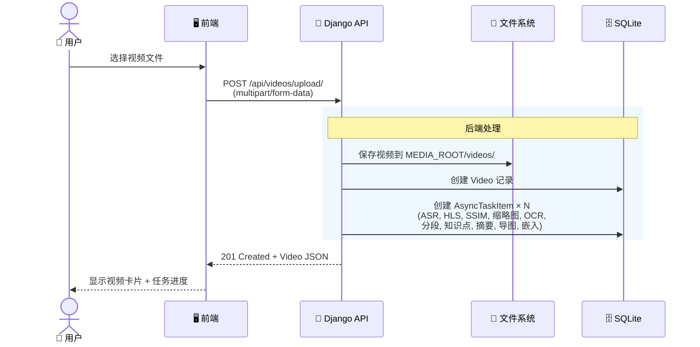
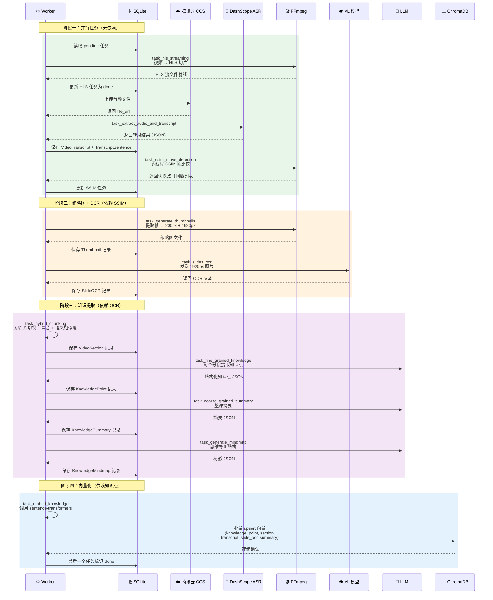
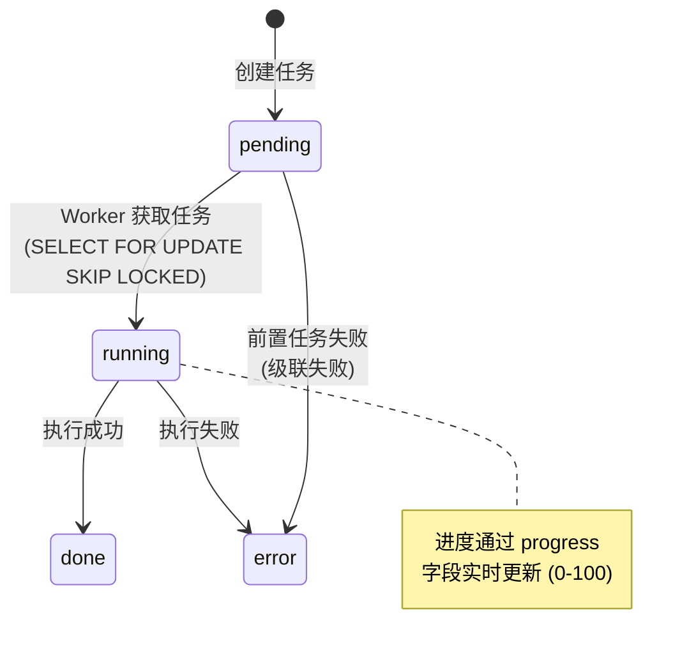
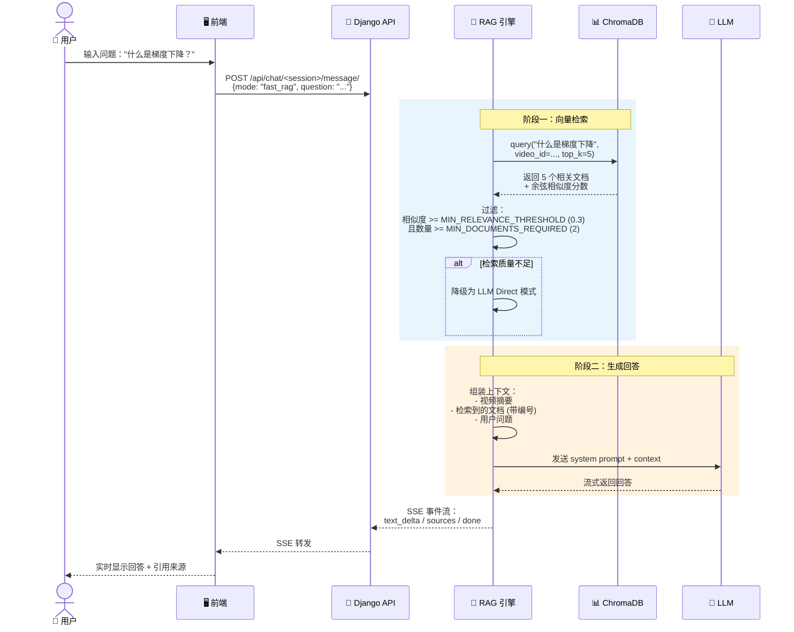
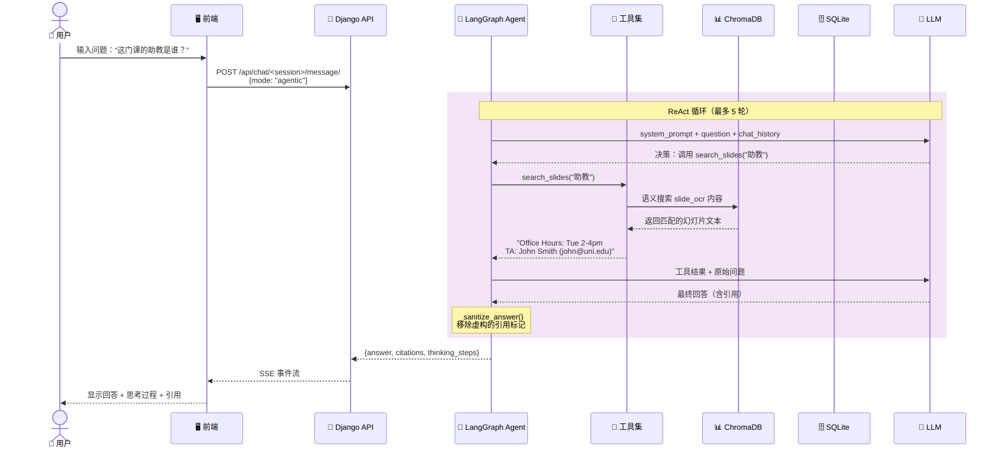
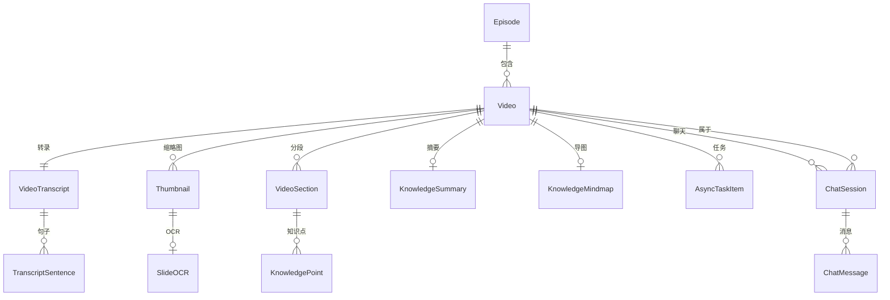
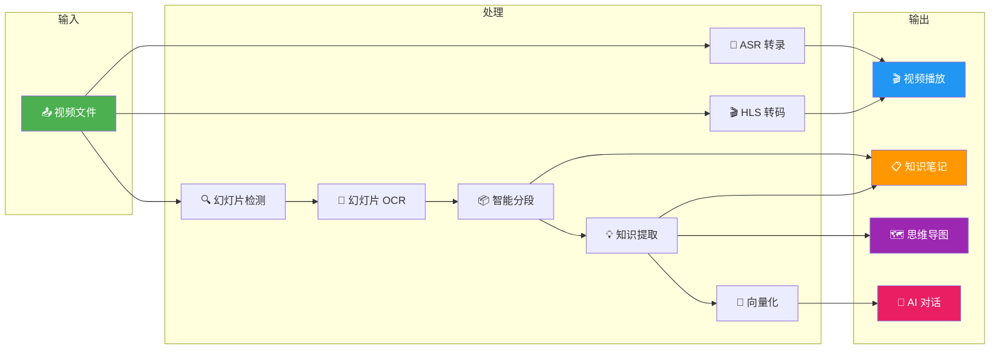

# 数据流详解

本章深入讲解 LectureMind 中数据的完整生命周期——从用户上传视频开始，经过 AI 处理管线，到最终通过 RAG 聊天输出回答。理解数据流是排查问题和扩展系统的基础。

---

## 1. 视频上传流程

当用户上传一个视频文件时，数据经过以下步骤：



**关键细节**：
- 视频文件保存到 `MEDIA_ROOT/videos/<uuid>/` 目录
- 一次性创建所有任务节点，通过 `previous` 字段建立 DAG 依赖关系
- 无依赖的任务（ASR、HLS、SSIM）可以被 Worker 并行执行
- 前端通过轮询 `GET /api/tasks/video/<uuid>/` 获取进度

<div className="pipeline-step">

**步骤 1** — 文件保存：视频二进制数据写入磁盘

</div>
<div className="pipeline-step">

**步骤 2** — 记录创建：Video + AsyncTaskItem 写入 SQLite

</div>
<div className="pipeline-step">

**步骤 3** — 响应返回：前端收到任务列表，开始轮询进度

</div>

---

## 2. 视频处理流程 (任务管线)

Worker 进程持续轮询数据库，按 DAG 顺序执行任务。以下是完整的处理流水线：



**任务状态机**：



---

## 3. Fast RAG 聊天流程

当用户选择 Fast RAG 模式时，系统执行单次检索 + 生成：



**降级策略**：如果向量检索返回的文档太少或相似度太低，Fast RAG 会自动降级为 LLM Direct（纯 LLM 回答，不使用任何上下文），避免基于不相关内容生成误导性回答。

---

## 4. Agentic RAG 聊天流程

Agentic RAG 是更强大的模式，LLM 可以多轮调用工具来收集信息：



**可用的 Agent 工具**：

| 工具名称 | 输入 | 输出 | 适用场景 |
|----------|------|------|---------|
| `search_knowledge` | query, top_k | 知识点、章节、转录文本 | 概念性问题 |
| `search_slides` | query, top_k | 幻灯片 OCR 文本 | 课程信息、联系方式 |
| `get_section_detail` | section_id | 完整章节内容 | 深入了解某一段 |
| `get_transcript_range` | start_sec, end_sec | 时间范围内转录文本 | 定位特定内容 |

**思考过程可视化**：Agent 的每一轮"思考→工具调用→观察"都会通过 SSE 发送给前端，用户可以看到 AI 是如何一步步找到答案的。

---

## 5. 数据存储全景 (Data at Rest)

处理完成后，数据分布在三个存储位置：

### SQLite 表结构



**主要表说明**：

| 表名 | 记录示例 | 数据量级 |
|------|---------|---------|
| `Video` | id, title, file, duration | 每个视频 1 条 |
| `VideoTranscript` | file_url, format, sample_rate | 每个视频 1 条 |
| `TranscriptSentence` | text, begin_time, end_time | 每个视频 100-1000 条 |
| `Thumbnail` | image, image_high_res, time_second | 每个视频 10-50 张 |
| `SlideOCR` | ocr_text, time_second | 每个视频 10-50 条 |
| `VideoSection` | title, begin_time, end_time, transcript_text | 每个视频 5-20 段 |
| `KnowledgePoint` | title, summary, key_terms, importance | 每个视频 20-100 个 |
| `KnowledgeSummary` | overview, key_topics, learning_objectives | 每个视频 1 条 |
| `KnowledgeMindmap` | tree_data, react_flow_nodes, react_flow_edges | 每个视频 1 条 |
| `AsyncTaskItem` | func_name, status, progress, previous | 每个视频约 10 个 |
| `ChatSession` | video_id, title | 每个视频多个 |
| `ChatMessage` | role, content, citations | 每个会话多条 |

### ChromaDB 向量存储

所有知识内容在向量化后存入 ChromaDB 的单一 collection `lecture_knowledge`。

| `content_type` 元数据 | 来源 | 用途 |
|----------------------|------|------|
| `knowledge_point` | 细粒度 LLM 提取 | 精确概念检索 |
| `section` | 混合分段摘要 | 段落级语义搜索 |
| `transcript` | ASR 逐句转录 | 原文定位 |
| `slide_ocr` | 幻灯片 OCR 文本 | 视觉内容检索 |
| `lecture_summary` | 粗粒度课程摘要 | 主题概览 |

**过滤机制**：所有查询都通过 `video_id` 元数据过滤，确保不同视频的知识不会混淆。

### 文件系统

```
MEDIA_ROOT/
├── videos/                 # 原始视频文件
│   └── <uuid>/
│       └── lecture.mp4
├── streams/                # HLS 自适应流
│   └── <uuid>/
│       ├── master.m3u8
│       ├── 720p/
│       ├── 480p/
│       └── 360p/
├── thumbnails/             # 缩略图
│   ├── <uuid>.jpg          # 200px 网页展示
│   └── high_res/
│       └── <uuid>.jpg      # 1920px OCR 输入
├── audio/                  # 提取的音频文件
│   └── <uuid>.wav
└── chromadb/               # 向量数据库持久化
    └── ...
```

---

## 6. 数据流转总结

下图展示了数据从上传到最终输出的完整生命周期：



:::tip 下一步
- 想了解每种技术的具体版本和用途？请阅读 [技术栈](./tech-stack.md)
- 想了解任务管线的代码实现？请阅读 [任务管线](../backend/task-pipeline.md)
:::
