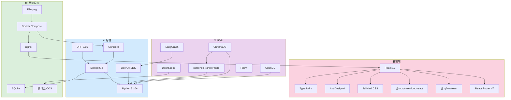
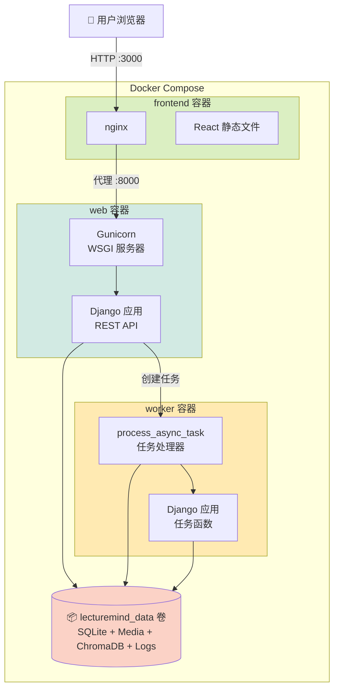

# 技术栈

本章完整列出 LectureMind 使用的每一项技术，解释**为什么选择它**以及**它在系统中扮演什么角色**。内容面向初学者，不仅告诉你"用了什么"，更重要的是告诉你"为什么用"。

---

## 技术栈金字塔

LectureMind 的技术栈可以分为四层。越靠近底层越偏向基础设施，越靠近顶层越偏向用户交互。

  

    🖥️ 前端层 
    React · TypeScript · Ant Design
  

  

    🤖 AI 层 
    DashScope · sentence-transformers · ChromaDB · LangGraph
  

  

    ⚙️ 后端层 
    Python · Django · DRF · Gunicorn
  

  

    🏗️ 基础设施层 
    Docker Compose · nginx · SQLite · FFmpeg
  

---

## 完整技术栈参考表

### 后端技术

| 技术 | 版本 | 用途 | 为什么选择它 |
|------|------|------|-------------|
| **Python** | 3.10+ | 后端编程语言 | AI/ML 生态最完善，所有主流库都首选支持 |
| **Django** | 5.2 | Web 框架 | "自带电池"——ORM、Admin、Auth、迁移全内置 |
| **Django REST Framework** | 3.15+ | REST API 框架 | Django 生态中最成熟的 API 框架，序列化器强大 |
| **Gunicorn** | 21.2+ | WSGI 服务器 | 生产级 Python WSGI 服务器，稳定可靠 |
| **OpenAI SDK** | 1.0+ | LLM 调用客户端 | 事实标准，DashScope/vLLM 等都兼容此协议 |
| **FFmpeg** | 系统级 | 视频/音频处理 | 业界标准，支持 HLS 转码、帧提取、音频提取 |
| **python-dotenv** | 1.0+ | 环境变量加载 | 从 `.env` 文件加载配置，开发/生产统一 |

### AI/ML 技术

| 技术 | 版本 | 用途 | 为什么选择它 |
|------|------|------|-------------|
| **sentence-transformers** | 2.2+ | 文本向量化 | 本地运行，无需 API 调用，all-MiniLM-L6-v2 模型小巧高效 |
| **ChromaDB** | 0.5+ | 向量数据库 | 嵌入式运行，零配置，与 SQLite 理念一致 |
| **DashScope (Qwen3-ASR)** | 云服务 | 语音识别 (ASR) | 阿里云提供的高质量中文 ASR 服务 |
| **DashScope (Qwen)** | 云服务 | 大语言模型 | 支持多种模型，OpenAI 兼容接口 |
| **LangGraph** | - | Agent 状态机 | 实现 ReAct 循环的轻量级框架 |
| **OpenCV** | 4.8+ | 幻灯片检测 | SSIM 算法检测视频帧变化 |
| **scikit-image** | 0.21+ | 图像相似度计算 | 提供 SSIM 指标实现 |
| **Pillow** | 10.0+ | 图像处理 | 缩略图生成和尺寸调整 |
| **pydub** | 0.25+ | 音频处理 | 音频格式转换和切分 |

### 前端技术

| 技术 | 版本 | 用途 | 为什么选择它 |
|------|------|------|-------------|
| **React** | 19.2 | UI 框架 | 组件化开发，生态最丰富 |
| **TypeScript** | 4.9+ | 编程语言 | 类型安全，减少运行时错误 |
| **Ant Design** | 6.2+ | UI 组件库 | 企业级 React 组件库，开箱即用 |
| **Tailwind CSS** | 3.4+ | CSS 工具类 | 快速构建自定义样式，无需写 CSS 文件 |
| **@mux/mux-video-react** | 0.29+ | 视频播放器 | 专业 HLS 自适应流播放器 |
| **@xyflow/react (ReactFlow)** | 12.10+ | 思维导图渲染 | 强大的节点-连线图可视化库 |
| **react-markdown** | 10.1+ | Markdown 渲染 | 渲染 AI 回答中的 Markdown 格式 |
| **react-router-dom** | 7.9+ | 前端路由 | React 生态标准路由方案 |
| **SSE (原生)** | - | 流式传输 | 浏览器原生支持，无需 WebSocket |

### 基础设施

| 技术 | 版本 | 用途 | 为什么选择它 |
|------|------|------|-------------|
| **Docker Compose** | - | 容器编排 | 单机部署最简方案，一个命令启动全部服务 |
| **nginx** | - | 静态文件服务 | 高性能 Web 服务器，前端 SPA 托管 |
| **SQLite** | - | 关系数据库 | 零配置，单文件，Django ORM 无缝支持 |
| **腾讯云 COS** | 云服务 | 对象存储 | ASR 音频文件临时托管（DashScope 要求 URL 输入） |

---

## 技术依赖关系

下图展示了各技术之间的依赖关系。箭头表示"依赖于"——例如 RAG 引擎依赖 LLM 客户端和向量数据库。

---

## 关键技术详解

### all-MiniLM-L6-v2 — 本地嵌入模型

这是 sentence-transformers 提供的一个轻量级文本嵌入模型。

**工作原理**：
1. 输入一段文本（如"梯度下降是优化算法"）
2. 模型输出一个 384 维的向量（一串 384 个数字）
3. 语义相似的文本会生成相近的向量

**为什么不用 OpenAI 的 embedding API？**
- 本地运行，不消耗 API 额度
- 延迟低（几毫秒 vs 几百毫秒）
- 无网络依赖
- 384 维足够用于教育内容的语义搜索

**注意事项**：更换嵌入模型需要重新向量化所有已有数据，因为不同模型生成的向量空间不兼容。

### DashScope Qwen3-ASR — 语音识别

阿里云 DashScope 提供的语音识别服务。

**工作流程**：
1. 将视频中的音频提取为 WAV 文件
2. 上传到腾讯云 COS（DashScope 要求 URL 输入）
3. 调用 ASR API，传入音频 URL
4. 返回带时间戳的逐句转录结果

**为什么不用 Whisper？**
- Whisper 需要 GPU，服务器成本高
- Qwen3-ASR 对中文支持更好
- 云端服务无需管理模型

### ChromaDB — 向量数据库

ChromaDB 是一个嵌入式向量数据库，类似于 SQLite 之于关系数据库。

**核心概念**：
- **Collection**：类似数据库表，LectureMind 使用单一 collection `lecture_knowledge`
- **Document**：原始文本
- **Embedding**：文本的向量表示
- **Metadata**：附加信息（如 `video_id`、`content_type`）
- **Query**：通过向量相似度搜索最相关的文档

**为什么不用 Pinecone/Weaviate？**
- ChromaDB 嵌入式运行，无需外部服务
- 数据完全在本地，无隐私顾虑
- 零配置即可使用

### LangGraph — Agent 框架

LangGraph 是 LangChain 生态中用于构建有状态 Agent 的轻量框架。

**在 LectureMind 中的作用**：
- 实现 ReAct（Reasoning + Acting）循环
- LLM 决策是否调用工具，工具结果反馈给 LLM
- 最多 5 轮循环，防止无限循环
- 通过 SSE 流式输出思考过程

**为什么不全盘使用 LangChain？**
- LangChain 依赖庞大，引入不必要的复杂性
- 只需要 Agent 循环功能，不需要 Chain/Prompt Template 等
- OpenAI SDK 直接调用更简单、更可控

---

## Docker Compose 服务拓扑

三个容器共享一个数据卷，各自承担不同职责：

**资源限制**（`docker-compose.yml` 中配置）：

| 容器 | 内存限制 | CPU 限制 | 说明 |
|------|---------|---------|------|
| `web` | 4 GB | 2 核 | 运行 Django API |
| `worker` | 4 GB | 2 核 | 运行 AI 任务（最耗资源） |
| `frontend` | 512 MB | 0.5 核 | 仅提供静态文件 |

:::info 共享数据卷
`web` 和 `worker` 容器挂载同一个 `lecturemind_data` 卷到 `/data`。这意味着：
- SQLite 数据库文件被两个进程共享
- 上传的视频文件对两个进程都可见
- ChromaDB 持久化目录被两个进程共享
:::

---

## 版本兼容性说明

| 依赖 | 最低版本 | 推荐版本 | 说明 |
|------|---------|---------|------|
| Python | 3.10 | 3.11 | Django 5.x 要求 Python 3.10+ |
| Node.js | 18 | 20+ | React 19 要求 Node 18+ |
| Docker | 20.10 | 24+ | Compose V2 支持 |
| FFmpeg | 5.0 | 6.0+ | HLS 转码和帧提取 |
| pnpm | 8.0 | 9.0+ | 前端包管理 |

:::tip 下一步
- 想了解数据如何在这些技术之间流动？请阅读 [数据流详解](./data-flow.md)
- 想开始实际开发？请阅读 [后端概览](../backend/overview.md)
:::
