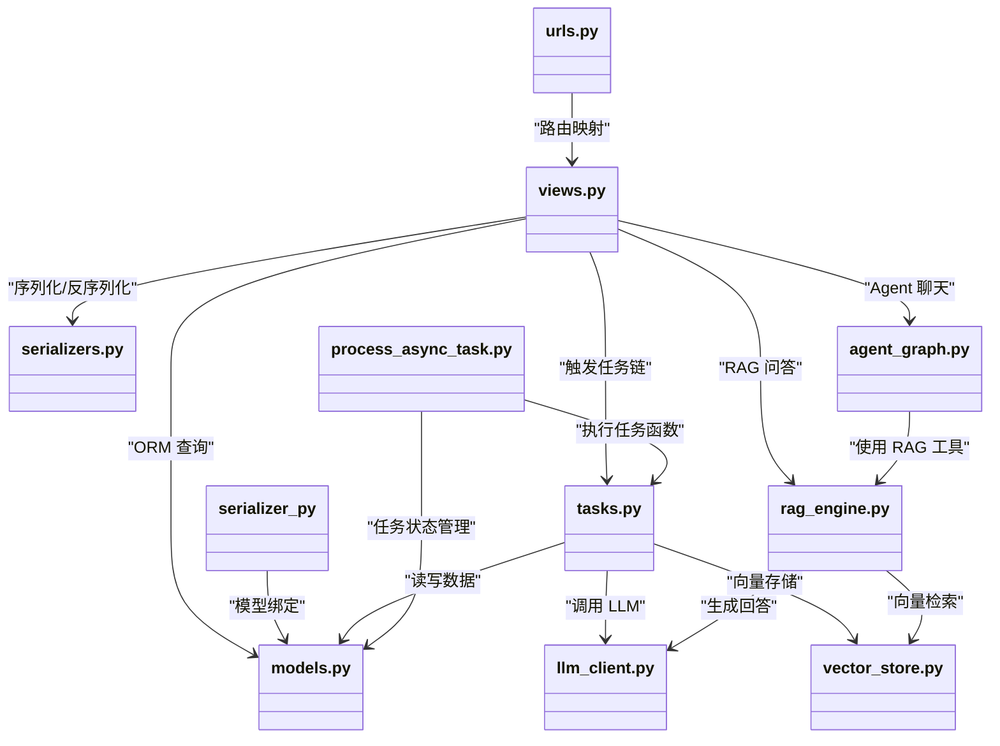

# 后端概览

LectureMind 的后端基于 **Django + Django REST Framework (DRF)** 构建，负责视频上传、异步处理管线、RAG 智能问答等核心功能。本文档帮助你快速了解后端的整体架构和关键文件。

## 项目目录结构

```
server/app/
├── manage.py                  # Django 管理脚本入口
├── db.sqlite3                 # SQLite 数据库文件（开发环境）
├── media/                     # 用户上传文件存储目录
│   ├── videos/                #   原始视频文件
│   ├── thumbnails/            #   缩略图（低分辨率 + 高分辨率）
│   ├── audio/                 #   提取的音频文件
│   └── streams/               #   HLS 流媒体切片
│
├── videoapp/                  # Django 项目配置包（项目级别）
│   ├── __init__.py
│   ├── settings.py            #   全局配置（数据库、中间件、CORS 等）
│   ├── urls.py                #   根 URL 路由，将 /api/ 指向 api 应用
│   ├── wsgi.py                #   WSGI 入口
│   └── asgi.py                #   ASGI 入口
│
└── api/                       # 核心业务应用（主要开发区域）
    ├── __init__.py
    ├── apps.py                #   应用配置
    ├── admin.py               #   Django Admin 注册
    ├── models.py              #   所有数据模型定义（14 个模型）
    ├── serializers.py         #   DRF 序列化器
    ├── urls.py                #   API 路由定义
    ├── views.py               #   视图（REST 端点实现）
    ├── tasks.py               #   异步任务实现 + 任务注册表
    ├── config_utils.py        #   配置管理工具
    ├── llm_client.py          #   LLM 客户端封装（DashScope API）
    ├── dashscope_asr.py       #   ASR 语音识别客户端
    ├── rag_engine.py          #   RAG 检索增强生成引擎
    ├── agent_graph.py         #   LangGraph Agent 实现
    ├── agent_tools.py         #   Agent 工具函数
    ├── vector_store.py        #   向量数据库操作
    ├── utils.py               #   通用工具函数
    ├── lecture_video_slides_chunker.py  # 幻灯片切换检测
    ├── lecture_video_hybrid_chunker.py  # 混合分块算法
    ├── evaluate/              #   RAG 评估模块
    ├── management/
    │   └── commands/
    │       ├── process_async_task.py  # 任务处理器（核心！）
    │       ├── runserver.py           # 自定义开发服务器
    │       └── evaluate_rag.py        # RAG 评估命令
    └── migrations/            #   数据库迁移文件
```

## 核心架构

LectureMind 的后端可以分为以下几个核心模块：

### 1. 数据层（models.py）

定义了 14 个 Django 模型，涵盖视频管理、转录、知识提取、聊天和任务系统。所有模型使用 UUID 作为主键。

### 2. API 层（views.py + serializers.py + urls.py）

使用 DRF 的通用视图（Generic Views）模式，提供 RESTful API。支持 SSE（Server-Sent Events）流式响应用于实时聊天。

### 3. 任务管线（tasks.py）

包含 10 个异步任务函数，通过 `TASK_REGISTRY` 字典注册。任务以有向无环图（DAG）方式组织，支持并行和串行依赖。

### 4. 任务处理器（process_async_task.py）

Django 管理命令，独立运行的后台进程。通过轮询数据库获取待执行任务，使用 `SELECT FOR UPDATE` 保证并发安全。

### 5. AI 集成层

- `llm_client.py` -- LLM 调用封装
- `dashscope_asr.py` -- 语音识别
- `rag_engine.py` -- RAG 引擎
- `agent_graph.py` -- LangGraph Agent
- `vector_store.py` -- 向量存储

## 关键文件关系图



## Django 配置加载机制

LectureMind 使用 `.env` 文件管理敏感配置（API Key、COS 密钥等）。配置加载流程如下：

```
.env 文件
    ↓
videoapp/settings.py（通过 os.environ 读取）
    ↓
Django 启动，创建数据库连接、注册应用等
    ↓
SystemConfig 模型（运行时可通过 API 动态修改配置）
```

:::tip 动态配置
除了 `.env` 文件，所有配置项都可以通过 `SystemConfig` 模型在运行时修改。`config_utils.py` 中的 `ConfigManager` 提供了统一的读取接口，优先级为：**数据库 > .env 文件 > 代码默认值**。
:::

:::warning 环境变量命名
注意项目中 COS 相关的环境变量使用了 `SECRECT`（拼写错误）而非 `SECRET`，这是历史遗留问题：`COS_SECRECT_ID`、`COS_SECRECT_KEY`。在 `.env` 文件中请注意使用正确的拼写。
:::

## Django 应用划分

| 组件 | 路径 | 角色 |
|------|------|------|
| `videoapp` | `server/app/videoapp/` | Django **项目配置**包，包含 settings、根 URL、WSGI/ASGI |
| `api` | `server/app/api/` | Django **业务应用**，包含所有业务逻辑 |

在 `videoapp/urls.py` 中，所有 `/api/` 前缀的请求都被转发到 `api/urls.py`：

```python
# videoapp/urls.py
urlpatterns = [
    path('admin/', admin.site.urls),
    path('api/', include('api.urls')),  # 转发到 api 应用
]
```

## 开发服务器启动

```bash
# 进入项目目录
cd server/app

# 启动 Django 开发服务器
python manage.py runserver

# 启动异步任务处理器（另开一个终端）
python manage.py process_async_task
```

:::tip 两个进程
开发时需要同时运行**两个进程**：Web 服务器（处理 HTTP 请求）和任务处理器（执行异步任务）。缺少任何一个都会导致功能不完整。
:::

## 下一步

- [数据模型](./models.md) -- 了解所有 14 个 Django 模型
- [REST API 参考](./api.md) -- 查看完整的 API 端点
- [任务管线](./task-pipeline.md) -- 理解 10 个异步任务的执行流程
- [任务处理器](./task-processor.md) -- 深入了解任务调度机制
