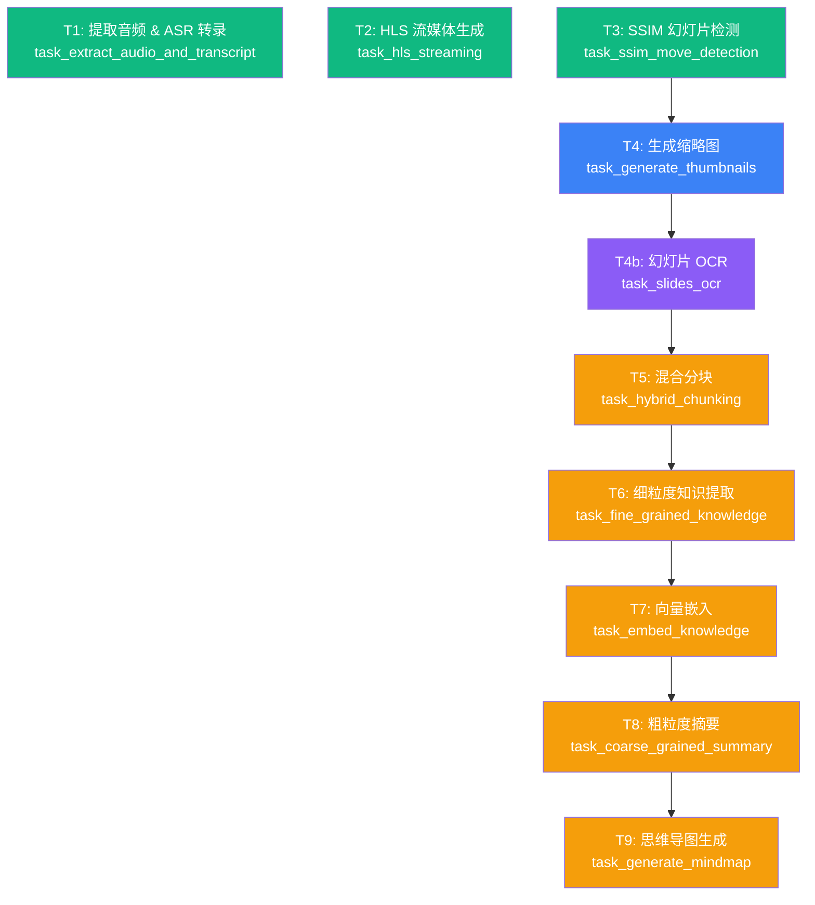

# 任务管线

任务管线（Task Pipeline）是 LectureMind 的核心处理流程，负责将一个原始视频文件转化为结构化的知识数据。本文档详细介绍管线的 10 个任务及其依赖关系。

## 什么是任务管线？

当你通过 `POST /api/videos/process/` 触发视频处理时，系统会自动创建 10 个 `AsyncTaskItem` 记录，形成一条**有向无环图（DAG）**。后台运行的任务处理器（`process_async_task` 命令）会按照依赖关系依次执行这些任务。

:::tip 为什么需要管线？
视频处理涉及多个计算密集型步骤（音频提取、语音识别、幻灯片检测、LLM 分析等），每个步骤耗时从几秒到几十分钟不等。将它们拆分为独立任务可以：
- 支持并行执行（如 ASR、HLS、SSIM 同时进行）
- 支持失败重试（只重试失败的任务，不重复已完成的工作）
- 实时报告进度（前端可轮询每个任务的状态和进度百分比）
:::

## 任务 DAG 全览



**图例**：
- 绿色：并行任务（无依赖，同时开始执行）
- 蓝色/紫色：中间任务（依赖上游结果）
- 橙色：LLM 相关任务（依赖分块结果）

## 依赖链详解

```
阶段 1（并行启动，无依赖）：
  T1 (ASR) ──────────────────────────→ 独立完成
  T2 (HLS) ──────────────────────────→ 独立完成
  T3 (SSIM) ─────┐

阶段 2（顺序执行）：
                 └→ T4 (缩略图) → T4b (OCR) → T5 (分块)
                                                        ↓
阶段 3（LLM 处理链）：
                  T6 (知识点) → T7 (向量化) → T8 (摘要) → T9 (思维导图)
```

---

## 各任务详解

### T1: task_extract_audio_and_transcript

**功能**：从视频中提取音频，上传到腾讯云 COS，然后调用 DashScope ASR 进行语音识别。

**输入**：
```json
{"video_id": "uuid", "file": "videos/xxx.mp4"}
```

**输出**：
```json
{"video_id": "uuid", "file": "videos/xxx.mp4", "cos_audio_url": "https://cos..."}
```

**执行流程**：
1. 使用 `ffprobe` 检测视频是否有音频流
2. 使用 `ffmpeg` 提取音频为 WAV（16kHz 单声道）
3. 上传 WAV 到腾讯云 COS
4. 生成 COS 签名 URL
5. 调用 DashScope ASR 进行语音识别
6. 将转录结果保存到 `VideoTranscript` + `TranscriptSentence`

**进度报告**：5%（开始）→ 10%（ffmpeg）→ 20%（提取中）→ 40%（提取完成）→ 60%（COS 上传）→ 70%（ASR 提交）→ 90%（ASR 完成）

---

### T2: task_hls_streaming

**功能**：将视频转换为 HLS（HTTP Live Streaming）多码率流媒体格式。

**输入**：
```json
{"video_id": "uuid", "file": "videos/xxx.mp4"}
```

**输出**：
```json
{"video_id": "uuid", "master_m3u8_path": "/path/to/master-stream.m3u8"}
```

**执行流程**：
1. 使用 `generate_hls_renditions()` 生成多分辨率切片
2. 使用 `generate_master_playlist()` 生成主播放列表

**进度报告**：10%（开始）→ 80%（切片完成）→ 100%（主列表生成）

---

### T3: task_ssim_move_detection

**功能**：使用 SSIM（结构相似性）算法检测视频中的幻灯片切换时刻。

**输入**：
```json
{"video_id": "uuid", "file": "videos/xxx.mp4"}
```

**输出**：
```json
{"video_id": "uuid", "file": "videos/xxx.mp4", "changes": [12.5, 45.0, 120.3, ...]}
```

**执行流程**：
1. 调用 `detect_slide_changes_multithreaded()` 进行多线程 SSIM 检测
2. 参数：SSIM 阈值 0.7，最小间隔 5 秒，采样帧率 10fps，16 个工作线程
3. 返回所有检测到的切换时间点（秒）

**输出说明**：`changes` 数组中的每个值是一个时间点（秒），代表在此处检测到幻灯片发生了显著变化。

---

### T4: task_generate_thumbnails

**功能**：根据 SSIM 检测到的切换时间点，截取视频对应帧作为缩略图。

**输入**（来自 T3 的输出）：
```json
{"video_id": "uuid", "file": "videos/xxx.mp4", "changes": [12.5, 45.0, ...]}
```

**输出**：
```json
{"video_id": "uuid", "file": "videos/xxx.mp4", "changes": [...], "thumbnail_count": 15}
```

**执行流程**：
1. 对每个切换时间点截取视频帧
2. 生成低分辨率（200px 宽）缩略图用于网页展示
3. 生成高分辨率缩略图用于 OCR
4. 保存到 `Thumbnail` 模型
5. 将第一张缩略图设为视频封面

**进度报告**：按批次报告，每个批次处理约 1/10 的帧

---

### T4b: task_slides_ocr

**功能**：使用视觉语言模型（Qwen2.5-VL-72B）对每张幻灯片缩略图进行 OCR 文字提取。

**输入**（来自 T4 的输出）：
```json
{"video_id": "uuid", ...}
```

**输出**：
```json
{"video_id": "uuid", "ocr_count": 12, "skipped": 3}
```

**执行流程**：
1. 查询该视频的所有 `Thumbnail` 记录
2. 对每张缩略图：
   - 优先使用高分辨率图片，回退到低分辨率
   - 将图片编码为 base64 data URI
   - 调用 VL 模型的 `chat_vl()` 接口提取文字
   - 保存为 `SlideOCR` 记录
3. 跳过没有文本内容的幻灯片

**进度报告**：按已完成的幻灯片比例报告

---

### T5: task_hybrid_chunking

**功能**：将视频智能分段，结合幻灯片切换时间和 ASR 转录语义信息。

**输入**（来自 T4b 的输出，实际上需要 T3 的 `changes` 和 T1 的转录数据）：
```json
{"video_id": "uuid", ...}
```

**输出**：
```json
{"video_id": "uuid", "section_count": 8}
```

**执行流程**：
1. 获取视频时长（从 `Video.duration` 或推算）
2. 从数据库读取 ASR 转录数据
3. 调用 `hybrid_chunk()` 进行混合分块
4. 删除旧的 `VideoSection` 记录
5. 为每个分块创建 `VideoSection` 记录：
   - 设置开始/结束时间
   - 拼接该时间范围内的转录文本
   - 关联最近的缩略图

:::tip 分块算法
`hybrid_chunk` 结合了三种分块策略：
- **幻灯片边界**：以 SSIM 检测到的切换点作为分段候选
- **静音间隙**：在 ASR 转录的长停顿处切分
- **语义相似度**：（可选）在语义变化处切分

最终结果取各策略的交集或最合理划分。
:::

---

### T6: task_fine_grained_knowledge

**功能**：使用 LLM 从每个章节中提取细粒度知识点。

**输入**（来自 T5 的输出）：
```json
{"video_id": "uuid", ...}
```

**输出**：
```json
{"video_id": "uuid", "knowledge_points_count": 35, "sections_processed": 8}
```

**执行流程**：
1. 获取所有 `VideoSection` 记录
2. 对每个章节：
   - 将转录文本截断到 3000 字符
   - 构造 LLM 提示词（包含章节标题、时间范围、转录文本）
   - 调用 LLM 获取结构化 JSON 响应
   - 解析 JSON，更新章节标题
   - 创建 `KnowledgePoint` 记录（标题、摘要、关键术语、重要性评分）
3. 跳过转录文本过短的章节

**LLM 提示词示例**：
```
Extract the following in JSON format:
{
  "section_title": "A concise, descriptive title",
  "points": [
    {
      "title": "Knowledge point title",
      "summary": "2-3 sentence explanation",
      "terms": ["key term 1", "key term 2"],
      "importance": 0.8
    }
  ]
}
```

---

### T7: task_embed_knowledge

**功能**：将知识点、章节转录和幻灯片 OCR 文本向量化并存储到向量数据库。

**输入**（来自 T6 的输出）：
```json
{"video_id": "uuid", ...}
```

**输出**：
```json
{
  "video_id": "uuid",
  "embedded_knowledge_points": 35,
  "embedded_sections": 8,
  "embedded_slide_ocr": 12
}
```

**执行流程**：
1. 清除该视频在向量数据库中的旧数据
2. **嵌入知识点**：将 `title: summary (key terms)` 编码为向量
3. **嵌入章节转录**：将 `transcript_text` 编码为向量
4. **嵌入幻灯片 OCR**：将 `ocr_text` 编码为向量，匹配到所属章节
5. 更新 `KnowledgePoint.embedding_id` 字段

**向量元数据**：
```json
{
  "video_id": "uuid",
  "section_id": "uuid",
  "type": "knowledge_point | section_transcript | slide_ocr",
  "title": "...",
  "begin_time": 120.0,
  "end_time": 240.0,
  "importance": 0.8
}
```

---

### T8: task_coarse_grained_summary

**功能**：将所有章节和知识点聚合，由 LLM 生成视频级别的粗粒度摘要。

**输入**（来自 T7 的输出）：
```json
{"video_id": "uuid", ...}
```

**输出**：
```json
{"video_id": "uuid", "summary_created": true}
```

**执行流程**：
1. 获取所有章节和知识点
2. 构建结构化文本（每个章节的知识点以要点列表形式呈现）
3. 文本截断到 6000 字符
4. 调用 LLM 生成 JSON 格式的摘要
5. 保存到 `KnowledgeSummary` 模型

**输出数据结构**：
```json
{
  "overview": "3-5 句话的高层概述",
  "key_topics": ["主题1", "主题2", ...],
  "learning_objectives": ["学习目标1", ...],
  "prerequisites": ["前置知识1", ...],
  "difficulty_level": "beginner | intermediate | advanced"
}
```

---

### T9: task_generate_mindmap

**功能**：基于章节和知识点生成层次化的思维导图。

**输入**（来自 T8 的输出）：
```json
{"video_id": "uuid", ...}
```

**输出**：
```json
{"video_id": "uuid", "mindmap_nodes": 25, "mindmap_edges": 24}
```

**执行流程**：
1. 获取所有章节和知识点
2. 构建结构化文本（含关键术语）
3. 文本截断到 5000 字符
4. 调用 LLM 生成 JSON 树形结构
5. 使用 `_tree_to_react_flow()` 将树转换为 React Flow 的 nodes 和 edges
6. 保存到 `KnowledgeMindmap` 模型

**思维导图树结构**：
```json
{
  "id": "root",
  "label": "课程标题",
  "children": [
    {
      "id": "topic-1",
      "label": "主题名称",
      "children": [
        {"id": "sub-1-1", "label": "子主题", "children": []}
      ]
    }
  ]
}
```

---

## 任务注册表（TASK_REGISTRY）

所有任务函数通过 `TASK_REGISTRY` 字典注册，这是任务名称到函数的映射：

```python
# server/app/api/tasks.py

TASK_REGISTRY: Dict[str, Callable[[Dict[str, Any]], Dict[str, Any]]] = {
    "task_extract_audio_and_transcript": task_extract_audio_and_transcript,
    "task_hls_streaming": task_hls_streaming,
    "task_ssim_move_detection": task_ssim_move_detection,
    "task_generate_thumbnails": task_generate_thumbnails,
    "task_slides_ocr": task_slides_ocr,
    "task_hybrid_chunking": task_hybrid_chunking,
    "task_fine_grained_knowledge": task_fine_grained_knowledge,
    "task_embed_knowledge": task_embed_knowledge,
    "task_coarse_grained_summary": task_coarse_grained_summary,
    "task_generate_mindmap": task_generate_mindmap,
}
```

`get_task_function()` 函数根据 `func_name` 查找并返回对应的函数引用：

```python
def get_task_function(func_name: str) -> Callable:
    if func_name not in TASK_REGISTRY:
        raise ValueError(f"Unknown task: {func_name}. Known: {list(TASK_REGISTRY.keys())}")
    return TASK_REGISTRY[func_name]
```

:::tip 函数签名约定
所有任务函数遵循相同的签名：接受 `Dict[str, Any]`，返回 `Dict[str, Any]`。
- **输入**：`input_data` 字典，包含 `video_id` 和其他参数
- **输出**：结果字典，会作为下一个任务的输入
- **进度报告**：通过 `_report_progress(video_id, func_name, progress)` 更新进度
:::

## 如何添加新任务

以下是添加新任务的简要步骤：

### 1. 编写任务函数

在 `server/app/api/tasks.py` 中添加新函数：

```python
def task_my_new_feature(input_data: Dict[str, Any]) -> Dict[str, Any]:
    video_id = input_data['video_id']
    logger.info(f"[MyFeature] Processing {video_id}")

    # 报告进度（可选）
    _report_progress(video_id, "task_my_new_feature", 10)

    # ... 你的业务逻辑 ...

    _report_progress(video_id, "task_my_new_feature", 100)

    # 返回结果字典（会传递给下游任务）
    return {"video_id": video_id, "my_result": "some_value"}
```

### 2. 注册到 TASK_REGISTRY

在同一个文件的 `TASK_REGISTRY` 字典中添加条目：

```python
TASK_REGISTRY = {
    # ... 现有任务 ...
    "task_my_new_feature": task_my_new_feature,
}
```

### 3. 创建 AsyncTaskItem

在 `views.py` 的 `_create_processing_chain()` 方法中添加任务创建逻辑，设置正确的 `previous` 依赖：

```python
t_new = AsyncTaskItem.objects.create(
    video=video,
    title="My new feature",
    func_name="task_my_new_feature",
    param=json.dumps({"video_id": str(video.id)}),
    previous=t6.id,  # 设置依赖（例如在 T6 之后执行）
)
```

:::warning 注意事项
- 任务函数必须返回字典，否则处理器会抛出 `TypeError`
- 如果任务函数抛出异常，任务状态会变为 `error`，下游任务会级联失败
- 使用 `_report_progress()` 报告进度，参数 `progress` 范围是 0-100
:::
