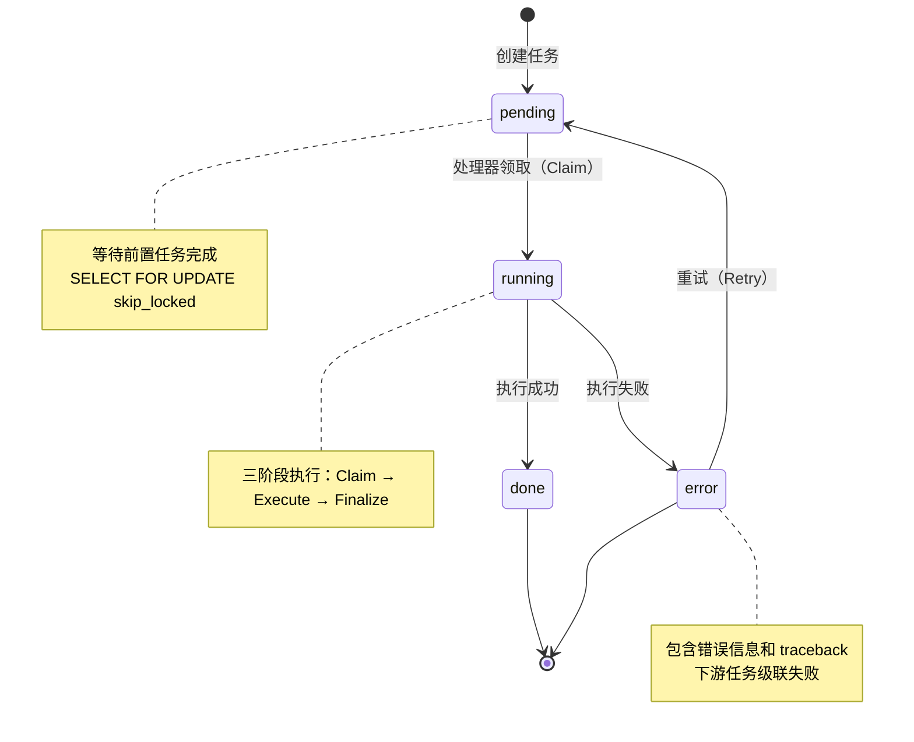
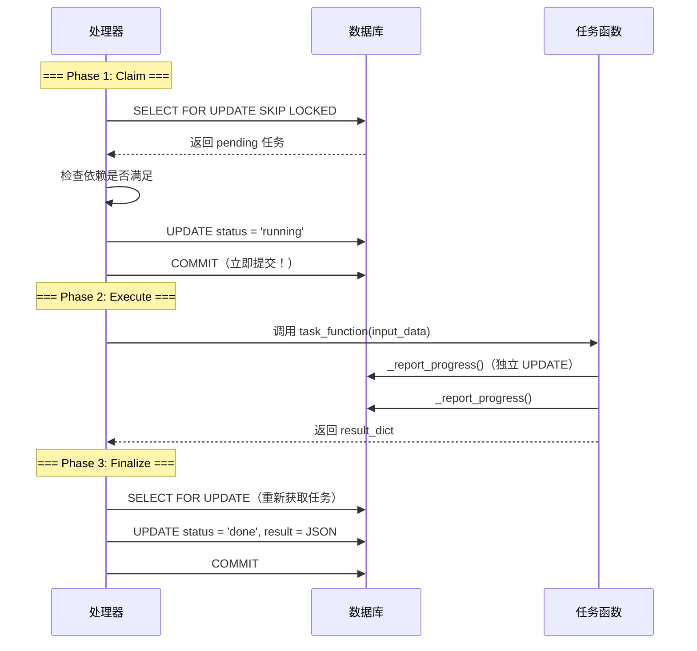

# 任务处理器

任务处理器（Task Processor）是 LectureMind 后台运行的独立进程，负责从数据库中领取并执行异步任务。其实现在 `server/app/api/management/commands/process_async_task.py` 中。

## 概述

任务处理器是一个 Django 管理命令，通过以下方式启动：

```bash
cd server/app
python manage.py process_async_task
```

它以**轮询循环**方式运行：每隔几秒检查数据库中是否有待执行的任务，按照依赖关系依次执行。

:::warning 必须单独运行
任务处理器是独立于 Web 服务器的进程。在开发环境中，你需要同时运行两个终端：
1. `python manage.py runserver` -- 处理 HTTP 请求
2. `python manage.py process_async_task` -- 执行异步任务
:::

## 任务生命周期



## 三阶段执行模型

每个任务的执行分为三个独立的事务阶段，这是处理器最核心的设计：



### Phase 1: Claim（领取任务）

```python
with transaction.atomic():
    task = AsyncTaskItem.objects.select_for_update(skip_locked=True).get(id=task_id)
    if task.status != 'pending':
        return
    if not self._is_task_ready(task_id):
        return

    input_data = self._get_task_input(task)
    func = get_task_function(task.func_name)

    task.status = 'running'
    task.progress = 0
    task.save(update_fields=['status', 'progress'])
    # 事务在这里提交 — 'running' 状态对外部立即可见
```

**关键点**：
- 使用 `SELECT FOR UPDATE` 加行锁，防止多个处理器同时领取同一个任务
- 使用 `SKIP LOCKED` 跳过已被其他处理器锁定的任务，支持多实例并发
- 事务提交后 `running` 状态立即对外可见，前端可以实时更新

### Phase 2: Execute（执行任务）

```python
# 在事务外部执行 — 不持有数据库锁
result_data = func(input_data)
```

**关键点**：
- 任务函数在**没有数据库事务**的上下文中执行
- `_report_progress()` 内部执行独立的 `UPDATE` 语句，每次更新立即提交
- 这意味着前端可以实时看到进度百分比的变化

### Phase 3: Finalize（完成任务）

```python
with transaction.atomic():
    task = AsyncTaskItem.objects.select_for_update().get(id=task_id)
    task.result = json.dumps(result_data)
    task.status = 'done'
    task.progress = 100
    task.finished_at = timezone.now()
    task.save(update_fields=['result', 'status', 'progress', 'finished_at'])
```

:::tip 为什么要分三个事务？
如果整个执行过程包裹在一个大事务中，前端在任务执行期间看到的状态将一直是 `pending`，进度也不会更新。分成三个阶段后：
- Phase 1 提交后，前端立即看到 `running` 状态
- Phase 2 中的 `_report_progress()` 独立提交，前端实时看到进度
- Phase 3 提交后，前端看到最终的 `done` 或 `error` 状态
:::

## 轮询循环

处理器的主循环逻辑：

```python
def handle(self, *args, **options):
    load_dotenv_file()              # 加载 .env 配置
    signal.signal(signal.SIGINT, self._handle_shutdown)   # 注册信号处理
    signal.signal(signal.SIGTERM, self._handle_shutdown)

    while not self._shutdown:
        try:
            processed = self._process_batch()
            if processed == 0:
                time.sleep(5)       # 没有任务时等待 5 秒
        except Exception as e:
            logger.exception(f"Critical error: {e}")
            time.sleep(10)          # 出错后等待 10 秒再重试
```

```mermaid
sequenceDiagram
    participant CMD as 命令入口
    participant Loop as 主循环
    participant Batch as 批处理器
    participant DB as 数据库
    participant Task as 任务函数

    CMD->>Loop: 启动主循环
    loop 每 5 秒（无任务时）
        Loop->>Batch: _process_batch()
        Batch->>DB: 查询 pending 任务
        DB-->>Batch: 返回任务 ID 列表

        alt 有可执行任务
            Batch->>Batch: 检查依赖满足
            Batch->>Task: _process_single_task(task_id)
            Task->>DB: Claim → Execute → Finalize
            Task-->>Batch: 完成
            Batch-->>Loop: processed = N
        else 无可执行任务
            Batch-->>Loop: processed = 0
            Loop->>Loop: sleep(5)
        end
    end
```

## 依赖解析

### 检查任务是否就绪

```python
def _is_task_ready(self, task_id: str) -> bool:
    task = AsyncTaskItem.objects.get(id=task_id)
    if not task.previous:
        return True                          # 无依赖，直接就绪

    prev_task = AsyncTaskItem.objects.filter(id=task.previous).first()
    if not prev_task:
        return False                         # 前置任务不存在（数据异常）

    if prev_task.status == 'error':
        self._cascade_failure(task, prev_task)  # 前置失败 → 级联失败
        return False

    return prev_task.status == 'done'        # 前置完成 → 就绪
```

### 获取任务输入

任务的输入数据来源取决于是否有前置任务：

```python
def _get_task_input(self, task: AsyncTaskItem) -> dict:
    if task.previous:
        prev_task = AsyncTaskItem.objects.get(id=task.previous)
        return json.loads(prev_task.result)  # 使用前置任务的输出
    else:
        return json.loads(task.param)        # 使用任务自身的参数
```

**数据流转示例**：
```
T3 (SSIM 检测) 的输出:
  {"video_id": "xxx", "file": "videos/xxx.mp4", "changes": [12.5, 45.0, ...]}
    ↓ 作为 T4 的输入
T4 (生成缩略图) 使用 changes 数组截取帧
    ↓ 输出传递给 T4b
T4b (OCR) 使用 video_id 查询缩略图
    ...
```

## 级联失败机制

当前置任务失败时，所有依赖它的下游任务会自动标记为失败：

```python
def _cascade_failure(self, task: AsyncTaskItem, failed_predecessor: AsyncTaskItem):
    error_data = {
        "error": f"Predecessor task '{failed_predecessor.title}' failed",
        "error_type": "CascadeFailure",
        "predecessor_id": str(failed_predecessor.id),
        "predecessor_func": failed_predecessor.func_name,
    }
    # 尝试提取原始错误信息
    pred_result = json.loads(failed_predecessor.result)
    error_data["original_error"] = pred_result.get("error", "Unknown error")

    task.result = json.dumps(error_data)
    task.status = 'error'
    task.finished_at = timezone.now()
    task.save(update_fields=['result', 'status', 'finished_at'])
```

**级联示例**：
```
T3 (SSIM) 失败
  → T4 (缩略图) 自动标记为 CascadeFailure
    → T4b (OCR) 自动标记为 CascadeFailure
      → T5 (分块) 自动标记为 CascadeFailure
        → T6 → T7 → T8 → T9 全部级联失败

T1 (ASR) 和 T2 (HLS) 不受影响（无依赖关系）
```

:::tip 部分成功
级联失败只影响依赖链上的任务。如果 T1 和 T2 已经成功完成，它们的结果仍然保留。用户可以使用重试 API 从失败点恢复。
:::

## 进度报告

任务函数通过 `_report_progress()` 更新执行进度：

```python
def _report_progress(video_id: str, func_name: str, progress: int) -> None:
    AsyncTaskItem.objects.filter(
        video_id=video_id, func_name=func_name, status='running'
    ).update(progress=min(max(progress, 0), 100))
```

- 进度值自动限制在 0-100 范围内
- 使用 `filter().update()` 直接执行 SQL，不经过 ORM 保存流程
- 前端通过轮询 `GET /api/tasks/video/{id}/` 获取最新进度

## 错误处理

当任务函数抛出异常时，处理器会：

1. 捕获异常和完整的 traceback
2. 将错误信息序列化为 JSON 存储在 `result` 字段中
3. 将任务状态设为 `error`
4. 记录详细的错误日志

**错误信息格式**：
```json
{
  "error": "Video file not found: /path/to/video.mp4",
  "error_type": "FileNotFoundError",
  "traceback": "Traceback (most recent call last):\n  File ..."
}
```

:::warning traceback 截断
traceback 信息会被截断到 2000 个字符，防止超长堆栈导致数据库存储问题。
:::

## 重试机制

用户可以通过 `POST /api/tasks/{uuid}/retry/` 重试失败的任务。

**重试逻辑**：
1. 检查目标任务状态是否为 `error`
2. 递归收集目标任务及其所有下游级联失败的任务
3. 将所有收集到的任务重置为 `pending` 状态
4. 清空 `result` 和 `finished_at` 字段
5. 任务处理器会在下一次轮询时自动领取这些任务

```python
# views.py
def task_retry_view(request, pk):
    task = AsyncTaskItem.objects.get(id=pk)
    tasks_to_reset = [task]
    _collect_downstream_tasks(task, tasks_to_reset)  # 递归收集下游

    for t in tasks_to_reset:
        t.status = 'pending'
        t.result = ''
        t.finished_at = None
        t.save(update_fields=['status', 'result', 'finished_at'])
```

**重试示例**：
```
用户重试 T3 (SSIM)
  → T3, T4, T4b, T5, T6, T7, T8, T9 全部重置为 pending
  → 处理器从 T3 开始重新执行整条链
  → T1, T2 不受影响（已完成且无依赖）
```

## 优雅关闭

处理器注册了 SIGINT（Ctrl+C）和 SIGTERM 信号处理器：

```python
def _handle_shutdown(self, signum, frame):
    logger.info("Received shutdown signal. Stopping after current batch...")
    self._shutdown = True
```

**关闭流程**：
1. 收到信号后设置 `_shutdown = True`
2. 当前批次中的剩余任务会继续处理（不会中途中断）
3. 主循环检查 `_shutdown` 标志后退出
4. 日志记录 "Async task processor STOPPED gracefully"

:::warning 不要强制终止
避免使用 `kill -9` 强制终止处理器。如果一个任务正在执行中被强制终止，该任务会停留在 `running` 状态，需要手动重置：
```sql
UPDATE api_asynctaskitem SET status = 'pending', progress = 0
WHERE status = 'running';
```
:::

## .env 文件加载

处理器启动时会自动向上遍历目录树查找 `.env` 文件：

```python
def load_dotenv_file():
    search = Path(__file__).resolve().parent
    for _ in range(10):
        env_file = search / '.env'
        if env_file.exists():
            # 解析并加载到 os.environ（不覆盖已有变量）
            ...
            return
        search = search.parent
```

这确保了即使在不同的工作目录下启动处理器，也能正确加载项目根目录的 `.env` 配置。

## 并发安全

### SELECT FOR UPDATE + SKIP LOCKED

```python
task = AsyncTaskItem.objects.select_for_update(skip_locked=True).get(id=task_id)
```

- `SELECT FOR UPDATE`：对选中的行加排他锁，其他事务无法同时修改
- `SKIP LOCKED`：如果行已被锁定，跳过而不是等待
- 这使得可以同时运行多个处理器实例而不会重复执行同一个任务

### 多实例部署

如果你需要更高的处理吞吐量，可以启动多个处理器实例：

```bash
# 终端 1
python manage.py process_async_task

# 终端 2
python manage.py process_async_task
```

每个实例会自动领取未被锁定的任务，通过数据库行锁保证同一个任务只被执行一次。

## 监控与调试

### 日志输出

处理器使用 `LectureMind` logger 输出详细的日志：

```
INFO  Async task processor STARTED (Press Ctrl+C to stop)
INFO  Found 3 ready task(s) to process
INFO  STARTED task xxx | Func: task_extract_audio_and_transcript | Video: yyy
INFO  COMPLETED task xxx | Func: task_extract_audio_and_transcript | Duration: 45.23s | Video: yyy
WARNING CASCADE FAIL task zzz <- predecessor xxx
ERROR  FAILED task www | Func: task_hls_streaming | Error: RuntimeError: FFmpeg failed
```

### 通过 API 监控

```bash
# 查看某视频的所有任务状态
curl http://localhost:8000/api/tasks/video/{video-id}/

# 查看单个任务详情
curl http://localhost:8000/api/tasks/{task-id}/
```

**前端可以通过以下方式监控进度**：
- 轮询 `GET /api/tasks/video/{id}/` 获取所有任务的 `status` 和 `progress`
- 状态变化：`pending` → `running` → `done` / `error`
- 进度范围：0-100（整数）

:::tip 实时性
由于三阶段执行模型的设计，`running` 状态和进度更新在 Phase 1/2 提交后立即对外可见。前端每 1-2 秒轮询一次即可获得良好的实时体验。
:::
