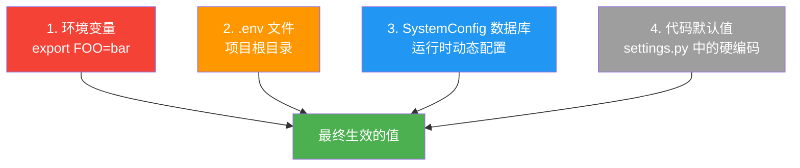
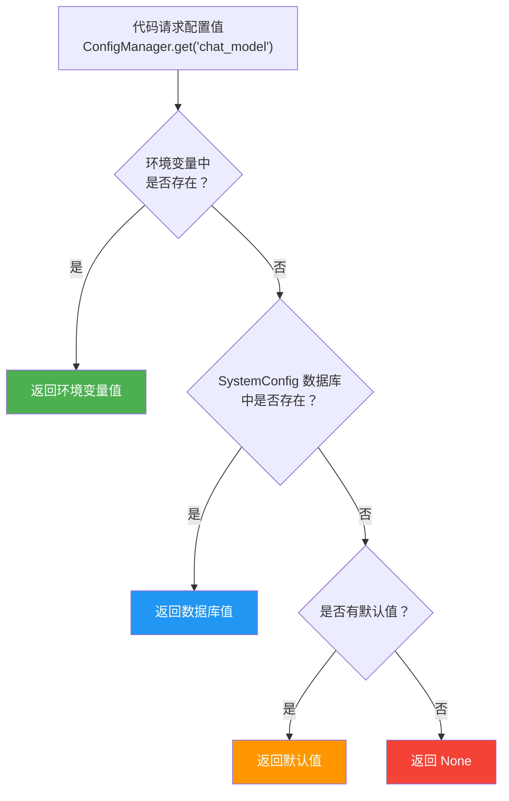

# 配置详解

LectureMind 的配置系统设计灵活，支持多种配置来源，让你在开发、测试和生产环境中都能轻松管理设置。本文档是所有配置项的完整参考。

---

## 配置来源与优先级

LectureMind 从四个来源读取配置，按优先级从高到低排列：



**优先级规则**：如果同一个配置项在多个来源中都有值，高优先级的来源会覆盖低优先级的。

### 各来源说明

| 来源 | 说明 | 适用场景 |
|------|------|---------|
| **环境变量** | 通过 `export` 设置的系统环境变量 | CI/CD、容器编排 |
| **.env 文件** | 项目根目录的 `.env` 文件，启动时自动加载 | 本地开发、Docker 部署 |
| **SystemConfig 数据库** | 通过 Web 界面或 API 动态修改 | 运行时调优、切换模型 |
| **代码默认值** | `settings.py` 中的硬编码默认值 | 兜底值，通常无需修改 |

:::info .env 文件查找路径
系统从 `manage.py` 所在目录向上逐级查找 `.env` 文件，找到的第一个即被使用。推荐将 `.env` 放在项目根目录 `LectureMind/.env`。
:::

:::warning 启动时 vs 运行时
在启动时读取的配置（如 `MEDIA_ROOT`、`DB_PATH`、`LOG_DIR`）修改后需要重启服务才能生效。而 LLM 模型、API Key 等支持运行时动态修改，无需重启。
:::

---

## 环境变量参考

### 服务器配置

| 变量名 | 默认值 | 说明 |
|--------|--------|------|
| `SECRET_KEY` | `django-insecure-...` | Django 密钥，**生产环境必须修改** |
| `DEBUG` | `True` | 调试模式，生产环境设为 `False` |
| `BACKEND_PORT` | `8000` | 后端 API 监听端口 |
| `ALLOWED_HOSTS` | `localhost,127.0.0.1` | 允许的主机名（逗号分隔） |
| `CORS_ALLOWED_ORIGINS` | `http://localhost:3000` | 允许的 CORS 来源（逗号分隔） |

### 存储路径

所有路径变量接受绝对路径。子目录变量（如 `MEDIA_AUDIO_DIR`）也接受相对名称，会相对于 `MEDIA_ROOT` 解析。

| 变量名 | 默认值 | 说明 |
|--------|--------|------|
| `MEDIA_ROOT` | `<BASE_DIR>/media` | 所有上传和生成文件的根目录 |
| `MEDIA_URL` | `/media/` | Django 服务媒体文件的 URL 前缀 |
| `MEDIA_AUDIO_DIR` | `<MEDIA_ROOT>/audio` | ASR 提取的 `.wav` 音频文件 |
| `MEDIA_STREAMS_DIR` | `<MEDIA_ROOT>/streams` | HLS `.m3u8` 播放列表和分片 |
| `MEDIA_THUMBNAILS_DIR` | `<MEDIA_ROOT>/thumbnails` | 幻灯片缩略图（两种分辨率） |
| `DB_PATH` | `<BASE_DIR>/db.sqlite3` | SQLite 数据库文件路径 |
| `LOG_DIR` | `<BASE_DIR>/logs` | 日志文件目录 |
| `CHROMA_PERSIST_DIR` | `<MEDIA_ROOT>/chromadb` | ChromaDB 持久化存储目录 |

### LLM 与 API 密钥

| 变量名 | 默认值 | 说明 |
|--------|--------|------|
| `LLM_API_BASE` | `https://dashscope.aliyuncs.com/compatible-mode/v1` | OpenAI 兼容 API 基地址 |
| `DASHSCOPE_API_KEY` | （无） | 阿里云 DashScope API 密钥（ASR + LLM） |
| `LLM_MODEL` | `qwen2.5-7b-instruct` | 任务管线使用的模型 |
| `CHAT_MODEL` | `qwen3-max` | 聊天 / Agent RAG 使用的模型 |
| `VL_MODEL` | `qwen2.5-vl-72b-instruct` | 幻灯片 OCR 使用的视觉语言模型 |

### 腾讯云 COS

用于 ASR 音频文件上传（DashScope ASR 要求通过 URL 访问音频文件）。

| 变量名 | 说明 |
|--------|------|
| `COS_SECRECT_ID` | 腾讯云 COS SecretId |
| `COS_SECRECT_KEY` | 腾讯云 COS SecretKey |
| `COS_REGION` | COS 区域（如 `ap-singapore`、`ap-guangzhou`） |
| `COS_BUCKET` | COS 存储桶名称 |

### Docker Compose 专用

| 变量名 | 默认值 | 说明 |
|--------|--------|------|
| `FRONTEND_PORT` | `3000` | 宿主机映射到前端 nginx 容器的端口 |

---

## SystemConfig 运行时配置

`SystemConfig` 是一个数据库模型，允许你在 **不重启服务** 的情况下动态修改 LLM 模型和 API 密钥。

### 它是什么？

SystemConfig 存储在 SQLite/PostgreSQL 数据库中，通过 Django Admin、Web 设置页面或 REST API 进行管理。当代码通过 `ConfigManager` 读取配置时，会自动检查数据库中的值。

### 如何使用？

**方式 1：Web 界面**

访问 LectureMind 前端的「设置」页面，可以直接修改 LLM 模型、API 密钥等配置。修改后立即生效。

**方式 2：REST API**

```bash
# 查看所有配置（密钥会被脱敏）
curl http://localhost:8000/api/config/

# 更新单个配置
curl -X POST http://localhost:8000/api/config/update/ \
  -H "Content-Type: application/json" \
  -d '{"key": "chat_model", "value": "qwen3-max"}'

# 批量更新
curl -X POST http://localhost:8000/api/config/update/ \
  -H "Content-Type: application/json" \
  -d '[
    {"key": "llm_model", "value": "qwen-turbo"},
    {"key": "chat_model", "value": "qwen3-max"}
  ]'

# 从 .env 同步到数据库
curl -X POST http://localhost:8000/api/config/sync-from-env/
```

### 安全机制

包含 `api_key`、`secret_id`、`secret_key` 的配置项在 API 响应中会被自动脱敏，只显示最后 4 个字符（`****xxxx`）。

---

## ConfigManager Python API

在后端 Python 代码中，使用 `ConfigManager` 来读写配置：

```python
from api.config_utils import ConfigManager

# 读取值（优先级: 环境变量 → 数据库 → 默认值）
model = ConfigManager.get('chat_model', default='qwen-turbo')

# 写入值（同时持久化到数据库和 .env）
ConfigManager.set('chat_model', 'qwen3.6-plus')

# 批量写入
ConfigManager.set_multiple({
    'llm_model':  {'value': 'qwen-turbo',  'description': '任务管线模型'},
    'chat_model': {'value': 'qwen3-max',   'description': '聊天/Agent 模型'},
})

# 读取所有值（密钥默认脱敏）
all_cfg = ConfigManager.get_all()
all_cfg_with_secrets = ConfigManager.get_all(include_secrets=True)

# 从 .env 同步到数据库（手动编辑 .env 后使用）
ConfigManager.sync_from_env()

# 模型切换后重置 LLM 客户端单例
ConfigManager.reset_llm_client()
```

:::tip 何时需要重置 LLM 客户端？
当你通过 `ConfigManager.set()` 修改模型或 API 配置时，LLM 客户端会自动重置。但如果你手动编辑了 `.env` 文件，需要调用 `sync_from_env()` 或重启服务。
:::

---

## 前端运行时配置

React 前端通过 `window.__ENV__` 注入运行时配置，无需重新构建镜像即可修改 API 地址。

### 工作原理

Docker 容器启动时，`frontend/docker-entrypoint.sh` 会生成一个 `env-config.js` 文件：

```javascript
// /usr/share/nginx/html/env-config.js（容器启动时写入）
window.__ENV__ = {
  API_PREFIX: "http://your-server:8000"
};
```

前端代码通过 `src/config.ts` 读取：

```typescript
export const API_PREFIX: string =
    window.__ENV__?.API_PREFIX ?? "http://127.0.0.1:8000"
```

### 修改 API 地址

**Docker 部署** — 在 `docker-compose.yml` 或 `.env` 中设置：

```yaml
# docker-compose.yml
frontend:
  environment:
    API_PREFIX: "https://api.myserver.com"
```

**本地开发** — 编辑 `frontend/public/env-config.js`：

```javascript
window.__ENV__ = {
  API_PREFIX: "http://localhost:8000"
};
```

---

## 配置解析流程

下图展示了当代码请求一个配置值时的完整解析流程：



---

## 最小配置示例

只需 4 个值即可让 LectureMind 运行起来：

```bash
# .env — 最小可运行配置

# 阿里云 DashScope（必填）
DASHSCOPE_API_KEY=sk-xxxxxxxxxxxxxxxx

# 腾讯云 COS（必填，ASR 音频上传需要）
COS_SECRECT_ID=AKIDxxxxxxxx
COS_SECRECT_KEY=xxxxxxxx
COS_REGION=ap-singapore
COS_BUCKET=my-bucket-name
```

其他所有配置都有合理的默认值，无需修改即可运行。

---

## 完整 .env 示例

```bash
# ── API 密钥（必填）──────────────────────────────────────────
DASHSCOPE_API_KEY=sk-xxxxxxxxxxxxxxxx
COS_SECRECT_ID=AKIDxxxxxxxx
COS_SECRECT_KEY=xxxxxxxx
COS_REGION=ap-singapore
COS_BUCKET=my-bucket-name

# ── LLM 模型 ─────────────────────────────────────────────────
LLM_API_BASE=https://dashscope.aliyuncs.com/compatible-mode/v1
LLM_MODEL=qwen2.5-7b-instruct        # 任务管线模型
CHAT_MODEL=qwen3-max                   # 聊天/RAG 模型
VL_MODEL=qwen2.5-vl-72b-instruct      # OCR 视觉模型

# ── 服务器 ───────────────────────────────────────────────────
BACKEND_PORT=8000
FRONTEND_PORT=3000
SECRET_KEY=your-random-secret-key-here
DEBUG=False
ALLOWED_HOSTS=myserver.com,www.myserver.com
CORS_ALLOWED_ORIGINS=https://myserver.com

# ── 存储路径 ─────────────────────────────────────────────────
MEDIA_ROOT=/data/media
MEDIA_URL=/media/
MEDIA_AUDIO_DIR=audio
MEDIA_STREAMS_DIR=streams
MEDIA_THUMBNAILS_DIR=thumbnails
DB_PATH=/data/db.sqlite3
LOG_DIR=/data/logs
CHROMA_PERSIST_DIR=/data/media/chromadb
```

---

## 配置计算器

根据你的部署规模，参考以下建议配置：

<div style="background: linear-gradient(135deg, #667eea 0%, #764ba2 100%); border-radius: 12px; padding: 24px; color: white; margin: 16px 0;">

<h3 style="color: white; margin-top: 0;">部署规模配置建议</h3>

<table style="color: white; width: 100%; border-collapse: collapse;">
<thead>
<tr style="border-bottom: 1px solid rgba(255,255,255,0.3);">
<th style="color: white; padding: 8px; text-align: left;">场景</th>
<th style="color: white; padding: 8px; text-align: left;">内存</th>
<th style="color: white; padding: 8px; text-align: left;">LLM_MODEL</th>
<th style="color: white; padding: 8px; text-align: left;">CHAT_MODEL</th>
<th style="color: white; padding: 8px; text-align: left;">说明</th>
</tr>
</thead>
<tbody>
<tr style="border-bottom: 1px solid rgba(255,255,255,0.2);">
<td style="padding: 8px;">个人学习</td>
<td style="padding: 8px;">8 GB</td>
<td style="padding: 8px;">qwen2.5-7b-instruct</td>
<td style="padding: 8px;">qwen-plus</td>
<td style="padding: 8px;">语义分段自动关闭</td>
</tr>
<tr style="border-bottom: 1px solid rgba(255,255,255,0.2);">
<td style="padding: 8px;">小团队</td>
<td style="padding: 8px;">16 GB</td>
<td style="padding: 8px;">qwen2.5-7b-instruct</td>
<td style="padding: 8px;">qwen3-max</td>
<td style="padding: 8px;">完整功能，推荐配置</td>
</tr>
<tr style="border-bottom: 1px solid rgba(255,255,255,0.2);">
<td style="padding: 8px;">生产环境</td>
<td style="padding: 8px;">32 GB+</td>
<td style="padding: 8px;">qwen2.5-7b-instruct</td>
<td style="padding: 8px;">qwen3-max</td>
<td style="padding: 8px;">建议使用 PostgreSQL</td>
</tr>
<tr>
<td style="padding: 8px;">高精度 OCR</td>
<td style="padding: 8px;">16 GB+</td>
<td style="padding: 8px;">qwen2.5-7b-instruct</td>
<td style="padding: 8px;">qwen3-max</td>
<td style="padding: 8px;">VL_MODEL 使用 72B 视觉模型</td>
</tr>
</tbody>
</table>

</div>

---

## 安全注意事项

:::warning 生产环境安全清单
1. **修改 SECRET_KEY** — 使用随机生成的长字符串：`python -c "import secrets; print(secrets.token_hex(50))"`
2. **关闭 DEBUG** — 设置 `DEBUG=False`
3. **限制 ALLOWED_HOSTS** — 仅填写实际域名
4. **限制 CORS** — 仅填写实际前端域名
5. **保护 .env 文件** — 设置权限 `chmod 600 .env`，确保不被提交到 Git
6. **Docker 密钥管理** — 通过 `env_file` 注入，不要将密钥烘焙到镜像中
:::

---

## 常见配置问题

### 端口冲突

```bash
# 修改 .env 中的端口
BACKEND_PORT=9000
FRONTEND_PORT=8080
```

### 媒体文件无法访问

确认 `MEDIA_ROOT` 目录存在且可写：

```bash
ls -la $MEDIA_ROOT
# 如果不存在，手动创建
mkdir -p $MEDIA_ROOT
chmod 755 $MEDIA_ROOT
```

### ChromaDB 启动报错

ChromaDB 首次使用时自动创建。权限问题的解决方法：

```bash
mkdir -p $CHROMA_PERSIST_DIR
chmod 755 $CHROMA_PERSIST_DIR
```

### 配置修改未生效

1. **LLM 相关配置**（模型、API Key）：通过 `ConfigManager.set()` 或 Web 设置页修改后立即生效
2. **手动编辑 .env**：需要调用同步接口或重启服务

```bash
# 同步 .env 到数据库
curl -X POST http://localhost:8000/api/config/sync-from-env/
```

3. **路径和端口配置**（`MEDIA_ROOT`、`DB_PATH` 等）：需要重启服务才能生效

### .env 文件未加载

确认 `.env` 文件位于以下位置之一：

```
LectureMind/.env        # 项目根目录（推荐）
LectureMind/server/.env
LectureMind/server/app/.env
```

---

:::tip 下一步
配置完成后，返回 [快速开始](./getting-started.md) 上传你的第一个视频，或查看 [架构概览](./architecture) 深入了解系统设计。
:::
