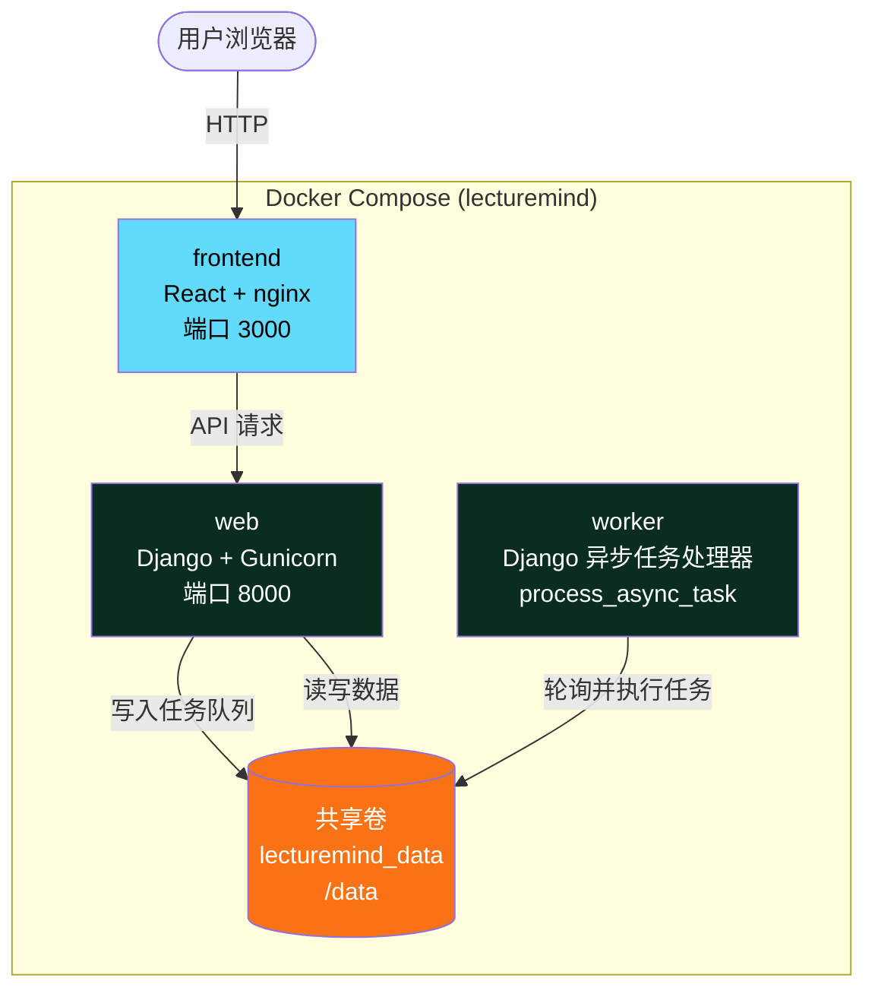

# Docker 部署

本文档介绍如何使用 Docker Compose 将 LectureMind 部署到生产环境或本地服务器。整个系统由三个容器服务组成，通过共享卷实现数据互通。

## 服务架构

LectureMind 使用 Docker Compose 编排三个服务：



### 服务说明

| 服务 | 镜像 | 职责 | 端口 | 资源限制 |
|---|---|---|---|---|
| **web** | `lecturemind-backend` | Django REST API + Gunicorn | `${BACKEND_PORT:-8000}` | 4GB 内存, 2 CPU |
| **worker** | `lecturemind-backend` (同一镜像) | 异步任务处理 (`process_async_task`) | 无 | 4GB 内存, 2 CPU |
| **frontend** | `lecturemind-frontend` | React SPA + nginx 静态服务 | `${FRONTEND_PORT:-3000}` | 512MB 内存, 0.5 CPU |

`web` 和 `worker` 使用同一个镜像，通过环境变量 `SERVICE` 区分启动方式：
- `SERVICE=web` → 启动 Gunicorn
- `SERVICE=worker` → 启动 `python manage.py process_async_task`

## docker-compose.yml 详解

以下是完整的配置文件并附带逐行注释：

```yaml
# docker-compose.yml — LectureMind
# 使用方法：
#   cp .env.example .env && vim .env   # 填写密钥配置
#   docker compose up --build

name: lecturemind  # 项目名称，用于容器命名前缀

services:

  # ── Django API (Gunicorn) ──────────────────────────────────────────────────
  web:
    image: lecturemind-backend
    build:
      context: ./server            # 构建上下文为 server/ 目录
      dockerfile: Dockerfile       # 使用 server/Dockerfile
      target: runtime              # 多阶段构建，使用 runtime 阶段
    env_file: .env                 # 从项目根目录 .env 加载所有环境变量
    environment:
      SERVICE: web                 # 入口脚本根据此变量决定启动 web 还是 worker
      DEBUG: "False"               # 生产环境关闭调试模式
      MEDIA_ROOT: /data/media      # 媒体文件存储根目录（容器内路径）
      LOG_DIR: /data/logs          # 日志目录
      DB_PATH: /data/db.sqlite3    # SQLite 数据库路径
      CHROMA_PERSIST_DIR: /data/media/chromadb  # ChromaDB 向量数据库持久化路径
      ALLOWED_HOSTS: "localhost,127.0.0.1,web"  # Django 允许的主机名
      CORS_ALLOWED_ORIGINS: "http://localhost:3000,http://frontend:3000"  # CORS 白名单
    volumes:
      - lecturemind_data:/data     # 挂载持久化数据卷
    ports:
      - "${BACKEND_PORT:-8000}:8000"  # 映射到宿主机端口（默认 8000）
    restart: unless-stopped        # 除非手动停止，否则自动重启
    healthcheck:                   # 健康检查：每 30 秒访问 /api/health/
      test: ["CMD", "python", "-c",
             "import urllib.request; urllib.request.urlopen('http://localhost:8000/api/health/')"]
      interval: 30s
      timeout: 10s
      retries: 5                   # 连续 5 次失败后标记为不健康
      start_period: 20s            # 给予 20 秒启动时间
    deploy:
      resources:
        limits:
          memory: 4G               # 最大内存
          cpus: '2.0'              # 最大 CPU 核数
        reservations:
          memory: 512M             # 预留内存

  # ── 异步任务处理 Worker ────────────────────────────────────────────────────
  worker:
    image: lecturemind-backend     # 与 web 使用相同镜像
    build:
      context: ./server
      dockerfile: Dockerfile
      target: runtime
    env_file: .env
    environment:
      SERVICE: worker              # 关键区别：启动任务处理器而非 Gunicorn
      DEBUG: "False"
      MEDIA_ROOT: /data/media
      LOG_DIR: /data/logs
      DB_PATH: /data/db.sqlite3
      CHROMA_PERSIST_DIR: /data/media/chromadb
    volumes:
      - lecturemind_data:/data     # 与 web 共享同一数据卷
    depends_on:
      web:
        condition: service_healthy # 等待 web 健康后再启动
    restart: unless-stopped
    healthcheck:
      test: ["CMD", "python", "-c", "import sys; sys.exit(0)"]
      interval: 60s
      timeout: 5s
      retries: 3
      start_period: 10s
    deploy:
      resources:
        limits:
          memory: 4G
          cpus: '2.0'
        reservations:
          memory: 512M

  # ── React 前端 (nginx) ─────────────────────────────────────────────────────
  frontend:
    image: lecturemind-frontend
    build:
      context: ./frontend          # 构建上下文为 frontend/ 目录
      dockerfile: Dockerfile
      target: runtime              # 多阶段构建，使用 nginx 运行阶段
    environment:
      # 浏览器调用此 URL — 必须从用户机器可达
      API_PREFIX: "http://localhost:${BACKEND_PORT:-8000}"
    ports:
      - "${FRONTEND_PORT:-3000}:3000"  # 映射到宿主机端口（默认 3000）
    depends_on:
      web:
        condition: service_healthy # 等待 web 健康后再启动
    restart: unless-stopped
    deploy:
      resources:
        limits:
          memory: 512M
          cpus: '0.5'

# ── 共享数据卷 ───────────────────────────────────────────────────────────────
volumes:
  lecturemind_data:
    driver: local  # 本地存储驱动
```

### 共享卷 `lecturemind_data` 的内容

```
/data/
├── db.sqlite3              # SQLite 数据库
├── media/
│   ├── audio/              # 提取的 WAV 音频文件
│   ├── streams/            # HLS 切片和播放列表
│   ├── thumbnails/         # 幻灯片缩略图
│   └── chromadb/           # ChromaDB 向量数据库
└── logs/                   # 应用日志
```

## 前置要求

在开始部署之前，请确保你的系统满足以下条件：

- **Docker Engine** 20.10 或更高版本
- **Docker Compose** v2（随 Docker Desktop 一起安装）
- **FFmpeg** 已安装在 Docker 镜像中（无需宿主机安装）
- 至少 **8GB 可用内存**（推荐 16GB）
- 至少 **20GB 可用磁盘空间**（视频处理需要较大存储）

## 部署步骤

### 第一步：克隆仓库

```bash
git clone https://github.com/XUranus/LectureMind.git
cd LectureMind
```

### 第二步：配置环境变量

```bash
cp .env.example .env
```

编辑 `.env` 文件，填写必要的配置项：

```bash
# 必填：DashScope API 密钥（用于 ASR 和 LLM）
DASHSCOPE_API_KEY=sk-xxxxxxxxxxxxxxxx

# 必填：腾讯云 COS 配置（用于 ASR 音频上传）
COS_SECRECT_ID=AKIDxxxxxxxx
COS_SECRECT_KEY=xxxxxxxx
COS_REGION=ap-singapore
COS_BUCKET=my-bucket-name

# 推荐：模型配置
LLM_MODEL=qwen2.5-7b-instruct
CHAT_MODEL=qwen3-max
VL_MODEL=qwen2.5-vl-72b-instruct

# 可选：端口配置（默认值即可满足大多数场景）
BACKEND_PORT=8000
FRONTEND_PORT=3000

# 生产环境必填：安全配置
SECRET_KEY=your-long-random-secret-key-here
DEBUG=False
ALLOWED_HOSTS=your-domain.com,www.your-domain.com
CORS_ALLOWED_ORIGINS=https://your-domain.com
```

> **提示**：生成安全的 SECRET_KEY 可以使用以下命令：
> ```bash
> python -c "import secrets; print(secrets.token_hex(50))"
> ```

### 第三步：构建并启动

```bash
# 构建镜像并启动所有服务
docker compose up --build
```

如果要在后台运行：

```bash
docker compose up --build -d
```

构建过程包括：
1. **后端镜像** (`lecturemind-backend`)：两阶段构建 — 先编译 Python 依赖，再构建轻量运行时
2. **前端镜像** (`lecturemind-frontend`)：两阶段构建 — 先用 pnpm 构建 React 应用，再用 nginx 提供服务

### 第四步：验证部署

等待服务启动完成后（首次启动可能需要 1-2 分钟），验证各服务状态：

```bash
# 查看所有容器状态
docker compose ps

# 检查后端健康状态
curl http://localhost:8000/api/health/

# 检查前端是否可访问
curl -I http://localhost:3000
```

预期输出：
- `web` 服务状态为 `healthy`
- `worker` 服务状态为 `healthy`
- `frontend` 服务状态为 `running`
- `/api/health/` 返回 200 状态码

## 常用运维操作

### 查看日志

```bash
# 查看所有服务的实时日志
docker compose logs -f

# 查看特定服务的日志
docker compose logs -f web       # 后端 API 日志
docker compose logs -f worker    # 任务处理器日志
docker compose logs -f frontend  # 前端 nginx 日志

# 查看最近 100 行日志
docker compose logs --tail 100 web
```

### 重启服务

```bash
# 重启所有服务
docker compose restart

# 重启单个服务
docker compose restart web
docker compose restart worker
```

### 重新构建单个服务

当你只修改了后端代码而不需要重建前端时：

```bash
# 仅重新构建并重启后端
docker compose build web worker  # web 和 worker 共用同一镜像
docker compose up -d web worker

# 仅重新构建并重启前端
docker compose build frontend
docker compose up -d frontend
```

### 停止并清理

```bash
# 停止所有服务（保留数据卷）
docker compose down

# 停止并删除数据卷（⚠️ 会删除所有数据，包括数据库和媒体文件）
docker compose down -v

# 停止并删除所有内容，包括镜像
docker compose down -v --rmi all
```

### 进入容器调试

```bash
# 进入后端容器
docker compose exec web bash

# 在容器内运行 Django 管理命令
docker compose exec web python manage.py shell
docker compose exec web python manage.py dbshell
docker compose exec web python manage.py createsuperuser
```

### 查看资源使用

```bash
# 实时查看容器资源占用
docker stats

# 查看数据卷大小
docker system df -v
```

## 多阶段构建说明

### 后端 Dockerfile

```dockerfile
# 阶段 1：编译 Python 依赖
FROM python:3.11-slim AS builder
# 安装编译工具，编译 opencv、Pillow 等需要原生编译的包
# 将依赖安装到 /install 前缀目录

# 阶段 2：运行时镜像
FROM python:3.11-slim AS runtime
# 安装运行时依赖：ffmpeg、libgl1 等
# 从 builder 复制编译好的 Python 包
# 创建非 root 用户 appuser 运行应用
# 使用 docker-entrypoint.sh：migrate → collectstatic → 启动 gunicorn/worker
```

### 前端 Dockerfile

```dockerfile
# 阶段 1：构建 React 应用
FROM node:20-alpine AS builder
# 使用 pnpm 安装依赖并构建生产版本

# 阶段 2：nginx 静态服务
FROM nginx:1.27-alpine AS runtime
# 复制构建产物到 nginx html 目录
# 使用 docker-entrypoint.sh 注入运行时环境变量并启动 nginx
```

## 常见问题

### 端口被占用

如果 8000 或 3000 端口已被占用，可以在 `.env` 中修改：

```bash
BACKEND_PORT=9000
FRONTEND_PORT=8080
```

### 容器启动失败

```bash
# 查看详细错误日志
docker compose logs web

# 检查环境变量是否正确
docker compose exec web env | grep DASHSCOPE
```

### 内存不足

如果系统内存不足（低于 8GB），可以在 `docker-compose.yml` 中降低资源限制：

```yaml
deploy:
  resources:
    limits:
      memory: 2G   # 降低内存限制
      cpus: '1.0'
```

> **注意**：降低资源限制可能导致视频处理速度变慢或失败。
