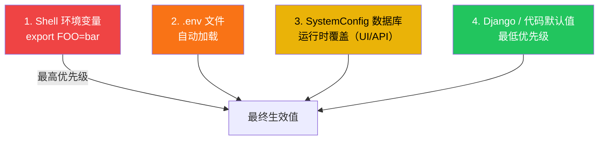

# 环境变量配置

LectureMind 的所有配置都可以通过环境变量进行设置。本文档是完整的环境变量参考手册，涵盖 `.env` 文件、`SystemConfig` 数据库覆盖、Docker Compose 变量以及前端运行时配置。

## 配置优先级

配置值按以下优先级从高到低解析：



**优先级说明**：

1. **Shell 环境变量**：通过 `export` 设置，优先级最高，适合临时覆盖
2. **`.env` 文件**：Django 启动时自动加载，是最常用的配置方式
3. **`SystemConfig` 数据库**：支持运行时通过 Web 界面或 API 修改，无需重启（部分配置除外）
4. **代码默认值**：在 `settings.py` 中定义的安全默认值

> **注意**：`MEDIA_ROOT`、`LOG_DIR`、`DB_PATH` 等路径类配置在启动时读取一次，运行时修改数据库中的值不会生效，需要重启服务。

## .env 文件

### 文件位置

`.env` 文件的查找从 `manage.py` 所在目录开始，逐级向上查找，使用找到的第一个文件：

```
server/app/.env    ← Django 会找到
server/.env        ← Django 会找到
LectureMind/.env   ← 推荐位置（项目根目录）
```

### 创建 .env 文件

```bash
# 从模板创建
cp .env.example .env

# 编辑配置
vim .env
```

### 文件格式

```bash
# 这是注释
KEY=value
QUOTED_KEY="value with spaces"
# 不要在值中使用引号包裹，除非值本身包含空格
```

### 最小可用配置

以下是让 LectureMind 正常运行所需的最少配置：

```bash
# 必填：DashScope API 密钥（ASR + LLM）
DASHSCOPE_API_KEY=sk-xxxxxxxxxxxxxxxx

# 必填：腾讯云 COS（ASR 音频文件托管）
COS_SECRECT_ID=AKIDxxxxxxxx
COS_SECRECT_KEY=xxxxxxxx
COS_REGION=ap-singapore
COS_BUCKET=my-bucket-name
```

### 完整配置示例

```bash
# ── 服务配置 ──────────────────────────────────────────────────────────────
SECRET_KEY=your-long-random-secret-key
DEBUG=False
BACKEND_PORT=8000
ALLOWED_HOSTS=your-domain.com,www.your-domain.com
CORS_ALLOWED_ORIGINS=https://your-domain.com

# ── 存储路径 ──────────────────────────────────────────────────────────────
MEDIA_ROOT=/data/media
DB_PATH=/data/db.sqlite3
LOG_DIR=/data/logs
CHROMA_PERSIST_DIR=/data/media/chromadb

# ── LLM 和 API ───────────────────────────────────────────────────────────
LLM_API_BASE=https://dashscope.aliyuncs.com/compatible-mode/v1
DASHSCOPE_API_KEY=sk-xxxxxxxxxxxxxxxx
LLM_MODEL=qwen2.5-7b-instruct
CHAT_MODEL=qwen3-max
VL_MODEL=qwen2.5-vl-72b-instruct

# ── 腾讯云 COS ───────────────────────────────────────────────────────────
COS_SECRECT_ID=AKIDxxxxxxxx
COS_SECRECT_KEY=xxxxxxxx
COS_REGION=ap-singapore
COS_BUCKET=my-bucket-name

# ── Docker Compose ────────────────────────────────────────────────────────
FRONTEND_PORT=3000
```

## 完整变量参考

### 服务配置

| 变量名 | 默认值 | 必填 | 说明 |
|---|---|---|---|
| `SECRET_KEY` | `insecure dev key` | 生产环境必填 | Django 密钥，用于加密签名。**生产环境必须修改** |
| `DEBUG` | `True` | 生产环境必填 | 调试模式。生产环境必须设为 `False` |
| `BACKEND_PORT` | `8000` | 否 | 后端服务监听端口 |
| `ALLOWED_HOSTS` | `localhost,127.0.0.1` | 生产环境必填 | 逗号分隔的允许访问主机名 |
| `CORS_ALLOWED_ORIGINS` | `http://localhost:3000` | 生产环境必填 | 逗号分隔的 CORS 允许来源 |

### 存储路径

所有路径变量接受绝对路径。子目录变量（如 `MEDIA_AUDIO_DIR`）也接受相对名称，会相对于 `MEDIA_ROOT` 解析。

| 变量名 | 默认值 | 必填 | 说明 |
|---|---|---|---|
| `MEDIA_ROOT` | `<BASE_DIR>/media` | 否 | 所有上传和生成的媒体文件的根目录 |
| `MEDIA_URL` | `/media/` | 否 | Django 提供媒体文件的 URL 前缀 |
| `MEDIA_AUDIO_DIR` | `<MEDIA_ROOT>/audio` | 否 | 提取的 WAV 音频文件目录 |
| `MEDIA_STREAMS_DIR` | `<MEDIA_ROOT>/streams` | 否 | HLS 播放列表和切片目录 |
| `MEDIA_THUMBNAILS_DIR` | `<MEDIA_ROOT>/thumbnails` | 否 | 幻灯片缩略图目录 |
| `DB_PATH` | `<BASE_DIR>/db.sqlite3` | 否 | SQLite 数据库文件路径 |
| `LOG_DIR` | `<BASE_DIR>/logs` | 否 | 日志文件目录 |
| `CHROMA_PERSIST_DIR` | `<MEDIA_ROOT>/chromadb` | 否 | ChromaDB 向量数据库持久化目录 |

### LLM 和 API 配置

| 变量名 | 默认值 | 必填 | 说明 |
|---|---|---|---|
| `LLM_API_BASE` | `https://dashscope.aliyuncs.com/compatible-mode/v1` | 否 | OpenAI 兼容 API 基础 URL |
| `DASHSCOPE_API_KEY` | — | **是** | 阿里云 DashScope API 密钥（ASR + LLM） |
| `LLM_MODEL` | `qwen2.5-7b-instruct` | 否 | 任务管道使用的默认模型 |
| `CHAT_MODEL` | `qwen3-max` | 否 | 聊天/Agent RAG 使用的模型 |
| `VL_MODEL` | `qwen2.5-vl-72b-instruct` | 否 | 视觉语言模型，用于幻灯片 OCR |

### 腾讯云 COS（音频托管）

| 变量名 | 默认值 | 必填 | 说明 |
|---|---|---|---|
| `COS_SECRECT_ID` | — | **是** | 腾讯云 COS SecretId |
| `COS_SECRECT_KEY` | — | **是** | 腾讯云 COS SecretKey |
| `COS_REGION` | — | **是** | COS 区域（如 `ap-singapore`） |
| `COS_BUCKET` | — | **是** | COS 存储桶名称 |

### Docker Compose 专用

| 变量名 | 默认值 | 必填 | 说明 |
|---|---|---|---|
| `FRONTEND_PORT` | `3000` | 否 | 宿主机映射到前端 nginx 容器的端口 |

## SystemConfig 数据库覆盖

`LLM_MODEL`、`CHAT_MODEL`、`VL_MODEL`、`LLM_API_BASE` 以及所有 API 密钥和 COS 配置都同时存储在 `SystemConfig` 数据库模型中。这允许在**运行时**通过 Web 界面或 API 修改，无需重启服务。

### 通过 Web 界面修改

访问 LectureMind 前端的 **设置** 页面，可以直接修改各项配置。

### 通过 REST API 修改

```bash
# 查看所有配置（密钥会被脱敏）
curl http://localhost:8000/api/config/

# 更新单个配置
curl -X POST http://localhost:8000/api/config/update/ \
  -H "Content-Type: application/json" \
  -d '{"key": "chat_model", "value": "qwen3.6-plus"}'

# 批量更新
curl -X POST http://localhost:8000/api/config/update/ \
  -H "Content-Type: application/json" \
  -d '[
    {"key": "llm_model", "value": "qwen-turbo"},
    {"key": "chat_model", "value": "qwen3-max"}
  ]'

# 从 .env 文件同步到数据库
curl -X POST http://localhost:8000/api/config/sync-from-env/
```

### 密钥脱敏

包含 `api_key`、`secret_id`、`secret_key` 的配置在 API 响应中会被自动脱敏，只显示最后 4 个字符：

```json
{
  "dashscope_api_key": {
    "value": "****6ba",
    "description": "DashScope API key",
    "is_secret": true
  }
}
```

## ConfigManager Python API

在后端 Python 代码中，使用 `ConfigManager` 读写配置：

```python
from api.config_utils import ConfigManager

# 读取配置（env → 数据库 → 默认值）
model = ConfigManager.get('chat_model', default='qwen-turbo')

# 写入配置（持久化到数据库和 .env）
ConfigManager.set('chat_model', 'qwen3.6-plus')

# 批量写入
ConfigManager.set_multiple({
    'llm_model':  {'value': 'qwen-turbo',  'description': '任务管道模型'},
    'chat_model': {'value': 'qwen3-max',   'description': '聊天/Agent 模型'},
})

# 读取所有配置（密钥默认脱敏）
all_cfg = ConfigManager.get_all()
all_cfg_with_secrets = ConfigManager.get_all(include_secrets=True)

# 从 .env 同步到数据库（手动编辑 .env 后使用）
ConfigManager.sync_from_env()

# 强制重置 LLM 客户端单例（修改模型后调用）
ConfigManager.reset_llm_client()
```

## 前端运行时配置

React 前端通过 `window.__ENV__` 读取运行时配置，由 `frontend/docker-entrypoint.sh` 在容器启动时注入：

```javascript
// /usr/share/nginx/html/env-config.js（容器启动时生成）
window.__ENV__ = {
  API_PREFIX: "http://your-server:8000"
};
```

前端代码 `src/config.ts` 读取此配置并提供本地回退：

```typescript
export const API_PREFIX: string =
    window.__ENV__?.API_PREFIX ?? "http://127.0.0.1:8000"
```

### 修改前端 API 地址

**Docker 部署**：在 `docker-compose.yml` 的 `frontend` 服务中设置环境变量：

```yaml
frontend:
  environment:
    API_PREFIX: "https://api.your-domain.com"
```

**本地开发**：直接编辑 `frontend/public/env-config.js`：

```javascript
window.__ENV__ = {
  API_PREFIX: "http://127.0.0.1:8000"
};
```

## 场景配置示例

### 本地开发

```bash
# .env — 本地开发配置
DEBUG=True
SECRET_KEY=insecure-dev-key-change-in-production
BACKEND_PORT=8000
FRONTEND_PORT=3000
ALLOWED_HOSTS=localhost,127.0.0.1
CORS_ALLOWED_ORIGINS=http://localhost:3000

# 使用 DashScope 免费额度的模型
LLM_MODEL=qwen2.5-7b-instruct
CHAT_MODEL=qwen3-max
VL_MODEL=qwen2.5-vl-72b-instruct

DASHSCOPE_API_KEY=sk-xxxxxxxx
COS_SECRECT_ID=AKIDxxxxxxxx
COS_SECRECT_KEY=xxxxxxxx
COS_REGION=ap-singapore
COS_BUCKET=my-dev-bucket
```

### 测试/预发布环境

```bash
# .env — 预发布配置
DEBUG=False
SECRET_KEY=$(python -c "import secrets; print(secrets.token_hex(50))")
BACKEND_PORT=8000
FRONTEND_PORT=3000
ALLOWED_HOSTS=staging.your-domain.com
CORS_ALLOWED_ORIGINS=https://staging.your-domain.com

# 使用更强的模型
LLM_MODEL=qwen2.5-72b-instruct
CHAT_MODEL=qwen3-max
VL_MODEL=qwen2.5-vl-72b-instruct

DASHSCOPE_API_KEY=sk-xxxxxxxx
COS_SECRECT_ID=AKIDxxxxxxxx
COS_SECRECT_KEY=xxxxxxxx
COS_REGION=ap-singapore
COS_BUCKET=staging-bucket

# 自定义存储路径
MEDIA_ROOT=/mnt/storage/lecturemind/media
LOG_DIR=/var/log/lecturemind
DB_PATH=/mnt/storage/lecturemind/db.sqlite3
```

### 生产环境

```bash
# .env — 生产配置
DEBUG=False
SECRET_KEY=<使用 python -c "import secrets; print(secrets.token_hex(50))" 生成>
BACKEND_PORT=8000
FRONTEND_PORT=3000
ALLOWED_HOSTS=your-domain.com,www.your-domain.com
CORS_ALLOWED_ORIGINS=https://your-domain.com

# 推荐使用高性能模型
LLM_MODEL=qwen2.5-72b-instruct
CHAT_MODEL=qwen3-max
VL_MODEL=qwen2.5-vl-72b-instruct

DASHSCOPE_API_KEY=sk-xxxxxxxx
COS_SECRECT_ID=AKIDxxxxxxxx
COS_SECRECT_KEY=xxxxxxxx
COS_REGION=ap-singapore
COS_BUCKET=production-bucket

# 生产环境存储路径
MEDIA_ROOT=/data/media
LOG_DIR=/data/logs
DB_PATH=/data/db.sqlite3
CHROMA_PERSIST_DIR=/data/media/chromadb
```

## 故障排除

### 端口被占用

```bash
# 修改端口
BACKEND_PORT=9000
FRONTEND_PORT=8080
```

### 媒体文件无法访问

确认 `MEDIA_ROOT` 目录存在且可写。在开发模式下 Django 自动提供媒体文件；生产环境需要配置 nginx 从 `MEDIA_ROOT` 提供 `MEDIA_URL` 的静态服务。

### ChromaDB 启动报错

ChromaDB 在首次使用时自动创建。如果出现权限错误，检查 `CHROMA_PERSIST_DIR` 目录是否可写。在 Docker 中该路径为 `/data/media/chromadb`，通过 `lecturemind_data` 卷提供。

### 配置修改未生效

1. 通过 `ConfigManager.set()` 修改的配置会自动重置 LLM 客户端
2. 手动编辑 `.env` 后需要同步到数据库：`curl -X POST http://localhost:8000/api/config/sync-from-env/`
3. 在启动时读取的配置（如 `MEDIA_ROOT`、`LOG_DIR`）需要重启服务才能生效

### .env 文件未被加载

Django 从 `manage.py` 所在目录开始向上查找 `.env` 文件。确保文件位于以下位置之一：
- `server/app/.env`
- `server/.env`
- `LectureMind/.env`（项目根目录，推荐）
