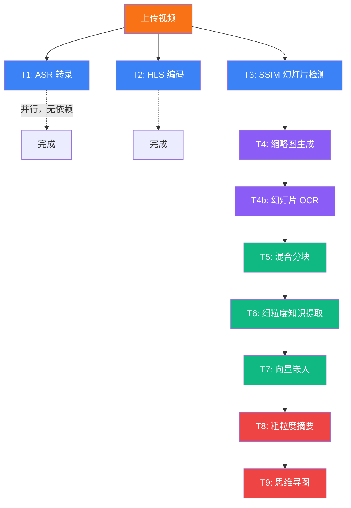
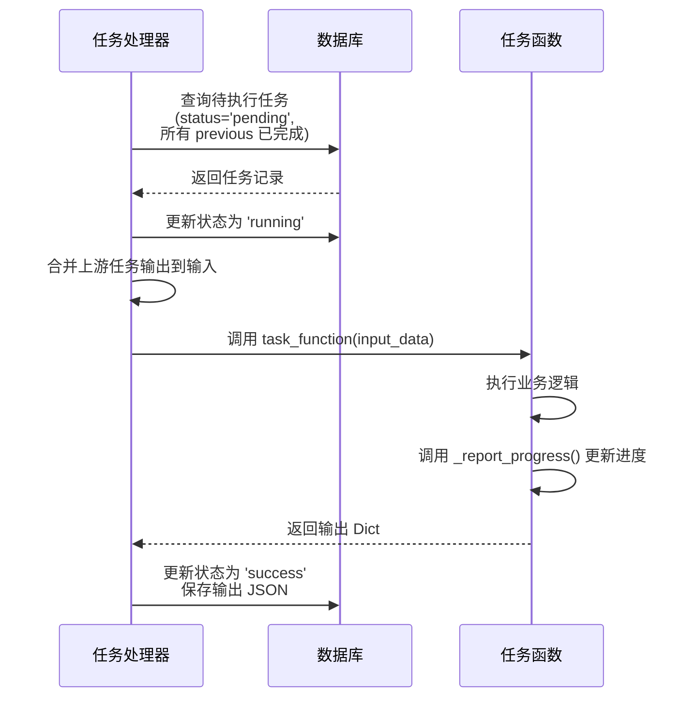
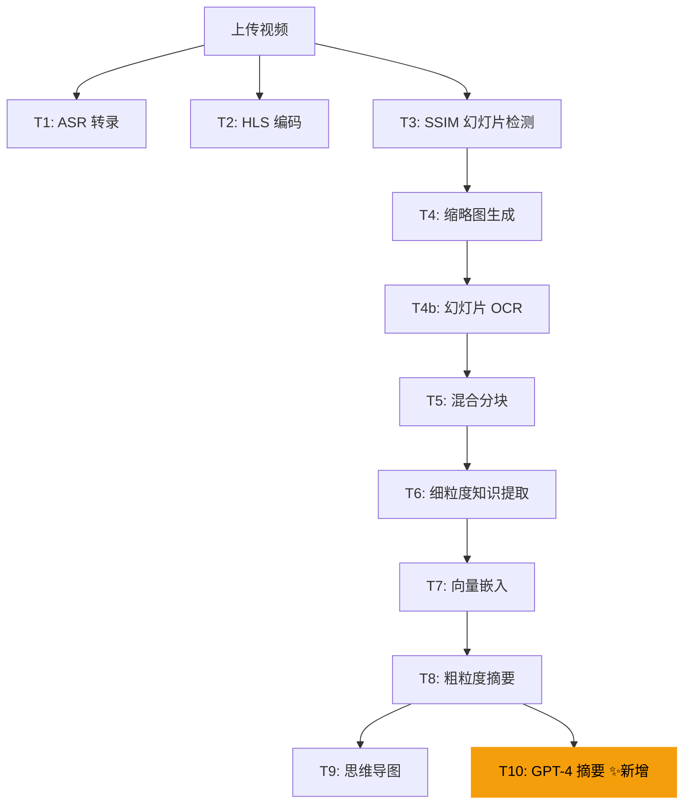

# 添加新任务

LectureMind 使用自定义的 DAG（有向无环图）异步任务处理器来执行视频处理管道。本文档将指导你如何向管道中添加新的任务类型。

## 任务系统概述

### 现有任务 DAG



### 核心机制

1. **`AsyncTaskItem` 模型**：存储在数据库中的任务记录，包含 `func_name`（函数名）、`param`（JSON 输入）、`previous`（依赖任务 ID）、`status`（状态）、`progress`（进度 0-100）
2. **`TASK_REGISTRY` 字典**：函数名到实现函数的映射表
3. **`process_async_task` 管理命令**：每 5 秒轮询数据库，使用 `SELECT FOR UPDATE SKIP LOCKED` 保证并发安全
4. **`previous` 字段**：实现任务间的依赖关系，上游任务完成后自动合并输出到下游任务的输入中

### 任务执行流程



## 添加新任务的步骤

假设我们要添加一个"使用 GPT-4 生成摘要"的新任务 `task_gpt4_summary`，以下是完整步骤：

### 第一步：编写任务函数

在 `server/app/api/tasks.py` 中添加任务函数。所有任务函数遵循统一的签名规范：

```python
def task_gpt4_summary(input_data: Dict[str, Any]) -> Dict[str, Any]:
    """
    使用 GPT-4 对视频内容生成高质量摘要。

    输入 (input_data):
        - video_id: str — 视频 UUID
        - （可选）上游任务的输出会被自动合并

    输出 (return):
        - video_id: str
        - summary: str — 生成的摘要
        - word_count: int — 摘要字数
    """
    from api.llm_client import get_llm_client

    video_id = input_data['video_id']
    logger.info(f"[GPT4 Summary] Processing {video_id}")

    # 1. 更新进度（0-100）
    _report_progress(video_id, "task_gpt4_summary", 10)

    # 2. 获取视频数据
    video = Video.objects.get(id=video_id)
    sections = VideoSection.objects.filter(video_id=video_id).order_by('order')

    # 3. 构建提示词
    sections_text = "\n".join(
        f"Section {s.order + 1}: {s.title}\n{s.transcript_text[:500]}"
        for s in sections
    )
    _report_progress(video_id, "task_gpt4_summary", 30)

    # 4. 调用 LLM
    llm = get_llm_client(model="gpt-4")  # 使用指定模型
    prompt = f"""请对以下讲座内容生成一份简洁的中文摘要：

{sections_text}

要求：
1. 摘要应涵盖所有主要知识点
2. 使用清晰的结构化格式
3. 长度控制在 500 字以内"""

    response = llm.chat(
        prompt=prompt,
        system_prompt="你是一位专业的教育内容分析师。",
        temperature=0.3,
        max_tokens=2048,
    )
    _report_progress(video_id, "task_gpt4_summary", 80)

    # 5. 保存结果（可选，存储到模型或文件）
    # 例如保存到 KnowledgeSummary 模型的某个字段
    # ...

    _report_progress(video_id, "task_gpt4_summary", 100)

    # 6. 返回输出（将被传递给下游任务）
    return {
        "video_id": video_id,
        "summary": response,
        "word_count": len(response),
    }
```

### 第二步：注册到 TASK_REGISTRY

在 `tasks.py` 文件末尾的 `TASK_REGISTRY` 字典中添加新任务：

```python
TASK_REGISTRY: Dict[str, Callable[[Dict[str, Any]], Dict[str, Any]]] = {
    "task_extract_audio_and_transcript": task_extract_audio_and_transcript,
    "task_hls_streaming": task_hls_streaming,
    "task_ssim_move_detection": task_ssim_move_detection,
    "task_generate_thumbnails": task_generate_thumbnails,
    "task_slides_ocr": task_slides_ocr,
    "task_hybrid_chunking": task_hybrid_chunking,
    "task_fine_grained_knowledge": task_fine_grained_knowledge,
    "task_embed_knowledge": task_embed_knowledge,
    "task_coarse_grained_summary": task_coarse_grained_summary,
    "task_generate_mindmap": task_generate_mindmap,
    # ↓ 添加新任务 ↓
    "task_gpt4_summary": task_gpt4_summary,
}
```

### 第三步：创建 AsyncTaskItem

在 `server/app/api/views.py` 的 `_create_processing_chain` 方法中，添加新任务的 `AsyncTaskItem` 创建逻辑：

```python
def _create_processing_chain(self, video: Video) -> None:
    """
    Task DAG (11 tasks):
      T1 (ASR), T2 (HLS), T3 (SSIM) — 并行
      T4 (Thumbnails) <- T3
      T4b (Slides OCR) <- T4
      T5 (Hybrid Chunking) <- T4b
      T6 (Fine-Grained Knowledge) <- T5
      T7 (Embed Knowledge) <- T6
      T8 (Coarse Summary) <- T7
      T9 (Mindmap) <- T8
      T10 (GPT4 Summary) <- T8   ← 新任务
    """
    # ... 现有任务创建代码 ...

    t9 = AsyncTaskItem.objects.create(
        video=video,
        title="Generate knowledge mindmap",
        func_name="task_generate_mindmap",
        param=json.dumps({"video_id": str(video.id)}),
        previous=t8.id
    )

    # 新增：GPT-4 摘要任务，依赖粗粒度摘要完成
    t10 = AsyncTaskItem.objects.create(
        video=video,
        title="GPT-4 高质量摘要",
        description="使用 GPT-4 生成结构化中文摘要",
        func_name="task_gpt4_summary",
        param=json.dumps({"video_id": str(video.id)}),
        previous=t8.id  # 依赖 T8（粗粒度摘要），与 T9 并行
    )
```

### 第四步：设置依赖关系

通过 `previous` 字段控制任务执行顺序：

| `previous` 值 | 含义 |
|---|---|
| `None` | 无依赖，上传后立即并行执行 |
| `t3.id` | 等待任务 T3 完成后执行 |
| `[t3.id, t4.id]` | 等待 T3 和 T4 都完成后执行（多依赖） |

**依赖链中的数据传递**：上游任务的输出 JSON 会自动合并到下游任务的 `input_data` 中。例如：

```
T8 输出: {"video_id": "xxx", "summary": "...", "difficulty_level": "intermediate"}
T9 输入: {"video_id": "xxx", "summary": "...", "difficulty_level": "intermediate"}
         ↑ 包含 T8 的所有输出字段
```

## 进度上报机制

`_report_progress` 函数用于更新当前任务的进度条，前端可以通过轮询 `GET /api/tasks/video/<uuid>/` 获取进度：

```python
def _report_progress(video_id: str, func_name: str, progress: int) -> None:
    """更新当前运行任务的 progress 字段（0-100）。"""
    from api.models import AsyncTaskItem
    try:
        AsyncTaskItem.objects.filter(
            video_id=video_id,
            func_name=func_name,
            status='running'
        ).update(progress=min(max(progress, 0), 100))
    except Exception as e:
        logger.debug(f"Failed to update progress: {e}")
```

**使用建议**：

```python
# 在任务开始时
_report_progress(video_id, "task_gpt4_summary", 0)

# 关键步骤完成后
_report_progress(video_id, "task_gpt4_summary", 30)  # 数据准备完成
_report_progress(video_id, "task_gpt4_summary", 70)  # LLM 调用完成
_report_progress(video_id, "task_gpt4_summary", 100) # 任务完成

# 对于有循环的任务，按比例上报
for i, section in enumerate(sections):
    # ... 处理逻辑 ...
    _report_progress(video_id, "task_gpt4_summary", int((i + 1) / total * 100))
```

## 输入输出传递

### 任务输入

每个任务函数接收一个 `Dict[str, Any]` 作为输入，内容包括：

1. **初始参数**：在 `_create_processing_chain` 中通过 `param` JSON 设置
2. **上游输出**：所有 `previous` 任务的输出 JSON 会被自动合并

```python
def my_task(input_data: Dict[str, Any]) -> Dict[str, Any]:
    video_id = input_data['video_id']           # 来自初始参数
    changes = input_data.get('changes', [])      # 来自 SSIM 检测任务的输出
    cos_audio_url = input_data.get('cos_audio_url')  # 来自 ASR 任务的输出
    # ...
```

### 任务输出

任务函数必须返回一个 `Dict[str, Any]`。返回值会作为 JSON 存储在 `AsyncTaskItem.output` 中，并自动合并到下游任务的输入。

```python
return {
    "video_id": video_id,
    "summary": response,
    "word_count": len(response),
}
```

## 任务函数模板

以下是一个完整的任务函数模板，包含错误处理、进度上报和日志记录：

```python
def task_my_new_task(input_data: Dict[str, Any]) -> Dict[str, Any]:
    """
    任务描述：说明这个任务做什么。

    输入:
        - video_id: str — 视频 UUID
        - 其他上游任务的输出字段

    输出:
        - video_id: str
        - 自定义输出字段
    """
    video_id = input_data['video_id']
    logger.info(f"[MyTask] Starting for video {video_id}")

    try:
        # 步骤 1：准备数据
        _report_progress(video_id, "task_my_new_task", 10)
        video = Video.objects.get(id=video_id)
        # ... 数据准备逻辑 ...

        # 步骤 2：执行核心处理
        _report_progress(video_id, "task_my_new_task", 50)
        # ... 核心处理逻辑 ...

        # 步骤 3：保存结果
        _report_progress(video_id, "task_my_new_task", 90)
        # ... 保存到数据库 ...

        _report_progress(video_id, "task_my_new_task", 100)
        logger.info(f"[MyTask] Completed for video {video_id}")

        return {
            "video_id": video_id,
            "result_field": "result_value",
        }

    except Exception as e:
        logger.error(f"[MyTask] Failed for video {video_id}: {e}")
        raise  # 重新抛出异常，任务处理器会标记为 failed
```

## 测试新任务

### 单元测试

在 `server/app/api/tests/` 中为新任务编写单元测试：

```python
from django.test import TestCase
from unittest.mock import patch, MagicMock
from api.tasks import task_gpt4_summary


class GPT4SummaryTaskTest(TestCase):
    def setUp(self):
        # 创建测试视频和相关数据
        self.video_id = "test-uuid-1234"
        self.input_data = {"video_id": self.video_id}

    @patch('api.tasks.get_llm_client')
    @patch('api.tasks.Video')
    @patch('api.tasks.VideoSection')
    def test_task_basic_flow(self, mock_sections, mock_video, mock_llm):
        """测试基本的任务执行流程"""
        # 设置 mock
        mock_video.objects.get.return_value = MagicMock(title="Test Video")
        mock_sections.objects.filter.return_value.order_by.return_value = [
            MagicMock(order=0, title="Section 1", transcript_text="Test content")
        ]

        mock_llm_instance = MagicMock()
        mock_llm_instance.chat.return_value = "Generated summary"
        mock_llm.return_value = mock_llm_instance

        # 执行任务
        result = task_gpt4_summary(self.input_data)

        # 验证结果
        self.assertEqual(result['video_id'], self.video_id)
        self.assertIn('summary', result)
        self.assertEqual(result['summary'], "Generated summary")

    @patch('api.tasks.get_llm_client')
    def test_task_handles_llm_error(self, mock_llm):
        """测试 LLM 调用失败时的错误处理"""
        mock_llm.side_effect = Exception("API Error")

        with self.assertRaises(Exception):
            task_gpt4_summary(self.input_data)
```

### 集成测试

使用 Django 的测试客户端测试完整的任务链：

```python
from django.test import TestCase, Client
from api.models import Video, AsyncTaskItem


class TaskChainIntegrationTest(TestCase):
    def test_processing_chain_creates_all_tasks(self):
        """测试 _create_processing_chain 是否创建了所有任务"""
        client = Client()
        # 上传一个测试视频并验证任务链
        # ...
```

### 手动测试

在开发环境中，可以单独调用任务函数进行测试：

```bash
cd server/app

# 进入 Django shell
python manage.py shell

# 在 shell 中手动调用任务
from api.tasks import task_gpt4_summary
result = task_gpt4_summary({"video_id": "your-video-uuid"})
print(result)
```

## 完整示例：添加 GPT-4 摘要任务

以下是将新任务集成到 DAG 中的完整示例，展示新任务在管道中的位置：



新任务 `T10` 与 `T9`（思维导图）并行执行，都依赖于 `T8`（粗粒度摘要）的完成。这种设计使得 GPT-4 摘要任务可以利用粗粒度摘要的结果作为参考，同时不影响思维导图的生成。

## 常见问题

### 任务一直停留在 pending 状态

1. 检查 `previous` 字段指向的任务是否已完成
2. 确认 `process_async_task` 管理命令正在运行
3. 查看 worker 日志：`docker compose logs -f worker`

### 任务执行失败

1. 查看错误日志：任务异常会被记录到 `AsyncTaskItem.error` 字段
2. 在 Django shell 中手动调用任务函数复现问题
3. 检查依赖服务是否可用（如 DashScope API、COS）

### 上游输出未传递到下游

确保上游任务的返回值中包含了下游任务需要的字段名。任务处理器会将所有上游输出的 JSON 键值对扁平合并到下游输入中。
