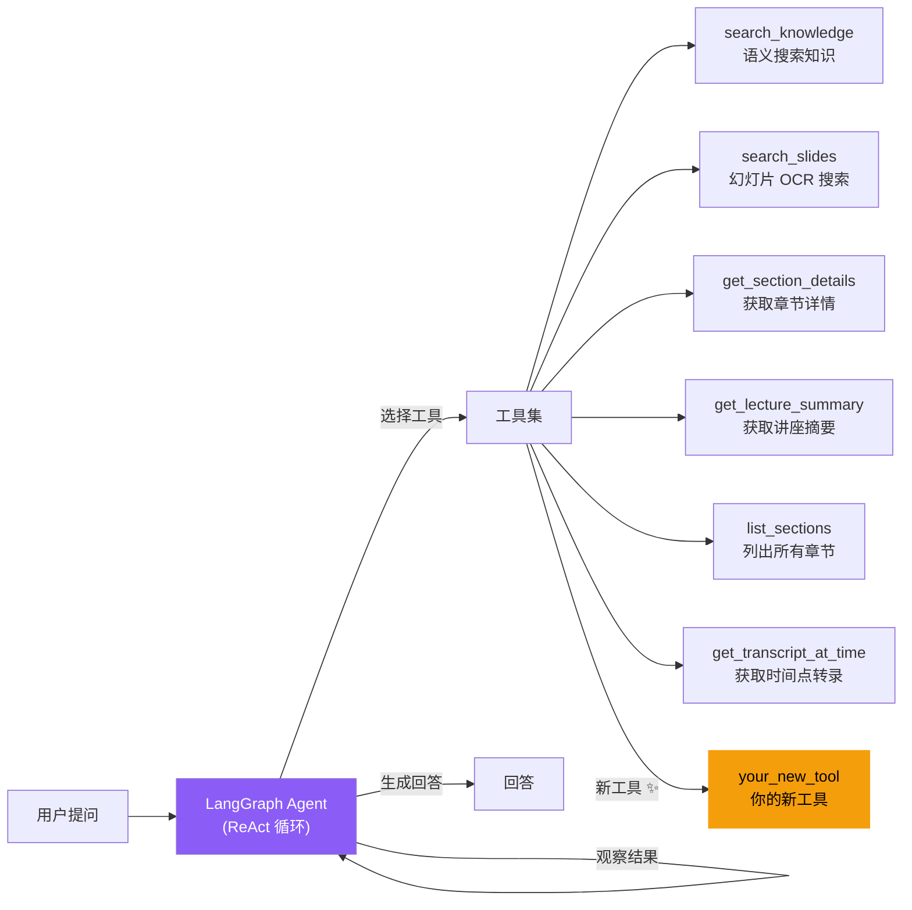

# 扩展 Agent 工具

LectureMind 使用基于 LangGraph 的 ReAct Agent 实现多步推理问答。Agent 可以调用一组工具来检索讲座内容，然后根据检索结果生成回答。本文档将指导你如何为 Agent 添加新的工具。

## Agent 系统架构



### 工作流程

Agent 使用 ReAct（Reasoning + Acting）模式工作：

1. **分析**：理解用户的问题
2. **选择工具**：根据问题类型选择合适的工具
3. **调用工具**：执行工具并获取结果
4. **观察**：分析工具返回的结果
5. **重复 2-4**：如果需要更多信息，继续调用其他工具（最多 5 轮）
6. **回答**：基于所有检索结果生成最终回答

### 关键文件

| 文件 | 职责 |
|---|---|
| `api/agent_tools.py` | 工具定义（schema）和实现（函数） |
| `api/agent_graph.py` | LangGraph Agent 状态机和系统提示词 |

## 添加新工具的步骤

假设我们要添加一个 `search_transcript_keywords` 工具，用于按关键词精确搜索转录文本。

### 第一步：定义工具 Schema

在 `server/app/api/agent_tools.py` 的 `make_tools` 函数中添加工具定义。Schema 使用 OpenAI Function Calling 格式：

```python
def make_tools(video_id: str) -> List[Dict[str, Any]]:
    """
    构建绑定到特定视频的工具定义列表。
    返回 OpenAI function-calling 格式的工具 schema。
    """
    return [
        # ... 现有工具定义 ...

        {
            "type": "function",
            "function": {
                "name": "search_transcript_keywords",
                "description": (
                    "按关键词精确搜索讲座转录文本。"
                    "当学生询问某个具体术语、人名、公式或短语在讲座中"
                    "出现的位置时使用此工具。与 search_knowledge 不同，"
                    "此工具进行精确的关键词匹配而非语义搜索。"
                ),
                "parameters": {
                    "type": "object",
                    "properties": {
                        "keywords": {
                            "type": "string",
                            "description": "要搜索的关键词或短语，多个关键词用空格分隔"
                        },
                        "max_results": {
                            "type": "integer",
                            "description": "最大返回结果数量（默认 10）",
                            "default": 10
                        }
                    },
                    "required": ["keywords"]
                }
            }
        },
    ]
```

**Schema 字段说明**：

| 字段 | 说明 |
|---|---|
| `function.name` | 工具名称，必须是有效的 Python 标识符 |
| `function.description` | 工具用途描述，LLM 根据此描述决定何时使用该工具 |
| `parameters.properties` | 参数定义，每个参数需要 `type` 和 `description` |
| `parameters.required` | 必填参数列表 |

**编写好的 description 的技巧**：

- 明确说明**何时应该使用**此工具
- 说明与其他工具的**区别**（如"与 search_knowledge 不同，此工具进行精确匹配"）
- 包含**使用场景示例**

### 第二步：实现工具函数

在 `agent_tools.py` 中添加工具的实现函数。每个工具函数遵循以下模式：

```python
def _tool_search_transcript_keywords(
    video_id: str, keywords: str, max_results: int = 10
) -> str:
    """
    按关键词精确搜索转录文本。

    参数:
        video_id: 视频 UUID（通过闭包注入）
        keywords: 搜索关键词
        max_results: 最大返回数

    返回:
        格式化的搜索结果字符串（供 LLM 阅读）
    """
    from api.models import TranscriptSentence

    # 解析关键词
    keyword_list = [kw.strip().lower() for kw in keywords.split() if kw.strip()]
    if not keyword_list:
        return "请提供至少一个搜索关键词。"

    # 查询转录句子
    sentences = TranscriptSentence.objects.filter(
        video_transcript__video_id=video_id,
    ).order_by('begin_time')

    # 精确匹配
    matches = []
    for sentence in sentences:
        text_lower = sentence.text.lower()
        matched_keywords = [kw for kw in keyword_list if kw in text_lower]
        if matched_keywords:
            matches.append({
                'sentence': sentence,
                'matched_keywords': matched_keywords,
                'score': len(matched_keywords),
            })

    # 按匹配数量排序
    matches.sort(key=lambda x: x['score'], reverse=True)
    matches = matches[:max_results]

    if not matches:
        return f"未找到包含关键词 '{keywords}' 的转录内容。"

    # 格式化结果
    lines = [f"# 关键词搜索结果: '{keywords}'\n"]
    for i, match in enumerate(matches):
        s = match['sentence']
        time_str = format_time(s.begin_time / 1000)
        matched = ", ".join(match['matched_keywords'])
        lines.append(
            f"[结果 {i+1}] [{time_str}] "
            f"(匹配关键词: {matched})\n"
            f"{s.text}\n"
        )

    return "\n".join(lines)
```

**工具函数规范**：

1. **作用域限定**：所有工具都通过 `video_id` 参数限定在单个视频范围内
2. **返回格式化字符串**：结果必须是 LLM 可以理解和推理的文本
3. **错误处理**：返回有意义的错误消息而非抛出异常
4. **结果限制**：限制返回的数据量，避免超出 LLM 上下文窗口

### 第三步：添加到 execute_tool 分发器

在 `agent_tools.py` 的 `execute_tool` 函数中添加新的分发分支：

```python
def execute_tool(video_id: str, tool_name: str, arguments: Dict[str, Any]) -> str:
    """
    执行工具调用并返回结果字符串。
    由 Agent 图在 LLM 决定使用工具时调用。
    """
    try:
        if tool_name == "search_knowledge":
            return _tool_search_knowledge(video_id, **arguments)
        elif tool_name == "search_slides":
            return _tool_search_slides(video_id, **arguments)
        elif tool_name == "get_section_details":
            return _tool_get_section_details(video_id, **arguments)
        elif tool_name == "get_lecture_summary":
            return _tool_get_lecture_summary(video_id)
        elif tool_name == "list_sections":
            return _tool_list_sections(video_id)
        elif tool_name == "get_transcript_at_time":
            return _tool_get_transcript_at_time(video_id, **arguments)
        # ↓ 添加新工具的分发 ↓
        elif tool_name == "search_transcript_keywords":
            return _tool_search_transcript_keywords(video_id, **arguments)
        else:
            return f"Unknown tool: {tool_name}"
    except Exception as e:
        logger.error(f"Tool {tool_name} failed: {e}")
        return f"Tool execution error: {e}"
```

### 第四步：更新 Agent 系统提示词

在 `agent_graph.py` 的 `AGENT_SYSTEM_PROMPT` 中添加新工具的使用指南：

```python
AGENT_SYSTEM_PROMPT = """You are an expert teaching assistant for a video lecture...

## Tool Selection Guidelines:

**Use `search_knowledge` for:**
- Conceptual questions about lecture content
- ...

**Use `search_slides` for:**
- Course logistics and contact information
- ...

**Use `search_transcript_keywords` for:**    ← 新增
- Finding exact mentions of specific terms, names, or formulas
- Locating where a particular phrase appears in the lecture
- Verbatim quote searches (e.g., "what did the professor say about X?")
- When the student uses quotes or asks for exact wording

## Rules:
- ALWAYS use at least one tool before answering
- Choose the RIGHT tool for the question type
- ...
"""
```

**系统提示词的重要性**：LLM 根据系统提示词中的工具选择指南来决定使用哪个工具。清晰的指南可以显著提高工具选择的准确性。

## 工具实现模式

### 基本模式：查询数据库

```python
def _tool_get_example(video_id: str, param: str) -> str:
    from api.models import ExampleModel

    results = ExampleModel.objects.filter(
        video_id=video_id,
        field__icontains=param,
    )[:10]

    if not results.exists():
        return "No results found."

    lines = ["# Results\n"]
    for r in results:
        lines.append(f"- {r.title}: {r.description}")
    return "\n".join(lines)
```

### 模式：语义搜索

```python
def _tool_semantic_search(video_id: str, query: str, top_k: int = 5) -> str:
    from api.vector_store import get_vector_store

    store = get_vector_store()
    results = store.query(
        query_text=query,
        video_id=video_id,
        top_k=top_k,
    )

    if not results:
        return "No relevant results found."

    lines = []
    for i, r in enumerate(results):
        meta = r.get("metadata", {})
        relevance = r.get("relevance", 0)
        text = r.get("text", "")[:400]
        lines.append(
            f"[Result {i+1}] (relevance: {relevance:.2f})\n{text}"
        )
    return "\n\n".join(lines)
```

### 模式：调用 LLM

```python
def _tool_llm_analysis(video_id: str, question: str) -> str:
    from api.llm_client import get_llm_client
    from api.models import VideoSection

    sections = VideoSection.objects.filter(video_id=video_id)
    context = "\n".join(s.transcript_text[:200] for s in sections[:5])

    llm = get_llm_client()
    response = llm.chat(
        prompt=f"Based on this context:\n{context}\n\nAnswer: {question}",
        system_prompt="You are a helpful assistant.",
    )
    return response
```

## 测试新工具

### 单元测试

```python
from django.test import TestCase
from unittest.mock import patch, MagicMock
from api.agent_tools import make_tools, execute_tool, _tool_search_transcript_keywords


class SearchTranscriptKeywordsToolTest(TestCase):
    def test_make_tools_includes_new_tool(self):
        """测试新工具是否出现在工具列表中"""
        tools = make_tools("test-video-id")
        tool_names = [t["function"]["name"] for t in tools]
        self.assertIn("search_transcript_keywords", tool_names)

    def test_execute_tool_dispatches_correctly(self):
        """测试 execute_tool 是否正确分发到新工具"""
        with patch('api.agent_tools._tool_search_transcript_keywords') as mock:
            mock.return_value = "test result"
            result = execute_tool(
                "video-id",
                "search_transcript_keywords",
                {"keywords": "test"}
            )
            self.assertEqual(result, "test result")
            mock.assert_called_once_with("video-id", keywords="test")

    @patch('api.agent_tools.TranscriptSentence')
    def test_tool_returns_results(self, mock_model):
        """测试工具返回正确的搜索结果"""
        mock_sentence = MagicMock()
        mock_sentence.text = "This is a test sentence"
        mock_sentence.begin_time = 5000  # 5 seconds in ms

        mock_model.objects.filter.return_value.order_by.return_value = [mock_sentence]

        result = _tool_search_transcript_keywords("video-id", "test")

        self.assertIn("test", result.lower())
        self.assertIn("5", result)  # 时间戳

    def test_tool_handles_no_results(self):
        """测试无结果时的返回"""
        with patch('api.agent_tools.TranscriptSentence') as mock:
            mock.objects.filter.return_value.order_by.return_value = []
            result = _tool_search_transcript_keywords("video-id", "nonexistent")
            self.assertIn("未找到", result)
```

### 手动测试

```bash
cd server/app
python manage.py shell

# 在 shell 中测试工具
from api.agent_tools import make_tools, execute_tool

# 查看工具列表
tools = make_tools("your-video-uuid")
for t in tools:
    print(t["function"]["name"])

# 直接调用工具
result = execute_tool(
    "your-video-uuid",
    "search_transcript_keywords",
    {"keywords": "machine learning", "max_results": 5}
)
print(result)
```

### 集成测试

通过聊天 API 端点间接测试工具：

```bash
# 创建聊天会话
curl -X POST http://localhost:8000/api/chat/ \
  -H "Content-Type: application/json" \
  -d '{"video_id": "your-video-uuid"}'

# 发送会触发新工具的问题
curl -X POST http://localhost:8000/api/chat/<session_id>/message/ \
  -H "Content-Type: application/json" \
  -d '{"content": "讲座中哪里提到了 gradient descent？"}'
```

## 工具选择指南

Agent 根据系统提示词中的指南选择工具。以下是现有工具的使用场景映射：

| 问题类型 | 推荐工具 | 示例问题 |
|---|---|---|
| 概念性问题 | `search_knowledge` | "什么是梯度下降？" |
| 课程后勤信息 | `search_slides` | "助教的邮箱是什么？" |
| 课程概览 | `get_lecture_summary` | "这节课讲了什么？" |
| 查找特定章节 | `list_sections` | "哪一部分讲了神经网络？" |
| 章节详情 | `get_section_details` | "第三章的完整内容" |
| 时间点内容 | `get_transcript_at_time` | "5:30 处讲了什么？" |
| 精确关键词搜索 | `search_transcript_keywords` | "讲座中哪里提到了 backpropagation？" |

添加新工具时，务必在系统提示词中明确说明其适用场景，以确保 Agent 能够正确选择。

## 常见问题

### 工具未被 Agent 调用

1. 检查 `description` 是否清晰描述了使用场景
2. 在系统提示词中添加明确的使用指南
3. 检查工具是否正确出现在 `make_tools` 返回的列表中

### 工具返回结果格式不佳

1. 结果应该是结构化的、LLM 易于理解的文本
2. 使用 Markdown 格式（标题、列表、粗体）提高可读性
3. 限制结果长度，避免超出上下文窗口

### 工具执行超时

1. 数据库查询添加索引
2. 限制查询结果数量（使用 `[:N]` 切片）
3. 对于 LLM 调用，设置合理的超时时间
