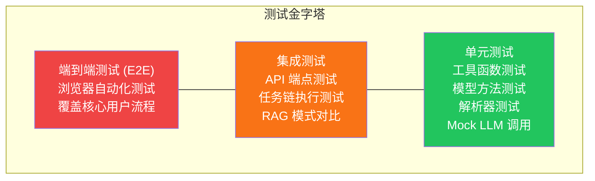
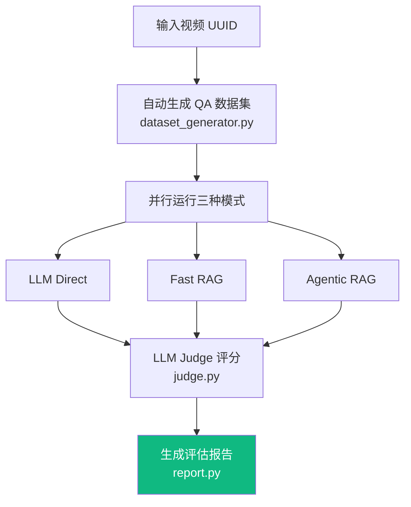

# 测试策略

LectureMind 采用分层测试策略，确保代码质量和系统可靠性。本文档介绍测试体系、运行方法以及如何编写新测试。

## 测试金字塔



| 层级 | 数量 | 速度 | 成本 | 覆盖范围 |
|---|---|---|---|---|
| **单元测试** | 多 | 快（毫秒级） | 低 | 函数、模型方法、工具 |
| **集成测试** | 中 | 中（秒级） | 中 | API 端点、任务链、数据库交互 |
| **端到端测试** | 少 | 慢（分钟级） | 高 | 完整用户流程 |

## 运行测试

### 后端测试

```bash
cd server/app

# 运行所有测试
python manage.py test api

# 运行特定测试模块
python manage.py test api.tests.test_tasks
python manage.py test api.tests.test_tools
python manage.py test api.tests.test_views

# 运行单个测试类
python manage.py test api.tests.test_tasks.GPT4SummaryTaskTest

# 运行单个测试方法
python manage.py test api.tests.test_tools.SearchKnowledgeToolTest.test_basic_search

# 显示详细输出
python manage.py test api --verbosity=2

# 运行测试并显示覆盖率（需要安装 coverage）
coverage run manage.py test api
coverage report
coverage html  # 生成 HTML 报告
```

### 前端测试

```bash
cd frontend

# 运行所有测试
pnpm test

# 监听模式（文件变更时自动运行）
pnpm test --watch

# 生成覆盖率报告
pnpm test --coverage
```

### RAG 评估

RAG 评估是一个独立的测试系统，用于对比不同 RAG 模式的回答质量：

```bash
cd server/app

# 基本评估（默认 20 道题）
python manage.py evaluate_rag --video <video-uuid>

# 自定义题目数量
python manage.py evaluate_rag --video <video-uuid> --questions 30

# 指定自定义问题
python manage.py evaluate_rag --video <video-uuid> \
  --question "Who are the tutors?,What is the course schedule?" \
  --question_count 10

# 指定输出目录
python manage.py evaluate_rag --video <video-uuid> --output ./reports/

# 使用自定义模型
python manage.py evaluate_rag --video <video-uuid> \
  --sota-model qwen3.6-plus \
  --test-model qwen-turbo

# 并行处理（加速评估）
python manage.py evaluate_rag --video <video-uuid> \
  --parallel-questions --question-workers 4

# 加载已有数据集
python manage.py evaluate_rag --video <video-uuid> --dataset ./my_dataset.json
```

## 测试分类

### 单元测试

单元测试验证独立的函数和方法，使用 Mock 隔离外部依赖。

#### 工具函数测试

```python
# api/tests/test_utils.py
from django.test import TestCase
from api.utils import format_time, parse_llm_json


class FormatTimeTest(TestCase):
    def test_format_seconds(self):
        """测试秒数格式化"""
        self.assertEqual(format_time(0), "00:00")
        self.assertEqual(format_time(65), "01:05")
        self.assertEqual(format_time(3661), "01:01:01")

    def test_format_milliseconds(self):
        """测试毫秒输入"""
        # format_time 接受秒，不是毫秒
        self.assertEqual(format_time(90.5), "01:30")


class ParseLLMJsonTest(TestCase):
    def test_valid_json(self):
        """测试解析有效 JSON"""
        result = parse_llm_json('{"key": "value"}')
        self.assertEqual(result, {"key": "value"})

    def test_json_with_markdown_fences(self):
        """测试解析带 Markdown 围栏的 JSON"""
        input_text = '```json\n{"key": "value"}\n```'
        result = parse_llm_json(input_text)
        self.assertEqual(result, {"key": "value"})

    def test_invalid_json_raises(self):
        """测试无效 JSON 抛出异常"""
        with self.assertRaises(Exception):
            parse_llm_json("not json at all")
```

#### 模型方法测试

```python
# api/tests/test_models.py
from django.test import TestCase
from api.models import Video, AsyncTaskItem


class VideoModelTest(TestCase):
    def test_video_creation(self):
        """测试视频模型创建"""
        video = Video.objects.create(
            title="Test Lecture",
            file="test.mp4",
            duration=3600,
        )
        self.assertEqual(video.title, "Test Lecture")
        self.assertEqual(video.status, "pending")  # 默认状态

    def test_video_str_representation(self):
        """测试视频字符串表示"""
        video = Video(title="Test Lecture")
        self.assertIn("Test Lecture", str(video))
```

### 集成测试

集成测试验证多个组件协同工作，包括数据库交互和 API 端点。

#### API 端点测试

```python
# api/tests/test_views.py
from django.test import TestCase, Client
from django.urls import reverse
from api.models import Video
import json


class HealthEndpointTest(TestCase):
    def test_health_check(self):
        """测试健康检查端点"""
        client = Client()
        response = client.get('/api/health/')
        self.assertEqual(response.status_code, 200)


class VideoUploadTest(TestCase):
    def test_upload_creates_video(self):
        """测试上传视频创建记录"""
        # 使用测试文件
        with open('test_data/sample.mp4', 'rb') as f:
            client = Client()
            response = client.post(
                '/api/videos/upload/',
                {'title': 'Test Video', 'file': f},
                format='multipart',
            )
        self.assertEqual(response.status_code, 201)
        self.assertEqual(Video.objects.count(), 1)

    def test_list_videos(self):
        """测试获取视频列表"""
        Video.objects.create(title="Video 1", file="v1.mp4")
        Video.objects.create(title="Video 2", file="v2.mp4")

        client = Client()
        response = client.get('/api/videos/')
        self.assertEqual(response.status_code, 200)
        self.assertEqual(len(response.json()), 2)
```

#### 任务链测试

```python
# api/tests/test_tasks.py
from django.test import TestCase
from unittest.mock import patch, MagicMock
from api.tasks import (
    task_extract_audio_and_transcript,
    task_hls_streaming,
    task_hybrid_chunking,
    TASK_REGISTRY,
)


class TaskRegistryTest(TestCase):
    def test_all_tasks_registered(self):
        """测试所有任务都已注册"""
        expected_tasks = [
            "task_extract_audio_and_transcript",
            "task_hls_streaming",
            "task_ssim_move_detection",
            "task_generate_thumbnails",
            "task_slides_ocr",
            "task_hybrid_chunking",
            "task_fine_grained_knowledge",
            "task_embed_knowledge",
            "task_coarse_grained_summary",
            "task_generate_mindmap",
        ]
        for task_name in expected_tasks:
            self.assertIn(task_name, TASK_REGISTRY)

    def test_all_tasks_are_callable(self):
        """测试所有注册的任务都是可调用的"""
        for name, func in TASK_REGISTRY.items():
            self.assertTrue(callable(func), f"{name} is not callable")


class AudioTranscriptTaskTest(TestCase):
    @patch('api.tasks.subprocess.run')
    @patch('api.tasks.DashScopeASRClient')
    @patch('api.tasks.get_local_file_path')
    def test_task_extracts_audio(self, mock_path, mock_asr, mock_subprocess):
        """测试音频提取任务的基本流程"""
        mock_path.return_value = '/tmp/test.mp4'
        mock_subprocess.return_value = MagicMock(returncode=0, stdout='', stderr='')

        # 模拟 ASR 返回
        mock_asr_instance = MagicMock()
        mock_asr_instance.transcribe_audio.return_value = {
            'transcripts': [{'channel_id': 0, 'sentences': []}]
        }
        mock_asr.return_value = mock_asr_instance

        # 注意：实际测试需要更完整的 mock 设置
        # 这里展示测试模式
```

### AI 质量测试

#### RAG 评估系统

LectureMind 内置了 RAG 评估系统，用于对比三种 RAG 模式的回答质量：

| 模式 | 说明 | 用途 |
|---|---|---|
| **LLM Direct** | 无检索，纯 LLM 回答 | 基线对照，展示无知识库时的幻觉程度 |
| **Fast RAG** | 单次向量检索 + LLM 生成 | 标准 RAG 流程 |
| **Agentic RAG** | 多步 LangGraph Agent + 工具调用 | 最高质量，支持多轮推理 |

**评估流程**：



**理解评估报告**：

评估报告包含以下维度的对比：

- **准确性**：回答是否与讲座内容一致
- **完整性**：是否涵盖了问题的所有方面
- **相关性**：回答是否与问题相关
- **幻觉率**：包含讲座中不存在信息的比例

**评估报告输出位置**：`server/app/evaluation_reports/`

#### 编写 RAG 质量断言

```python
# api/tests/test_rag_quality.py
from django.test import TestCase
from unittest.mock import patch, MagicMock
from api.rag_engine import FastRAGEngine


class RAGQualityTest(TestCase):
    @patch('api.rag_engine.get_vector_store')
    @patch('api.rag_engine.get_llm_client')
    def test_rag_returns_relevant_answer(self, mock_llm, mock_store):
        """测试 RAG 引擎返回相关答案"""
        # 设置 mock 向量搜索结果
        mock_store_instance = MagicMock()
        mock_store_instance.query.return_value = [
            {
                'text': 'Gradient descent is an optimization algorithm',
                'relevance': 0.95,
                'metadata': {'title': 'Optimization Methods'}
            }
        ]
        mock_store.return_value = mock_store_instance

        # 设置 mock LLM 响应
        mock_llm_instance = MagicMock()
        mock_llm_instance.chat.return_value = (
            "Gradient descent is an optimization algorithm used to "
            "minimize a function by iteratively moving in the direction "
            "of steepest descent."
        )
        mock_llm.return_value = mock_llm_instance

        # 执行查询
        engine = FastRAGEngine(video_id="test-uuid")
        result = engine.query("What is gradient descent?")

        # 验证结果
        self.assertIn("gradient descent", result['answer'].lower())
        self.assertGreater(len(result['answer']), 50)
```

## 编写测试指南

### Django TestCase 模式

```python
from django.test import TestCase


class MyTest(TestCase):
    @classmethod
    def setUpTestData(cls):
        """类级别 setUp，只执行一次（用于创建共享的测试数据）"""
        cls.video = Video.objects.create(
            title="Test Video",
            file="test.mp4",
            duration=3600,
        )

    def setUp(self):
        """方法级别 setUp，每个测试方法执行前调用"""
        self.client = Client()

    def test_something(self):
        """测试方法以 test_ 开头"""
        response = self.client.get('/api/health/')
        self.assertEqual(response.status_code, 200)
```

### Mock LLM 调用

在测试中总是 Mock LLM 调用，避免产生 API 费用和网络依赖：

```python
from unittest.mock import patch, MagicMock


class MyLLMTest(TestCase):
    @patch('api.tasks.get_llm_client')
    def test_task_with_mock_llm(self, mock_get_llm):
        """Mock LLM 客户端"""
        # 创建 mock LLM 实例
        mock_llm = MagicMock()
        mock_llm.chat.return_value = '{"summary": "Test summary"}'
        mock_get_llm.return_value = mock_llm

        # 执行被测代码
        result = my_task({"video_id": "test"})

        # 验证 LLM 被正确调用
        mock_llm.chat.assert_called_once()
        call_kwargs = mock_llm.chat.call_args
        self.assertIn("temperature", call_kwargs.kwargs)

    @patch('api.vector_store.get_vector_store')
    def test_task_with_mock_vector_store(self, mock_get_store):
        """Mock 向量存储"""
        mock_store = MagicMock()
        mock_store.query.return_value = [
            {"text": "result", "relevance": 0.9, "metadata": {}}
        ]
        mock_get_store.return_value = mock_store

        # ...
```

### 测试异步任务

```python
from django.test import TestCase
from unittest.mock import patch
from api.tasks import task_fine_grained_knowledge
from api.models import Video, VideoSection, KnowledgePoint


class AsyncTaskTest(TestCase):
    def setUp(self):
        self.video = Video.objects.create(
            title="Test", file="test.mp4", duration=600
        )
        self.video_id = str(self.video.id)

        # 创建测试章节
        self.section = VideoSection.objects.create(
            video=self.video,
            title="Section 1",
            begin_time=0,
            end_time=300,
            transcript_text="This is a test transcript about machine learning.",
            order=0,
        )

    @patch('api.tasks.get_llm_client')
    def test_fine_grained_knowledge_creates_points(self, mock_get_llm):
        """测试知识提取任务创建知识点"""
        mock_llm = MagicMock()
        mock_llm.chat.return_value = json.dumps({
            "section_title": "Machine Learning Basics",
            "points": [
                {
                    "title": "Supervised Learning",
                    "summary": "A type of ML where the model learns from labeled data.",
                    "terms": ["supervised", "labeled data"],
                    "importance": 0.9,
                }
            ]
        })
        mock_get_llm.return_value = mock_llm

        result = task_fine_grained_knowledge({"video_id": self.video_id})

        # 验证知识点被创建
        self.assertEqual(result['knowledge_points_count'], 1)
        kp = KnowledgePoint.objects.first()
        self.assertEqual(kp.title, "Supervised Learning")
        self.assertIn("supervised", kp.key_terms)
```

## 测试数据管理

### 使用 Fixture

```python
# api/fixtures/test_data.json
[
    {
        "model": "api.video",
        "pk": "123e4567-e89b-12d3-a456-426614174000",
        "fields": {
            "title": "Test Lecture",
            "file": "test.mp4",
            "duration": 3600,
            "status": "completed"
        }
    }
]
```

```bash
# 加载 fixture
python manage.py loaddata test_data

# 在测试中使用
class MyTest(TestCase):
    fixtures = ['test_data.json']
```

### 使用 Factory Boy（推荐）

```python
# api/tests/factories.py
import factory
from api.models import Video, VideoSection


class VideoFactory(factory.django.DjangoModelFactory):
    class Meta:
        model = Video

    title = factory.Sequence(lambda n: f"Test Video {n}")
    file = factory.LazyAttribute(lambda o: f"{o.title}.mp4")
    duration = 3600
    status = "completed"


class VideoSectionFactory(factory.django.DjangoModelFactory):
    class Meta:
        model = VideoSection

    video = factory.SubFactory(VideoFactory)
    title = factory.Sequence(lambda n: f"Section {n}")
    begin_time = 0
    end_time = 300
    order = 0
```

```python
# 在测试中使用 factory
class MyTest(TestCase):
    def test_something(self):
        video = VideoFactory(title="ML Lecture")
        section = VideoSectionFactory(video=video, title="Introduction")
        # ...
```

## 持续集成

### GitHub Actions 配置示例

```yaml
# .github/workflows/test.yml
name: Tests

on: [push, pull_request]

jobs:
  backend-tests:
    runs-on: ubuntu-latest
    steps:
      - uses: actions/checkout@v4
      - uses: actions/setup-python@v5
        with:
          python-version: '3.11'
      - name: Install dependencies
        run: |
          cd server/app
          pip install -r ../requirements.txt
      - name: Run tests
        run: |
          cd server/app
          python manage.py test api --verbosity=2
        env:
          DASHSCOPE_API_KEY: test-key
          SECRET_KEY: test-secret-key

  frontend-tests:
    runs-on: ubuntu-latest
    steps:
      - uses: actions/checkout@v4
      - uses: actions/setup-node@v4
        with:
          node-version: '20'
      - name: Install and test
        run: |
          cd frontend
          corepack enable && corepack prepare pnpm@latest --activate
          pnpm install --frozen-lockfile
          pnpm test
```

## 常见问题

### 测试数据库

Django 测试框架会自动创建一个独立的测试数据库，测试结束后销毁。不需要担心测试数据污染开发数据库。

### Mock 不生效

确保 patch 路径指向**使用位置**而非定义位置：

```python
# 正确：patch 使用位置
@patch('api.tasks.get_llm_client')

# 错误：patch 定义位置
@patch('api.llm_client.get_llm_client')
```

### 测试速度慢

1. 检查是否有未 Mock 的外部 API 调用
2. 使用 `setUpTestData` 而非 `setUp` 创建共享数据
3. 减少不必要的数据库查询

### RAG 评估超时

评估需要多次 LLM 调用，可能较慢。使用 `--parallel-questions` 和 `--mode-workers` 参数加速：

```bash
python manage.py evaluate_rag --video <uuid> \
  --parallel-questions --question-workers 4 \
  --mode-workers 3
```
