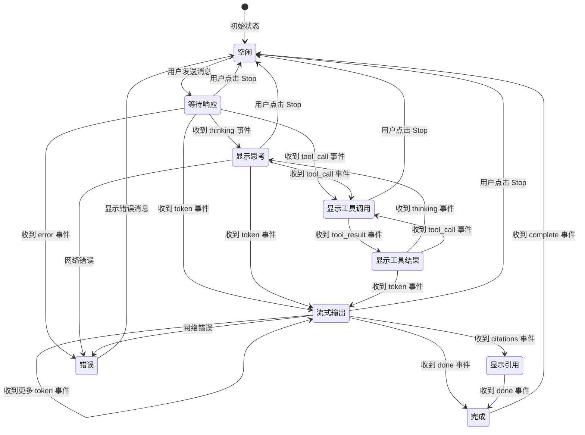

# 聊天界面

`LectureChatbot` 是 LectureMind 前端最核心、最复杂的组件。它实现了与 AI 的实时流式对话，支持两种模式、工具调用展示、引用跳转等丰富功能。

## 界面布局

```
┌──────────────────────────────────────────────────────┐
│ [Robot] Agent Mode  Multi-step reasoning with tools  │  ← 模式切换栏
│                                              [Switch] │
├──────────────────────────────────────────────────────┤
│                                                      │
│  ┌─────────────────────────────────────────────┐    │
│  │ Gradient descent is an optimization          │    │
│  │ algorithm that iteratively adjusts           │    │
│  │ parameters...                                │    │
│  │                                              │    │
│  │ ─ ─ ─ ─ ─ ─ ─ ─ ─ ─ ─ ─ ─ ─ ─ ─ ─ ─ ─ ─  │    │
│  │ Tool Searching knowledge (query: "gradient") │    │
│  │ Tool Reading section (section_id: "abc")     │    │
│  │                                              │    │
│  │ Sources:                                     │    │
│  │ [03:42 [1]] [12:15 [2]] [25:08 [3]]         │    │  ← 引用标签（可点击跳转）
│  └─────────────────────────────────────────────┘    │
│                                                      │
│         ┌───────────────────────────────────┐       │
│  用户消息 │ What is the loss function?       │       │  ← 用户消息（蓝色靠右）
│         └───────────────────────────────────┘       │
│                                                      │
│  ┌─────────────────────────────────────────────┐    │
│  │ [Purple Box]                                 │    │
│  │ 🔄 Searching knowledge...                    │    │  ← 实时 Agent 活动指示器
│  │ Tool Reading section (id: "xyz")             │    │
│  └─────────────────────────────────────────────┘    │
│                                                      │
├──────────────────────────────────────────────────────┤
│ [ Ask the agent about the lecture...        ] [Send] │  ← 输入框
└──────────────────────────────────────────────────────┘
```

## 两种聊天模式

LectureChatbot 提供两种 AI 交互模式，用户可以通过顶部的 Switch 开关切换：

### Agent Mode（默认）

- **后端端点**：`POST /api/videos/{videoId}/agent/stream/`
- **工作方式**：基于 LangGraph 的多步推理 Agent
- **特点**：AI 可以调用多种工具（搜索知识点、读取章节、获取摘要等），经过多轮推理后给出回答
- **用户看到**：思考过程 → 工具调用 → 工具结果 → 最终回答
- **适用场景**：复杂问题，需要跨多个知识点综合分析

### Quick Mode

- **后端端点**：`POST /api/videos/{videoId}/chat/stream/`
- **工作方式**：直接 RAG 检索 + 流式生成
- **特点**：一步到位，不经过工具调用
- **用户看到**：直接流式输出回答文本
- **适用场景**：简单问题，快速回答

```tsx
// 模式决定调用哪个 API
const endpoint = agentMode
  ? `${API_PREFIX}/api/videos/${videoId}/agent/stream/`
  : `${API_PREFIX}/api/videos/${videoId}/chat/stream/`;
```

**为什么需要两种模式？** Agent Mode 功能强大但响应较慢（需要多轮 LLM 调用），Quick Mode 响应快但能力有限。让用户根据问题复杂度自行选择。

## 消息渲染

### 用户消息

用户消息显示在右侧，蓝色背景，圆角气泡样式：

```
┌────────────────────────────────────┐
│ What is gradient descent?          │  ← 蓝色背景，白色文字
└────────────────────────────────────┘
                                   ╲
```

### 助手消息

助手消息显示在左侧，白色背景，支持 Markdown 渲染：

```
 ╱
┌────────────────────────────────────┐
│ Agent used 2 tools                 │  ← 工具步骤摘要
│   🔍 Searching knowledge (...)     │
│   📄 Reading section (...)         │
│────────────────────────────────────│
│ **Gradient descent** is an         │  ← Markdown 渲染
│ optimization algorithm...          │
│                                    │
│ Sources:                           │
│ [03:42 [1]] [12:15 [2]]           │  ← 引用标签
└────────────────────────────────────┘
```

助手消息使用 `react-markdown` + `remark-gfm` 渲染，支持：

- 标题、加粗、斜体
- 列表（有序/无序）
- 代码块
- 表格
- 链接

## Agent 工具步骤展示

在 Agent Mode 下，助手消息上方会显示 AI 使用了哪些工具。每个工具步骤由 `ToolStepDisplay` 组件渲染：

```tsx
const ToolStepDisplay: React.FC<{ step: AgentToolStep }> = ({ step }) => {
  const label = toolLabels[step.tool] || step.tool;  // 友好名称
  const icon = toolIcons[step.tool] || <ToolOutlined />;

  return (
    <div className="flex items-start gap-2 text-xs text-gray-500">
      <span>{icon}</span>
      <div>
        <span className="font-medium">{label}</span>
        <span>({argsStr})</span>
        {/* 工具结果可折叠展示 */}
        {step.result && <Collapse>Show result</Collapse>}
      </div>
    </div>
  );
};
```

工具名称到友好标签的映射：

| 工具名 | 显示标签 | 图标 |
|--------|---------|------|
| `search_knowledge` | Searching knowledge | 搜索图标 |
| `get_section_details` | Reading section | 文件图标 |
| `get_lecture_summary` | Getting summary | 灯泡图标 |
| `list_sections` | Listing sections | 文件图标 |
| `get_transcript_at_time` | Reading transcript | 时钟图标 |

工具结果默认折叠，用户可以点击 "Show result" 展开查看原始返回值。

## 引用标签（CitationBadge）

当 AI 的回答引用了视频中的具体内容时，会在消息底部显示引用标签：

```
Sources:
[03:42 [1]]  [12:15 [2]]  [25:08 [3]]
```

每个标签显示：

- **来源类型图标** — 知识点用灯泡，章节用文件图标
- **时间戳** — 引用内容在视频中的起始时间
- **编号** — `[1]`, `[2]` 等，对应回答中的引用标记

**点击跳转**：点击任何一个引用标签，视频会自动跳转到对应的时间点并开始播放。这是通过 `handleTimeClick` 回调实现的：

```tsx
const CitationBadge: React.FC<CitationBadgeProps> = ({ citation, onTimeClick }) => (
  <Tag onClick={() => onTimeClick(citation.begin_time)}>
    {icon}
    <ClockCircleOutlined />
    {formatTime(citation.begin_time)}
    <span>[Source {citation.source_num}]</span>
  </Tag>
);
```

## 输入处理

输入框支持以下交互：

- **Enter 键**：发送消息
- **Shift + Enter**：不发送（虽然当前是单行输入，但保留了这个约定）
- **流式进行中**：输入框被禁用，防止重复发送
- **空消息**：发送按钮被禁用

```tsx
<input
  onKeyDown={(e) => e.key === 'Enter' && !e.shiftKey && handleSendMessage()}
  disabled={isStreaming}
/>
```

## 停止流式输出

当 AI 正在流式输出时，发送按钮会变成红色的 "Stop" 按钮。点击后：

1. 调用 `AbortController.abort()` 中断 HTTP 请求
2. 流式状态重置
3. 已收到的部分内容保留在消息列表中

```tsx
const handleStopStreaming = () => {
  abortRef.current?.abort();       // 中断 fetch 请求
  setIsStreaming(false);
  setCurrentThinking(null);
  setCurrentToolSteps([]);
};
```

**为什么要用 AbortController？** 浏览器的 `fetch` API 不支持直接取消请求，但可以通过 `AbortController` 的 `signal` 来中断。这是 Web 标准的做法。

## 自动滚动

消息列表会自动滚动到最新消息。触发条件：

- 新消息添加时
- AI 思考状态更新时
- 工具步骤更新时

```tsx
useEffect(() => {
  messagesEndRef.current?.scrollIntoView({ behavior: 'smooth' });
}, [messages, currentThinking, currentToolSteps]);
```

底部有一个不可见的 `<div ref={messagesEndRef} />` 作为滚动锚点。

## 会话管理

### 创建会话

当用户第一次发送消息时，如果 `sessionId` 为空，后端会自动创建一个新的聊天会话，标题取用户消息的前 80 个字符。创建后，后端通过 `complete` 事件返回 `session_id`，前端保存下来。

### 继续会话

后续消息会携带 `session_id`，后端会将其追加到已有会话中。会话中的完整聊天历史会作为上下文传递给 LLM，实现多轮对话。

```tsx
// 发送时携带 session_id
body: JSON.stringify({ message: text, session_id: sessionId }),

// 收到 complete 事件后保存 session_id
case 'complete':
  if (data.session_id) setSessionId(data.session_id);
```

## 状态图

下图展示了聊天 UI 的完整状态转换：



## 组件状态一览

| 状态变量 | 类型 | 用途 |
|---------|------|------|
| `messages` | `ChatMessageData[]` | 所有聊天消息列表 |
| `inputValue` | `string` | 输入框当前文本 |
| `isStreaming` | `boolean` | 是否正在流式接收 AI 回复 |
| `sessionId` | `string \| null` | 当前聊天会话 ID |
| `agentMode` | `boolean` | 是否为 Agent 模式 |
| `currentThinking` | `string \| null` | 当前 Agent 思考内容（实时） |
| `currentToolSteps` | `AgentToolStep[]` | 当前正在执行的工具步骤（实时） |
| `abortRef` | `Ref<AbortController>` | 用于取消流式请求 |
| `messagesEndRef` | `Ref<HTMLDivElement>` | 自动滚动锚点 |

## 代码结构

```
LectureChatBot
├── 格式化工具
│   ├── formatTime()          — 秒数 → "MM:SS"
│   ├── toolLabels            — 工具名 → 友好标签映射
│   └── toolIcons             — 工具名 → 图标映射
│
├── 子组件
│   ├── CitationBadge         — 引用标签（可点击跳转）
│   └── ToolStepDisplay       — 工具步骤展示（可折叠结果）
│
└── 主组件
    ├── ModeToggleBar         — 模式切换栏
    ├── MessagesArea          — 消息列表 + 实时活动指示器
    └── InputArea             — 输入框 + 发送/停止按钮
```

## 下一步

- [SSE 流式通信](./sse-streaming.md) — 了解消息是如何从后端实时流式传输到前端的
- [组件架构](./components.md) — 了解 LectureChatbot 在整体架构中的位置
