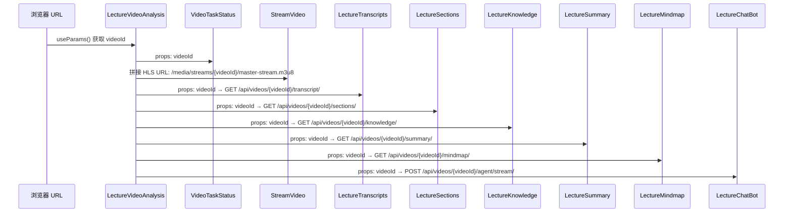

# 组件架构

本文档详细介绍 LectureMind 前端的每个组件：它们做什么、如何协作、数据如何流动。

## 组件全景图

```mermaid
graph TD
    subgraph 布局层
        ML["MainLayout<br/>根组件 + 路由"]
        AS["AppShell<br/>Header + Sider + Content"]
    end

    subgraph 页面层
        UD["UploadDashboard<br/>视频上传"]
        VD["VideoDashboard<br/>视频列表"]
        CD["CourseDashboard<br/>课程管理"]
        CDP["CourseDetailPage<br/>课程详情"]
        TD["TaskDashboard<br/>任务监控"]
        LVA["LectureVideoAnalysis<br/>视频分析 (核心)"]
        SP["SettingsPage<br/>系统配置"]
    end

    subgraph 分析组件层 (components/lecture/)
        VTS["VideoTaskStatus<br/>任务进度"]
        SV["StreamVideo<br/>HLS 播放器"]
        LT["LectureTranscripts<br/>转录文本"]
        LS["LectureSections<br/>章节列表"]
        LK["LectureKnowledge<br/>知识点"]
        LSum["LectureSummary<br/>AI 摘要"]
        LM["LectureMindmap<br/>思维导图"]
        LCB["LectureChatBot<br/>AI 聊天"]
    end

    subgraph 共享组件层 (components/)
        EB["ErrorBoundary<br/>错误边界"]
        CP["ChatPanel<br/>通用聊天面板"]
        TP["ThinkingPanel<br/>思考面板"]
        LB["LoadingButton<br/>加载按钮"]
    end

    ML --> AS
    AS --> EB
    EB --> UD & VD & CD & CDP & TD & LVA & SP

    LVA --> VTS & SV & LVA_tabs["Ant Design Tabs"]
    LVA_tabs --> LT & LS & LK & LSum & LM & LCB

    style LVA fill:#fff7e6,stroke:#fa8c16,stroke-width:2px
    style LCB fill:#f6ffed,stroke:#52c41a,stroke-width:2px
```

## 应用壳：MainLayout

`MainLayout.tsx` 是整个应用的根组件。它做三件事：

1. **提供路由** — 用 `<BrowserRouter>` 包裹整个应用
2. **定义布局** — 顶部 Header + 左侧可折叠 Sider + 右侧 Content
3. **声明路由表** — 路径到页面组件的映射

```tsx
// 简化结构
const MainLayout = () => (
  <BrowserRouter>
    <AppShell />   // 包含 Header、Sider、Content
  </BrowserRouter>
);
```

侧边栏的选中状态通过 URL 路径自动推导（`linkToMenuKey` 函数），不需要额外的状态管理。

## 页面组件

### UploadDashboard（首页）

**路由**：`/`

视频上传页面。用户选择本地视频文件，上传到后端。上传完成后可以触发处理流程（ASR、章节划分、知识提取等）。

**关键 Props**：
- `setUploadProgress: (progress: number) => void` — 从 MainLayout 传入，用于在 Header 显示上传进度

### VideoDashboard

**路由**：`/videos`

展示已上传的视频列表。每个视频卡片显示封面、标题、时长，点击进入 `/lecture/:videoId` 分析页面。

### CourseDashboard

**路由**：`/courses`

课程管理页面。一个「课程」(Course/Episode) 包含多个视频，用户可以将相关视频组织在一起，形成系列课程。

### CourseDetailPage

**路由**：`/courses/:courseId`

课程详情页。展示课程下的所有视频，并提供**跨视频聊天**功能 — Agent 可以同时搜索所有视频的知识点来回答问题。

### TaskDashboard

**路由**：`/tasks`

异步任务监控页面。视频上传后会触发一个任务链（ASR -> HLS -> 章节 -> 知识点 -> ...），这个页面展示每个任务的状态（pending / running / success / error）。

### SettingsPage

**路由**：`/settings`

系统配置页面。管理 LLM 模型选择（本地 HuggingFace 模型或阿里云远程模型）、API Key 等配置项。

### LectureVideoAnalysis（核心页面）

**路由**：`/lecture/:videoId`

这是 LectureMind 最重要的页面。它采用**左右分栏**布局：

```
┌──────────────────────────────────────────────────────┐
│ VideoTaskStatus (任务进度条)                            │
├────────────────────┬─────────────────────────────────┤
│                    │ ┌─────────────────────────────┐ │
│   StreamVideo      │ │ Transcript│Sections│Knowledge│ │
│   (HLS 播放器)      │ │ Summary│Mindmap│Chat        │ │
│                    │ ├─────────────────────────────┤ │
│                    │ │                             │ │
│                    │ │   当前选中 Tab 的内容          │ │
│                    │ │                             │ │
├────────────────────┤ │                             │ │
│ ThumbnailScroller  │ │                             │ │
│ (缩略图滚动条)      │ │                             │ │
└────────────────────┴─────────────────────────────────┘
```

**关键设计决策**：

1. **视频时间节流** — `currentTime` 每秒最多更新一次（`throttle ~1Hz`），避免频繁重渲染
2. **按需传递时间** — 只有当前激活的 Tab 会收到 `currentTime`，其他 Tab 收到 `-1`，避免六个 Tab 同时重渲染
3. **Tab 销毁** — 使用 `destroyInactiveTabPane` 属性，非激活 Tab 的组件会被销毁，节省内存

```tsx
// 核心逻辑：只为激活的 Tab 传递 currentTime
const timeForTab = useCallback(
  (tabKey: string) => (tabKey === activeTab ? currentTime : -1),
  [activeTab, currentTime]
);
```

## Lecture 组件（components/lecture/）

这些组件是 `LectureVideoAnalysis` 页面中六个 Tab 的内容。

### LectureTranscripts

展示 ASR（自动语音识别）生成的逐句转录文本。每条句子带有时间戳，点击可跳转到视频对应位置。

### LectureSections

展示视频的章节划分。每个章节有标题、时间范围和转录摘要。

**自动跟随功能**：当视频播放时，当前时间所在的章节会自动高亮并滚动到可视区域。但如果用户手动滚动了列表，自动跟随会暂停 3 秒（避免和用户抢夺滚动控制权）。

```tsx
// 用户手动滚动时，暂停自动跟随
const handleScroll = useCallback(() => {
  userScrolling.current = true;
  if (scrollTimer.current) clearTimeout(scrollTimer.current);
  scrollTimer.current = setTimeout(() => {
    userScrolling.current = false;  // 3秒后恢复自动跟随
  }, 3000);
}, []);
```

### LectureKnowledge

知识点浏览器。展示从视频中提取的结构化知识点，每个知识点关联到具体的章节和时间范围。

### LectureSummary

AI 生成的视频摘要，包含概览、关键主题、学习目标、前置知识和难度等级。

### LectureMindmap

基于 ReactFlow（@xyflow/react）的交互式思维导图。后端生成树形结构数据，前端渲染为可拖拽、可缩放的流程图。

### LectureChatbot

**这是整个前端最复杂的组件**，详见 [聊天界面](./chat-interface.md) 和 [SSE 流式通信](./sse-streaming.md)。

### StreamVideo

HLS 视频播放器。优先尝试 HLS 流（`master-stream.m3u8`），如果不可用则回退到直接播放 MP4 文件。

### VideoTaskStatus

在视频分析页面顶部展示当前视频的异步处理任务进度。

## 共享组件（components/）

### ErrorBoundary

React 错误边界组件，捕获子组件渲染时的 JavaScript 错误，显示友好的错误页面而不是白屏。

### ChatPanel / ThinkingPanel

通用的聊天面板和 AI 思考过程展示面板，可在不同页面复用。

### LoadingButton

带加载状态的按钮组件，点击后显示 loading 动画，防止重复提交。

## TypeScript 接口（model.tsx）

所有数据模型的 TypeScript 接口都定义在 `model.tsx` 中。这是前端的「数据契约」：

```typescript
// 视频
interface Video {
  id: string;
  title: string;
  video_url: string;
  duration: number;
  cover_url: string | null;
}

// 章节
interface Section {
  id: string;
  video: string;
  title: string;
  begin_time: number;
  end_time: number;
  transcript_text: string;
  order: number;
}

// 知识点
interface KnowledgePoint {
  id: string;
  section: string;
  video: string;
  title: string;
  summary: string;
  key_terms: string[];
  importance: number;
  begin_time: number;
  end_time: number;
}

// 聊天消息
interface ChatMessageData {
  id: string;
  role: 'user' | 'assistant';
  content: string;
  citations: Citation[];
  toolSteps?: AgentToolStep[];
}

// Agent 工具调用步骤
interface AgentToolStep {
  tool: string;
  args: Record<string, any>;
  result?: string;
}

// SSE 事件类型
type AgentEventType =
  | 'thinking' | 'tool_call' | 'tool_result'
  | 'token' | 'citations' | 'done' | 'complete' | 'error';
```

**为什么要统一定义？** 因为后端 API 返回的 JSON 结构和前端使用这些数据的组件需要对齐。如果后端改了字段名，TypeScript 编译器会在构建时就报错，而不是运行时才崩溃。

## 数据流：videoId 的旅程

`videoId` 是整个应用的核心标识符。下面展示它如何从 URL 流向各个组件：



每个组件拿到 `videoId` 后，独立地向后端发起 API 请求获取自己的数据。组件之间**没有数据依赖**（除了都依赖 videoId），这使得它们可以独立加载、独立出错。

## 时间跳转：组件间通信

虽然组件之间没有数据依赖，但它们需要协作完成一个功能：**点击时间戳，跳转视频**。

这个通信通过回调函数实现：

```tsx
// 在 LectureVideoAnalysis 中定义
const jumpVideoTime = useCallback((time: number) => {
  if (videoRef.current) {
    videoRef.current.currentTime = time;
    videoRef.current.play();
  }
}, []);

// 传递给需要跳转功能的子组件
<LectureTranscripts handleItemClick={jumpVideoTime} />
<LectureSections handleItemClick={jumpVideoTime} />
<LectureChatBot handleTimeClick={jumpVideoTime} />
```

当用户点击聊天中的引用标签（CitationBadge）时，会调用 `handleTimeClick`，视频就会跳转到对应的时间点。这是一个典型的**回调提升**模式 — 状态（视频播放位置）在父组件中管理，子组件通过回调通知父组件修改状态。

## 组件设计原则

1. **单一职责** — 每个组件只做一件事。LectureSections 只负责展示章节，不关心视频播放。
2. **Props 下传，Events 上冒** — 数据通过 props 向下流，事件通过回调向上传。
3. **按需渲染** — 使用 `React.memo`、`useCallback`、`useMemo` 避免不必要的重渲染。
4. **错误隔离** — ErrorBoundary 捕获渲染错误，一个 Tab 崩溃不会影响整个页面。
