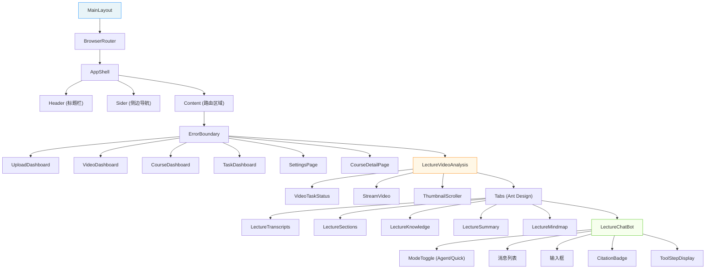

# 前端概览

本文档面向初次接触 LectureMind 前端代码的开发者，帮助你快速了解技术选型、项目结构和核心设计模式。

## 技术栈

| 类别 | 技术 | 版本 | 用途 |
|------|------|------|------|
| UI 框架 | React | 19 | 组件化视图层 |
| 类型系统 | TypeScript | 4.9 | 静态类型检查 |
| 组件库 | Ant Design | 6 | 表格、表单、Tabs 等企业级 UI 组件 |
| 工具样式 | Tailwind CSS | — | 原子化 CSS，快速布局 |
| 路由 | React Router | v7 | SPA 页面导航 |
| 图表/流程图 | @xyflow/react (ReactFlow) | 12 | 思维导图渲染 |
| Markdown | react-markdown + remark-gfm | — | AI 回答中的 Markdown 渲染 |
| 视频播放 | HLS.js (via custom StreamVideo) | — | 自适应码率视频流 |
| 构建工具 | Create React App (react-scripts) | 5 | 开发服务器、打包 |

**为什么不用 Next.js？** LectureMind 的前端是一个纯 SPA（单页应用），不需要 SSR/SSG。后端是独立的 Django 服务，前端通过 REST API 和 SSE 与之通信。Create React App 足够简单，适合快速开发。

## 项目目录结构

```
frontend/src/
├── index.tsx                 # 应用入口，挂载 <MainLayout />
├── MainLayout.tsx            # 根组件：BrowserRouter + 布局壳 + 路由
├── model.tsx                 # 全局 TypeScript 接口定义
├── config.ts                 # API 地址、模型列表等运行时配置
│
├── page/                     # 页面级组件（每个对应一条路由）
│   ├── UploadDashboard.tsx   # 首页：视频上传
│   ├── VideoDashboard.tsx    # 视频列表
│   ├── CourseDashboard.tsx   # 课程管理
│   ├── CourseDetailPage.tsx  # 课程详情（多视频聊天）
│   ├── TaskDashboard.tsx     # 异步任务监控
│   ├── LectureVideoAnalysis.tsx  # 核心页面：视频分析（Tab 布局）
│   └── SettingsPage.tsx      # 系统配置
│
├── components/               # 可复用组件
│   ├── ErrorBoundary.tsx     # React 错误边界
│   ├── ChatPanel.tsx         # 通用聊天面板
│   ├── ThinkingPanel.tsx     # AI 思考过程面板
│   ├── LoadingButton.tsx     # 带加载状态的按钮
│   └── lecture/              # 视频分析专用组件
│       ├── LectureChatbot.tsx    # AI 聊天（SSE 流式）
│       ├── LectureTranscripts.tsx # ASR 转录文本
│       ├── LectureSections.tsx    # 视频章节
│       ├── LectureKnowledge.tsx   # 知识点浏览
│       ├── LectureSummary.tsx     # AI 摘要
│       ├── LectureMindmap.tsx     # 思维导图
│       ├── StreamVideo.tsx        # HLS 视频播放器
│       ├── VideoTaskStatus.tsx    # 任务进度
│       └── CourseChatbot.tsx      # 课程级聊天
│
└── InitPage.tsx              # 初始化页面（可选）
```

## 路由设计

LectureMind 使用 React Router v7 的声明式路由，所有路由定义在 `MainLayout.tsx` 中：

```tsx
<Routes>
  <Route path="/"                   element={<UploadDashboard />} />
  <Route path="/videos"             element={<VideoDashboard />} />
  <Route path="/courses"            element={<CourseDashboard />} />
  <Route path="/courses/:courseId"  element={<CourseDetailPage />} />
  <Route path="/tasks"              element={<TaskDashboard />} />
  <Route path="/lecture/:videoId"   element={<LectureVideoAnalysis />} />
  <Route path="/settings"           element={<SettingsPage />} />
</Routes>
```

路由表：

| 路径 | 页面组件 | 说明 |
|------|---------|------|
| `/` | UploadDashboard | 首页，视频上传 |
| `/videos` | VideoDashboard | 已上传视频列表 |
| `/courses` | CourseDashboard | 课程管理 |
| `/courses/:courseId` | CourseDetailPage | 课程详情，含跨视频聊天 |
| `/tasks` | TaskDashboard | 异步任务进度监控 |
| `/lecture/:videoId` | LectureVideoAnalysis | **核心页面**：视频分析六合一 |
| `/settings` | SettingsPage | 系统配置（模型、API Key） |

`/lecture/:videoId` 是整个应用的核心路由。`:videoId` 是一个 UUID，标识一个已上传的视频。所有分析功能（转录、章节、知识点、摘要、思维导图、聊天）都围绕这个 videoId 展开。

## 状态管理

LectureMind **没有使用** Redux、Zustand 或其他全局状态管理库。所有状态都通过 React 的 `useState` / `useRef` / `useEffect` 在组件内部管理。

**为什么这样设计？**

1. **状态作用域小** — 大多数状态只在单个页面内使用（如聊天消息、章节列表）
2. **组件层级浅** — 页面组件直接管理其子组件的数据，不需要跨层级传递
3. **简单即美** — 对于这个规模的项目，useState 足够了，引入状态管理库会增加不必要的复杂度

唯一的「跨组件」状态是 `videoId`，它通过 URL 参数 (`useParams`) 在组件间共享，而不需要 props 层层传递。

## API 通信模式

前端与后端有两种通信方式：

### 1. REST API（fetch）

用于常规的数据读写操作：

```tsx
// 获取视频列表
const response = await fetch(`${API_PREFIX}/api/videos/`);
const data = await response.json();
```

### 2. SSE 流式通信（fetch + ReadableStream）

用于 AI 聊天等需要实时流式返回的场景：

```tsx
const response = await fetch(endpoint, {
  method: 'POST',
  body: JSON.stringify({ message: text, session_id: sessionId }),
});
const reader = response.body?.getReader();
// 逐块读取 SSE 事件...
```

这两种模式的区别和实现细节将在 [SSE 流式通信](./sse-streaming.md) 章节详细讲解。

## API 地址配置

API 基础地址定义在 `config.ts` 中：

```typescript
export const API_PREFIX: string =
  window.__ENV__?.API_PREFIX ?? "http://127.0.0.1:8000"
```

- **开发环境**：默认指向 `http://127.0.0.1:8000`（本地 Django 服务）
- **生产环境**：通过 Docker 注入的 `/env-config.js` 设置 `window.__ENV__.API_PREFIX`

这样做的好处是**构建时不需要知道部署地址**，运行时动态注入，同一份构建产物可以部署到任何环境。

## 组件层级关系

下图展示了从根组件到最底层组件的完整层级关系：



## 开发环境启动

```bash
# 1. 进入前端目录
cd frontend

# 2. 安装依赖
npm install

# 3. 启动开发服务器（默认 http://localhost:3000）
npm start
```

确保后端 Django 服务已运行在 `http://127.0.0.1:8000`，否则 API 请求会失败。

## 下一步

- [组件架构](./components.md) — 详细了解每个组件的职责和数据流
- [聊天界面](./chat-interface.md) — 深入 LectureChatbot 组件
- [SSE 流式通信](./sse-streaming.md) — 理解实时流式通信的原理和实现
