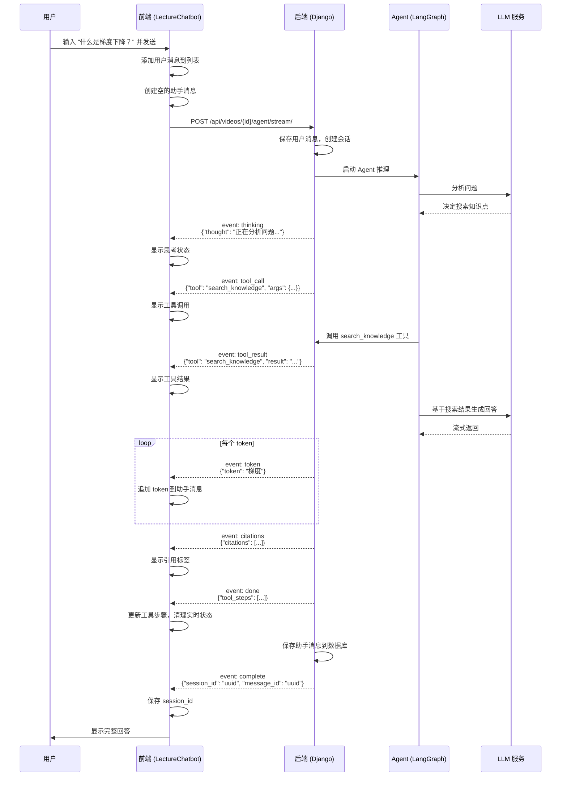

# SSE 流式通信

LectureMind 的 AI 聊天功能使用 **SSE (Server-Sent Events)** 实现流式通信。本文档从零开始讲解 SSE 是什么、为什么选择它、LectureMind 的事件协议，以及前后端的具体实现。

## 什么是 SSE？

SSE（Server-Sent Events，服务器推送事件）是一种 HTTP 标准，允许服务器通过一个长连接**持续地**向客户端推送数据。

### 和普通 HTTP 的区别

**普通 HTTP 请求-响应**：

```
客户端 → "给我数据" → 服务器
客户端 ← "这是所有数据" ← 服务器
              ↑ 一次性返回全部内容
```

**SSE 流式通信**：

```
客户端 → "给我数据" → 服务器
客户端 ← "chunk 1" ← 服务器
客户端 ← "chunk 2" ← 服务器
客户端 ← "chunk 3" ← 服务器
客户端 ← "完成" ← 服务器
              ↑ 数据一块一块地推过来
```

### 为什么用 SSE 而不是 WebSocket？

你可能会问：WebSocket 不也能实现双向通信吗？为什么不用它？

| 特性 | SSE | WebSocket |
|------|-----|-----------|
| 通信方向 | 服务器 → 客户端（单向） | 双向 |
| 协议 | HTTP | 独立的 ws:// 协议 |
| 自动重连 | 浏览器原生支持 | 需要手动实现 |
| 数据格式 | 纯文本 | 文本或二进制 |
| 防火墙/代理 | 兼容性好（就是 HTTP） | 可能被拦截 |
| 复杂度 | 低 | 高 |

**LectureMind 的场景**：用户发一条消息，AI 逐字流式返回回答。这是一个典型的**单向推送**场景 — 客户端只需要接收数据，不需要在流式过程中向服务器发数据。SSE 完全够用，而且比 WebSocket 简单得多。

### SSE 的数据格式

SSE 是纯文本协议，格式非常简单：

```
event: message_type
data: {"key": "value"}

event: another_type
data: {"key": "value"}

```

- `event:` — 事件类型名称
- `data:` — 事件数据（通常是 JSON 字符串）
- **空行** — 标志一个事件的结束

每个事件由 `event:` + `data:` + 空行组成。客户端收到空行就知道一个完整的事件到了。

## LectureMind 的 SSE 事件协议

LectureMind 定义了 8 种 SSE 事件类型，覆盖了 AI 聊天的完整生命周期：

### Agent Mode 事件序列

| 事件 | 含义 | 数据格式 |
|------|------|---------|
| `thinking` | Agent 正在推理 | `{"thought": "让我搜索相关知识点..."}` |
| `tool_call` | Agent 决定调用工具 | `{"tool": "search_knowledge", "args": {"query": "梯度下降"}}` |
| `tool_result` | 工具执行结果 | `{"tool": "search_knowledge", "result": "找到3个相关知识点..."}` |
| `token` | 流式输出文本片段 | `{"token": "梯度"}` |
| `citations` | 引用来源 | `{"citations": [{"source_num": 1, "title": "...", "begin_time": 222}]}` |
| `done` | 回答完成 | `{"tool_steps": [...], "message_id": "uuid"}` |
| `complete` | 服务器保存确认 | `{"session_id": "uuid", "message_id": "uuid"}` |
| `error` | 发生错误 | `{"error": "错误描述"}` |

### Quick Mode 事件序列

Quick Mode 只使用部分事件：

| 事件 | 含义 |
|------|------|
| `token` | 流式输出文本片段 |
| `citations` | 引用来源 |
| `done` | 回答完成 |
| `error` | 发生错误 |

## 完整的 SSE 交互流程

下面是一个 Agent Mode 聊天的完整时序图：



## 事件时间线

下图展示了用户发送一条消息后，SSE 事件的到达顺序和时间分布：

```
时间轴 ──────────────────────────────────────────────────────────►

用户发送消息
│
├─ [0.1s] thinking ──── "正在分析问题..."
│
├─ [0.3s] tool_call ─── search_knowledge({query: "梯度下降"})
│
├─ [1.2s] tool_result ─ search_knowledge → "找到3个相关知识点..."
│
├─ [1.5s] thinking ──── "基于搜索结果组织回答..."
│
├─ [2.0s] token ─────── "梯"
├─ [2.0s] token ─────── "度"
├─ [2.0s] token ─────── "下降"
├─ [2.0s] token ─────── "是一"
├─ [2.0s] token ─────── "种"
├─ [2.1s] token ─────── "优化"
├─ [2.1s] token ─────── "算法"
├─ [2.1s] token ─────── "..."
│          (token 快速连续到达)
├─ [3.5s] citations ─── [{source: 1, time: "03:42"}, {source: 2, time: "12:15"}]
│
├─ [3.6s] done ───────── {tool_steps: [...]}
│
├─ [3.8s] complete ───── {session_id: "xxx", message_id: "yyy"}
│
▼ 流结束，连接关闭
```

注意：`thinking` 和 `tool_call` 可能交替出现多次（Agent 多步推理），`token` 则是快速连续到达的。

## 前端 SSE 解析实现

前端使用 `fetch` API + `ReadableStream` 来读取 SSE 流。为什么不直接用浏览器的 `EventSource` API？因为 `EventSource` 只支持 GET 请求，而我们需要 POST 请求发送消息内容。

### 核心解析逻辑

```tsx
// 1. 发起 POST 请求
const response = await fetch(endpoint, {
  method: 'POST',
  headers: { 'Content-Type': 'application/json' },
  body: JSON.stringify({ message: text, session_id: sessionId }),
  signal: controller.signal,  // 用于取消
});

// 2. 获取 ReadableStream 读取器
const reader = response.body?.getReader();
const decoder = new TextDecoder();
let buffer = '';

// 3. 逐块读取
while (true) {
  const { done, value } = await reader.read();
  if (done) break;

  // 将二进制块解码为文本，追加到缓冲区
  buffer += decoder.decode(value, { stream: true });

  // 按换行符分割，处理完整的行
  const lines = buffer.split('\n');
  buffer = lines.pop() || '';  // 最后一行可能不完整，留到下次

  // 4. 逐行解析 SSE 事件
  let currentEvent = '';
  let dataBuffer = '';

  for (const line of lines) {
    if (line.startsWith('event: ')) {
      currentEvent = line.slice(7).trim();      // 提取事件类型
    } else if (line.startsWith('data: ')) {
      dataBuffer += (dataBuffer ? '\n' : '') + line.slice(6);  // 提取数据
    } else if (line === '' && dataBuffer) {
      // 空行 = 事件结束，解析 JSON 并处理
      const data = JSON.parse(dataBuffer);
      handleEvent(currentEvent, data);          // 分发事件
      currentEvent = '';
      dataBuffer = '';
    }
  }
}
```

### 为什么需要缓冲区？

网络传输是按**块**（chunk）进行的，一个块可能包含：
- 半行数据
- 一行完整数据
- 多行数据
- 多个完整事件

所以我们需要一个缓冲区，把不完整的行留到下一个块来拼接。这就是 `buffer` 变量的作用。

```
块 1: "event: think"                    → 不完整，留在 buffer
块 2: "ing\ndata: {\"thou"              → 拼接后 "event: thinking\ndata: {\"thou"，data 不完整
块 3: "ght\": \"分析\"}\n\nevent: t"    → 拼接后解析出 thinking 事件，"event: t" 留在 buffer
```

### 事件分发

解析出事件后，根据事件类型更新不同的状态：

```tsx
switch (currentEvent) {
  case 'thinking':
    setCurrentThinking(data.thought);     // 显示思考过程
    break;

  case 'tool_call':
    setCurrentThinking(null);             // 清除思考
    setCurrentToolSteps(prev => [...prev, { tool: data.tool, args: data.args }]);
    break;

  case 'tool_result':
    // 更新最后一个工具步骤的结果
    setCurrentToolSteps(prev => {
      const updated = [...prev];
      updated[updated.length - 1] = { ...updated[updated.length - 1], result: data.result };
      return updated;
    });
    break;

  case 'token':
    setCurrentThinking(null);
    // 追加 token 到助手消息的内容
    setMessages(prev => prev.map(msg =>
      msg.id === assistantId
        ? { ...msg, content: msg.content + data.token }
        : msg
    ));
    break;

  case 'citations':
    setMessages(prev => prev.map(msg =>
      msg.id === assistantId
        ? { ...msg, citations: data.citations }
        : msg
    ));
    break;

  case 'done':
    setMessages(prev => prev.map(msg =>
      msg.id === assistantId
        ? { ...msg, toolSteps: data.tool_steps }
        : msg
    ));
    setCurrentToolSteps([]);  // 清除实时工具状态
    break;

  case 'complete':
    setSessionId(data.session_id);  // 保存会话 ID
    break;

  case 'error':
    setMessages(prev => prev.map(msg =>
      msg.id === assistantId
        ? { ...msg, content: `Error: ${data.error}` }
        : msg
    ));
    break;
}
```

## 后端 SSE 生成器实现

后端使用 Django 的 `StreamingHttpResponse` 来实现 SSE 流。核心是一个 Python 生成器函数：

### Agent Mode 的 SSE 生成器

```python
@csrf_exempt
@api_view(['POST'])
def agent_chat_stream_view(request, video_id):
    # ... 参数解析、会话创建 ...

    def sse_generator():
        from api.agent_graph import run_agent_stream

        full_response = []
        citations = []
        tool_steps = []

        try:
            # run_agent_stream 是一个生成器，产出事件字典
            for event in run_agent_stream(str(video_id), message, chat_history):
                event_type = event.get("event", "")
                data = event.get("data", "")

                if event_type == "token":
                    full_response.append(data.get("token", ""))

                if event_type == "citations":
                    citations = data.get("citations", [])

                if event_type == "done":
                    tool_steps = data.get("tool_steps", [])

                # 格式化为 SSE 文本并 yield
                yield f"event: {event_type}\ndata: {json.dumps(data)}\n\n"

            # 流结束后保存助手消息到数据库
            assistant_msg = ChatMessage.objects.create(
                session=session, role='assistant',
                content=''.join(full_response), citations=citations,
            )

            # 发送 complete 事件（包含 session_id 和 message_id）
            yield f"event: complete\ndata: {json.dumps({
                'message_id': str(assistant_msg.id),
                'session_id': str(session.id)
            })}\n\n"

        except Exception as e:
            yield f"event: error\ndata: {json.dumps({'error': str(e)})}\n\n"

    # 返回 StreamingHttpResponse
    response = StreamingHttpResponse(sse_generator(), content_type='text/event-stream')
    response['Cache-Control'] = 'no-cache'       # 禁用缓存
    response['X-Accel-Buffering'] = 'no'          # 禁用 Nginx 缓冲
    return response
```

### 关键 HTTP 头

```python
response['Cache-Control'] = 'no-cache'
response['X-Accel-Buffering'] = 'no'
```

- `Cache-Control: no-cache` — 告诉浏览器和中间代理不要缓存响应
- `X-Accel-Buffering: no` — 告诉 Nginx 不要缓冲响应。如果 Nginx 缓冲了数据，客户端就收不到实时的事件流了

### Quick Mode 的 SSE 生成器

Quick Mode 的生成器更简单，直接从 RAG 引擎获取流式 token：

```python
def sse_generator():
    engine = RAGEngine(video_id=str(video_id))

    for token, cit in engine.ask_stream(message, chat_history=chat_history):
        if cit is not None:
            citations = cit                    # 最后一次迭代返回引用
        elif token:
            full_response.append(token)
            yield f"event: token\ndata: {json.dumps({'token': token})}\n\n"

    yield f"event: citations\ndata: {json.dumps({'citations': citations})}\n\n"
    yield f"event: done\ndata: {json.dumps({'message_id': '...'})}\n\n"
```

## 错误处理

### 前端错误处理

```tsx
try {
  const response = await fetch(endpoint, { ... });
  if (!response.ok) throw new Error(`HTTP ${response.status}`);
  // ... 流式读取 ...
} catch (err: any) {
  if (err.name !== 'AbortError') {
    // 非用户主动取消的错误，显示错误消息
    setMessages(prev => prev.map(msg =>
      msg.id === assistantId
        ? { ...msg, content: `Failed to get response: ${err.message}` }
        : msg
    ));
  }
  // AbortError 是用户点击 Stop 触发的，不需要显示错误
} finally {
  setIsStreaming(false);         // 无论如何都要重置流式状态
  setCurrentThinking(null);
  setCurrentToolSteps([]);
  abortRef.current = null;
}
```

错误分三类：

1. **HTTP 错误**（如 500、404）— `response.ok` 为 false 时抛出
2. **网络错误**（如断网）— fetch 本身抛出异常
3. **用户取消**（AbortError）— 用户点击 Stop 按钮触发，需要特殊处理（不显示错误消息）

### 后端错误处理

```python
try:
    for event in run_agent_stream(...):
        yield f"event: {event_type}\ndata: {json.dumps(data)}\n\n"
except Exception as e:
    logger.error(f"Agent SSE error: {e}")
    # 保存错误消息到数据库
    error_msg = ChatMessage.objects.create(
        session=session, role='assistant',
        content="I encountered an error processing your question.",
        citations=[],
    )
    yield f"event: error\ndata: {json.dumps({'error': 'An error occurred.'})}\n\n"
```

后端的错误会被捕获并通过 `error` 事件发送给前端，而不是直接断开连接。这样前端可以优雅地显示错误信息。

### 连接断开

如果用户关闭浏览器或网络断开：

- **前端**：`reader.read()` 会抛出异常，被 `catch` 捕获
- **后端**：Python 生成器在下一次 `yield` 时会收到 `GeneratorExit` 异常，生成器自动结束

这是一个自然的清理过程，不需要额外处理。

## CSRF 豁免

你可能注意到所有 SSE 端点都有 `@csrf_exempt` 装饰器：

```python
@csrf_exempt
@api_view(['POST'])
def agent_chat_stream_view(request, video_id):
```

**为什么？** Django 的 CSRF 保护要求 POST 请求携带 CSRF token。但 SSE 流式请求通过 `fetch` 发起，不像表单提交那样自动携带 cookie 中的 CSRF token。对于 API 服务，通常使用 token 认证（如 JWT）而不是 CSRF token。

## 前后端对应关系

| 前端代码 | 后端代码 | 说明 |
|---------|---------|------|
| `fetch('/api/videos/{id}/agent/stream/')` | `agent_chat_stream_view()` | Agent Mode 入口 |
| `fetch('/api/videos/{id}/chat/stream/')` | `chat_stream_view()` | Quick Mode 入口 |
| `reader.read()` 循环 | `sse_generator()` yield 循环 | 流式读写对应 |
| `JSON.parse(dataBuffer)` | `json.dumps(data)` | 序列化/反序列化 |
| `AbortController.abort()` | 生成器收到 `GeneratorExit` | 取消机制 |

## 小结

SSE 流式通信的核心思想很简单：

1. **后端**：用一个 Python 生成器，`yield` 出 SSE 格式的文本
2. **前端**：用 `fetch` + `ReadableStream` 逐块读取，按行解析 `event:` 和 `data:`
3. **两端通过 JSON 序列化的事件对象通信**

这种模式既保持了 HTTP 的简单性，又实现了接近实时的流式体验。对于 LectureMind 的 AI 聊天场景，SSE 是最合适的技术选择。
