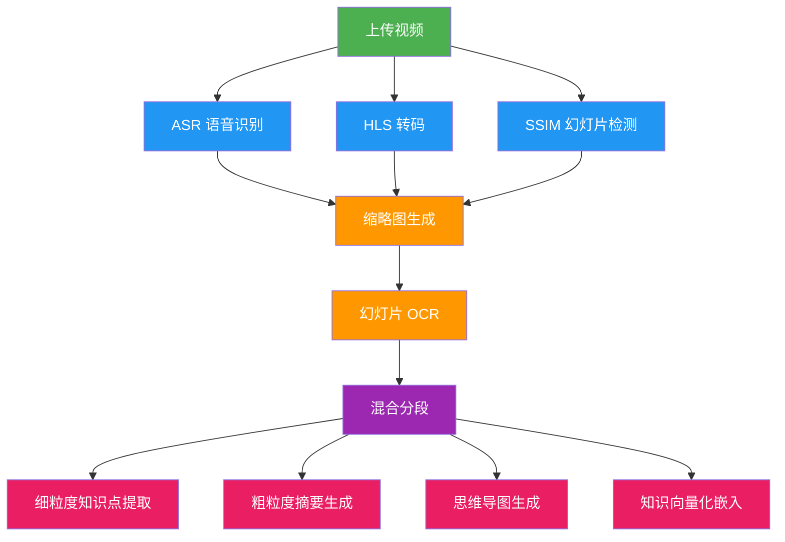

# 快速开始

本指南帮助你在 **5 分钟内** 从零启动 LectureMind。有两种方式可以选择：

- **Option A: Docker（推荐）** — 一键启动所有服务，无需手动安装依赖
- **Option B: 本地开发** — 分别启动后端和前端，适合需要修改代码的开发者

---

## 前置条件

无论选择哪种方式，你都需要：

| 方式 | 需要准备 |
|------|---------|
| Docker | Docker + Docker Compose |
| 本地开发 | Python 3.10+、Node.js 18+、pnpm、ffmpeg |

你还需要一个 **阿里云 DashScope API Key**（用于语音识别和 LLM），以及 **腾讯云 COS** 的密钥（用于 ASR 音频文件上传）。可在 [DashScope 控制台](https://dashscope.console.aliyun.com/) 和 [腾讯云 COS 控制台](https://console.cloud.tencent.com/cos) 获取。

---

## Option A: Docker 部署（推荐）

Docker 方式会自动拉起后端 API、任务处理器和前端三个容器，最适合快速体验。

### 第一步：克隆仓库

```bash
git clone https://github.com/XUranus/LectureMind.git
cd LectureMind
```

### 第二步：配置环境变量

```bash
cp .env.example .env
```

编辑 `.env` 文件，至少填写以下必填项：

```bash
# 阿里云 DashScope API Key（必填）
DASHSCOPE_API_KEY=sk-xxxxxxxxxxxxxxxx

# 腾讯云 COS 配置（必填，用于 ASR 音频上传）
COS_SECRECT_ID=AKIDxxxxxxxx
COS_SECRECT_KEY=xxxxxxxx
COS_REGION=ap-singapore
COS_BUCKET=my-bucket-name
```

### 第三步：启动服务

```bash
docker compose up --build
```

:::info 等待构建
首次构建需要下载依赖和编译镜像，可能需要几分钟。后续启动会快很多。
:::

### 第四步：访问系统

构建完成后，打开浏览器访问：

```
http://localhost:3000
```

---

## Option B: 本地开发

如果你需要修改代码，建议使用本地开发模式。

### 后端设置

```bash
# 进入后端目录
cd server/app

# 创建 Python 环境（二选一）
# 方式 1: Conda
conda env create -f environment.yml
conda activate LectureMind

# 方式 2: pip
pip install -r requirements.txt

# 配置环境变量
cp ../../.env.example ../../.env
# 编辑 .env 填写 API Key 等必填项

# 初始化数据库
python manage.py migrate

# 启动后端 API 服务（终端 1）
python manage.py runserver

# 启动任务处理器（终端 2）
python manage.py process_async_task
```

:::warning 两个终端
后端 API 和任务处理器需要在 **两个独立的终端** 中同时运行。任务处理器负责视频转码、ASR、知识提取等后台任务。
:::

### 前端设置

```bash
# 进入前端目录（新终端）
cd frontend

# 安装依赖
pnpm install

# 启动开发服务器
pnpm start
```

前端开发服务器默认运行在 `http://localhost:3000`。

---

## 首次运行

启动成功后，让我们来体验一下完整流程：

1. **打开浏览器** — 访问 `http://localhost:3000`
2. **创建课程** — 点击「新建课程」（Episode），输入课程名称
3. **上传视频** — 在课程下上传一个讲座视频文件
4. **查看任务进度** — 在视频详情页可以看到各个处理任务的实时进度
5. **探索结果** — 处理完成后，查看逐字稿、知识点、思维导图和幻灯片
6. **AI 对话** — 打开聊天面板，向 AI 提问关于课程内容的问题

---

## 上传后发生了什么？

视频上传后，系统会启动一个 DAG（有向无环图）任务管线。下面是处理流程：



:::note 任务并行执行
ASR、HLS 转码和幻灯片检测三个任务是 **并行执行** 的，互不依赖。后续任务会自动等待前置任务完成后才开始。
:::

| 阶段 | 任务 | 说明 |
|------|------|------|
| 并行阶段 | ASR 语音识别 | 提取音频并上传至 COS，调用 DashScope 生成逐字稿 |
| 并行阶段 | HLS 转码 | 将视频转为 HLS 自适应流格式 |
| 并行阶段 | SSIM 幻灯片检测 | 基于图像相似度算法检测画面切换 |
| 串行阶段 | 缩略图生成 | 在幻灯片切换点截取缩略图（200px + 1920px 双分辨率） |
| 串行阶段 | 幻灯片 OCR | 对高分辨率截图进行文字识别 |
| 串行阶段 | 混合分段 | 结合幻灯片切换、静音间隔和语义相似度进行内容分段 |
| 并行阶段 | 知识提取/摘要/导图/嵌入 | 最终的知识加工和向量化 |

---

## 常见问题排查

### 端口被占用

```bash
# 错误: port is already allocated
# 解决: 在 .env 中修改端口
BACKEND_PORT=9000
FRONTEND_PORT=8080
```

### 缺少 API Key

```bash
# 错误: DASHSCOPE_API_KEY not set
# 解决: 确保 .env 中填写了正确的 API Key
DASHSCOPE_API_KEY=sk-xxxxxxxxxxxxxxxx
```

### ffmpeg 未找到

```bash
# 错误: ffmpeg: command not found
# 解决: 安装 ffmpeg
# Ubuntu/Debian
sudo apt install ffmpeg
# macOS
brew install ffmpeg
# Arch Linux
sudo pacman -S ffmpeg
```

### Docker 构建失败

```bash
# 清除缓存重新构建
docker compose down
docker compose build --no-cache
docker compose up --build
```

### 任务卡住不动

检查任务处理器是否正在运行。在本地开发模式下，确保你已经在另一个终端启动了：

```bash
python manage.py process_async_task
```

---

:::tip 下一步
- 了解详细的 [安装指南](./installation.md) 获取更多环境配置信息
- 查看 [配置详解](./configuration.md) 了解所有可配置的参数
- 进入 [架构概览](./architecture) 深入了解系统设计
:::
